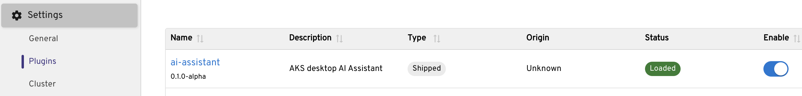
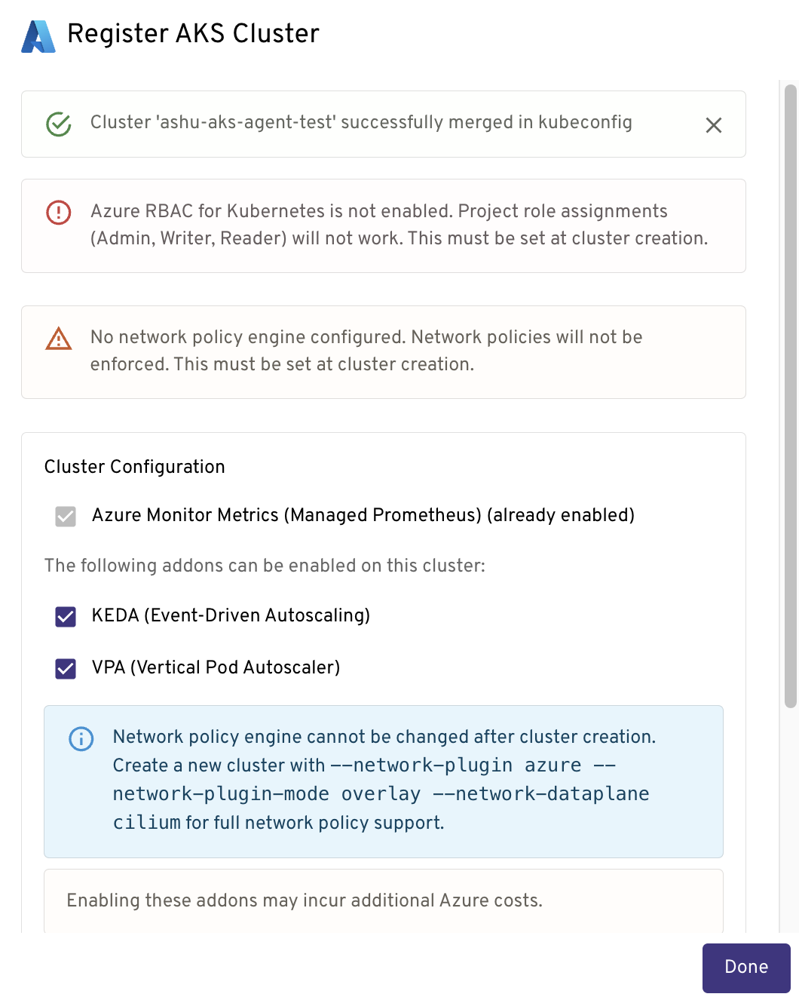
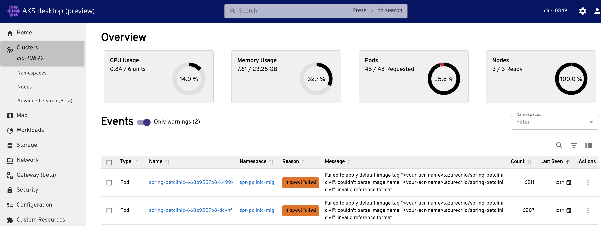
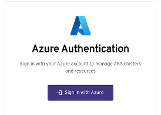
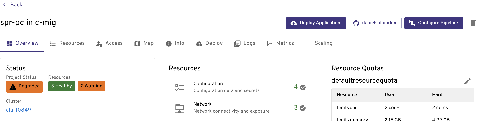

# Stable Release Notes Version 0.5.0 DRAFT

>>> UPDATE PIX TO REMOVE DETAILS

## Key updates in the release:
1. Accessibility, security, stability, localization and many minor fixes, documented in release notes.
2. Support for AKS Standard
3. Support for importing existing managed namespaces into AKS desktop projects.
4. Support for importing managed namespace into a project work when user doesn't have access to the cluster itself.

## Alpha Preview features
1. AI Assistant with Natural Language Support 
2. Insights (docs inflight)
3. Automating app deployment from AKS desktop with a GitHub Actions Pipeline (docs inflight)

## Features

### AI Assistant with Natural Language Support (Preview)
AKS Desktop Troubleshooting Assistant that brings together real-time cluster context, scoped analysis, and AI-generated recommendations to help users understand not just what happened, but why, and what to do next. 

#### Addressing Key Challenges
Troubleshooting Kubernetes workloads is often complex and time consuming, it typically relies on a mix of CLI commands, dashboards, and documentation to piece together what went wrong. Common issues like DNS failures, pod crashes, and upgrade blockers can be difficult to diagnose, especially when the root cause is buried across logs, events, and configurations.

This new AI-powered experience is designed to help developers and Kubernetes operators diagnose and resolve issues in AKS clusters faster and with greater confidence, users can now investigate problems using guided, explainable insights, all within the familiar AKS Desktop interface.

 
#### Functionality and Usage
The AKS Desktop Troubleshooting Assistant is built into AKS Desktop and provides a guided experience for diagnosing issues in your cluster. Users can:
* Select a project, namespace, or workload to investigate.
* Run scoped diagnostics that analyze logs, events, and metrics.
* Receive AI-generated summaries with clear reasoning and evidence.
* Preview recommended actions and apply them with confidence.
* Use your own language models or connect to Azure managed options.
* Work alongside existing dashboards in AKS Desktop for a cohesive troubleshooting experience.

> Note! This plugin is in early development and is not yet ready for production use. Using it may incur in costs from the AI provider! Use at your own risk.

#### Options
There are two options for enabling this functionality:
1. Utilize the Azure AKS Agentic CLI Agent - (recommended for AKS), this an AI-powered tool (using Azure OpenAI/LLMs) that acts as an intelligent sidekick to diagnose, troubleshoot, and optimize AKS clusters using natural language queries. It provides root cause analysis and remediation suggestions, operating in local (CLI) or cluster-mode (via Helm/Kubernetes pods) for enhanced DevOps. Here AKS desktop will connect to the 

2. Utlize an existing model - AKS desktop will act as an Agent itself, providing context to your model.

#### Enabling the feature
1. Utilize the Azure AKS Agentic CLI Agent 
    * Go to AKS desktop settings > Plugins > Enable AI Assistant
    * [Install the Agentic CLI Agent ](https://learn.microsoft.com/en-us/azure/aks/agentic-cli-for-aks-install?tabs=client-mode%2Cclient-cleanup)on your cluster and configure it to connect to a model.
    * Ensure the cluster runnning the Agentic CLI Agent is a registered cluster in AKS desktop, i.e you see it in your cluster list.

2. Go to AKS desktop settings > Plugins > Enable AI Assistant
    * Go to AKS desktop settings > Plugins > Enable AI Assistant > Add provider

#### Using AI Azure AKS Agentic CLI Agent
1. Open the AI Assistant
2. Select Agent
3. Select cluster where the agent is running.
4. Start chatting!

#### Enabling the feature
Go to Settings > Plugins ->  make sure ai-assistant plugin is enabled -> click on ai-assistant in the list of plugins -> toggle preview to enabled state. After this the ai-assistant icon should appear in the top right.

Select the cluster "ashu-aks-agent-test" once you’ve opened the AI assistant.

#### Try it out!
It is context aware, so when you see orange, errors, warnings...just ask!

 
### AKS Standard Cluster Support
In previous releases we only supported AKS Automatic, this was because Projects takes a dependency on features such as Entra enabled clusters, KEDA, Managed Prometheus, Cilium overlay etc. If you want to use existing clusters with Projects their functionality will depend on the features enabled, for example if you dont have a prometheus installed AKS desktop will not be able to show the graph metrics. This article [here](https://github.com/Azure/aks-desktop/blob/main/docs/cluster-requirements.md#aks-cluster-requirements-for-aks-desktop) discusses what each configuration enables. 

> Note! Cluster capabilties are checked when creating projects or when registering clusters, at that time we give you the opportunity to update your cluster to support them (if you have permissions), or review a doc. Before any changes to your cluster must review the  changes that the tool will make to your cluster and test them.

### AKS desktop Insights
Intro to be inserted.

## Awareness / updates
## Opening the app for the first time
When you download the app and open it for the first time it will open the 'clusters' view, you will see clusters here that are in your kubeconfig. You can click on the clusters and explore them, note, it is your existing identity and permissions that are used to interact with the clusters, so if you dont have the correct permissions to access clusters and their resources you will see these errors surface in AKS desktop.

Note it takes a few seconds for the screen to read 'projects' as we need to enumerate which projects you have access to.

## Sign In
To add existing Azure clusters you will need to sign in, this flow supports multi-factor authentication.

## Adding a cluster updates
You can add a cluster by selecting 'Add Cluster from Azure' using 'Add Cluster' and selecting the Azure Kubernetes Provider Service. You will then need to select your subscription.

## Project Updates
Projects are detailed [here](https://learn.microsoft.com/en-us/azure/aks/aks-desktop-app?tabs=azure-subscription%2Caks-managed-project%2Ccontainer-image#create-a-new-project-in-aks-deskto).

### Project Type updates
Projects are built on namespaces, these are the options:
1. Existing Namespace - you an bring a namespace into a project.
2. 
2. Create New AKS Managed Namespace (recommended) - this is built on [AKS Managed Namespace](https://learn.microsoft.com/en-us/azure/aks/concepts-managed-namespaces) which provides many benefits, e.g. resource quota, network policy etc.

> Note! When you select 'New AKS Managed Namespace' we will check if the cluster meets the minimum requirements to create a project, requirements are documented [here](https://github.com/Azure/aks-desktop/blob/main/docs/cluster-requirements.md#aks-cluster-requirements-for-aks-desktop).

### Access
Note: at this point we grant the RBAC permissions to the underlying [AKS Managed Namespace](https://learn.microsoft.com/en-us/azure/aks/concepts-managed-namespaces) that AKS desktop has created on your behalf.

## Delete Project
To delete a project select the 'Trash' icon, if also delete the namespace this can take a minute or so because it is an Azure request, deleting the AKS Managed Namespace.

