# AKS Desktop Threat Model Report

**Source model:** `aks-desktop-threat-model-3.tm7`  
**HTML report:** `aks-desktop-threat-model.htm`  
**Methodology:** STRIDE  
**Total threats:** 94 (all Priority: High, State: Not Started)  
**Generated:** 2026-03-06  
**Headlamp submodule commit (for file/line references):** `02feb87395462af7f7418ac1b68e777fc78f199b`  
<!-- https://github.com/Azure/aks-desktop/tree/02feb87395462af7f7418ac1b68e777fc78f199b -->

---

## Full Threat Model Diagram

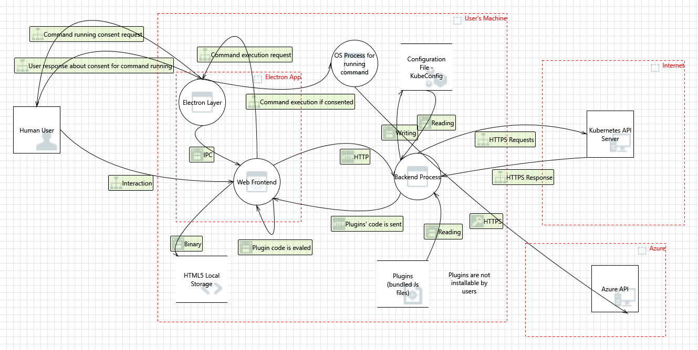

---

## Threat Model Summary

| State | Count |
|-------|-------|
| Not Started | 94 |
| Not Applicable | 0 |
| Needs Investigation | 0 |
| Mitigation Implemented | 0 |
| **Total** | **94** |

### 📊 Existing Mitigation Coverage Summary

Each of the 94 threats has been assessed for **existing mitigations already present in the codebase**. The confidence rating reflects how adequate the current code-level defenses are — higher means the existing code already provides strong protection; lower means the threat has few or no existing defenses.

| Existing Mitigation Strength | Confidence Range | Count | Threats |
|------------------------------|-----------------|-------|---------|
| ✅ **Strong** (adequate existing defenses) | 70–85% | 24 | #3, #9, #17, #18, #26, #57, #70, #2, #10, #20, #25, #39, #49, #11, #54, #61, #24, #65, #1, #16, #23, #50, #63, #74 |
| ⚠️ **Moderate** (partial defenses, gaps remain) | 40–69% | 43 | #7, #19, #27, #51, #68, #83, #88, #91, #6, #8, #48, #58, #90, #4, #12, #15, #21, #30, #59, #76, #92, #14, #35, #38, #60, #62, #82, #84, #37, #40, #55, #56, #79, #86, #22, #33, #52, #66, #71, #73, #77, #81, #89 |
| 🔴 **Weak/None** (little or no existing defense) | 15–39% | 27 | #13, #29, #42, #53, #72, #5, #36, #43, #78, #85, #93, #94, #31, #41, #44, #47, #67, #87, #28, #32, #34, #45, #46, #64, #69, #75, #80 |

**Key findings:**
- **24 threats** (26%) have strong existing mitigations — these are lower priority for new work
- **43 threats** (46%) have partial mitigations — gaps should be addressed
- **27 threats** (29%) have weak or no existing mitigations — these are highest priority for security hardening

### ⚠️ Top 20 Threats Least Likely to Have Mitigations Already in Place

The following threats are ranked by **existing mitigation confidence** — how well the current codebase already defends against each attack vector. Lower confidence means weaker existing protections and higher priority for security hardening.

| Rank | Threat | STRIDE Category | Existing Mitigation Confidence | Summary |
|------|--------|-----------------|-------------------------------|---------|
| 1 | [#13](#13-potential-data-repudiation-by-os-process-for-running-command--state-not-started--priority-high) | Repudiation | **15%** 🔴 | Potential Data Repudiation by OS Process for running command |
| 2 | [#29](#29-potential-data-repudiation-by-backend-process--state-not-started--priority-high) | Repudiation | **15%** 🔴 | Potential Data Repudiation by Backend Process |
| 3 | [#42](#42-potential-data-repudiation-by-backend-process--state-not-started--priority-high) | Repudiation | **15%** 🔴 | Potential Data Repudiation by Backend Process |
| 4 | [#53](#53-potential-data-repudiation-by-web-frontend--state-not-started--priority-high) | Repudiation | **15%** 🔴 | Potential Data Repudiation by Web Frontend |
| 5 | [#72](#72-potential-data-repudiation-by-web-frontend--state-not-started--priority-high) | Repudiation | **15%** 🔴 | Potential Data Repudiation by Web Frontend |
| 6 | [#5](#5-data-store-denies-html5-local-storage-potentially-writing-data--state-not-started--priority-high) | Repudiation | **20%** 🔴 | Data Store Denies HTML5 Local Storage Potentially Writing Data |
| 7 | [#36](#36-external-entity-kubernetes-api-server-potentially-denies-receiving-data--state-not-started--priority-high) | Repudiation | **20%** 🔴 | External Entity Kubernetes API Server Potentially Denies Receiving Data |
| 8 | [#43](#43-data-flow-sniffing--state-not-started--priority-high) | Information Disclosure | **25%** 🔴 | Data Flow Sniffing |
| 9 | [#78](#78-spoofing-of-source-data-store-configuration-file---kubeconfig--state-not-started--priority-high) | Spoofing | **25%** 🔴 | Spoofing of Source Data Store Configuration File - KubeConfig |
| 10 | [#85](#85-potential-data-repudiation-by-electron-layer--state-not-started--priority-high) | Repudiation | **25%** 🔴 | Potential Data Repudiation by Electron Layer |
| 11 | [#93](#93-potential-excessive-resource-consumption-for-backend-process-or-configuration-file---kubeconfig--state-not-started--priority-high) | Denial Of Service | **25%** 🔴 | Potential Excessive Resource Consumption for Backend Process or Configuration Fi... |
| 12 | [#94](#94-spoofing-of-destination-data-store-configuration-file---kubeconfig--state-not-started--priority-high) | Spoofing | **25%** 🔴 | Spoofing of Destination Data Store Configuration File - KubeConfig |
| 13 | [#31](#31-potential-process-crash-or-stop-for-backend-process--state-not-started--priority-high) | Denial Of Service | **30%** 🔴 | Potential Process Crash or Stop for Backend Process |
| 14 | [#41](#41-potential-lack-of-input-validation-for-backend-process--state-not-started--priority-high) | Tampering | **30%** 🔴 | Potential Lack of Input Validation for Backend Process |
| 15 | [#44](#44-potential-process-crash-or-stop-for-backend-process--state-not-started--priority-high) | Denial Of Service | **30%** 🔴 | Potential Process Crash or Stop for Backend Process |
| 16 | [#47](#47-elevation-by-changing-the-execution-flow-in-backend-process--state-not-started--priority-high) | Elevation Of Privilege | **30%** 🔴 | Elevation by Changing the Execution Flow in Backend Process |
| 17 | [#67](#67-cross-site-scripting--state-not-started--priority-high) | Tampering | **30%** 🔴 | Cross Site Scripting |
| 18 | [#87](#87-potential-process-crash-or-stop-for-electron-layer--state-not-started--priority-high) | Denial Of Service | **30%** 🔴 | Potential Process Crash or Stop for Electron Layer |
| 19 | [#28](#28-potential-lack-of-input-validation-for-backend-process--state-not-started--priority-high) | Tampering | **35%** 🔴 | Potential Lack of Input Validation for Backend Process |
| 20 | [#32](#32-data-flow-http-is-potentially-interrupted--state-not-started--priority-high) | Denial Of Service | **35%** 🔴 | Data Flow HTTP Is Potentially Interrupted |

> **Reading this table:** A low "Existing Mitigation Confidence" (🔴 15–35%) means the codebase currently has few or no code-level defenses against this threat. These are the highest priority items for security hardening.

---

## Gap Analysis: Missing Systems and Threat Boundaries

### Complete Architecture (including missing systems)

The following diagram shows the full AKS Desktop architecture including all 7 systems and 5 trust boundaries that are missing from the original threat model diagram. Items with numbered labels (1️⃣–7️⃣) and red/dashed borders are missing from the original model.

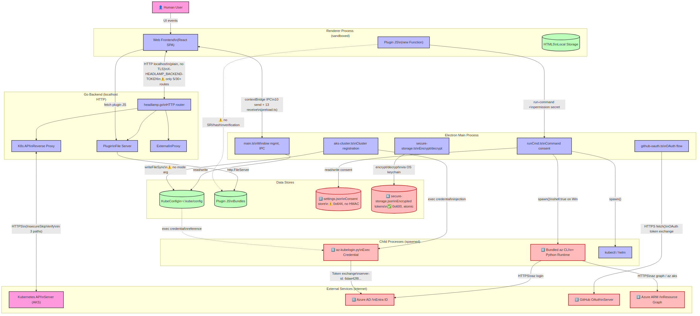

<details>
<summary>Mermaid source (click to expand)</summary>

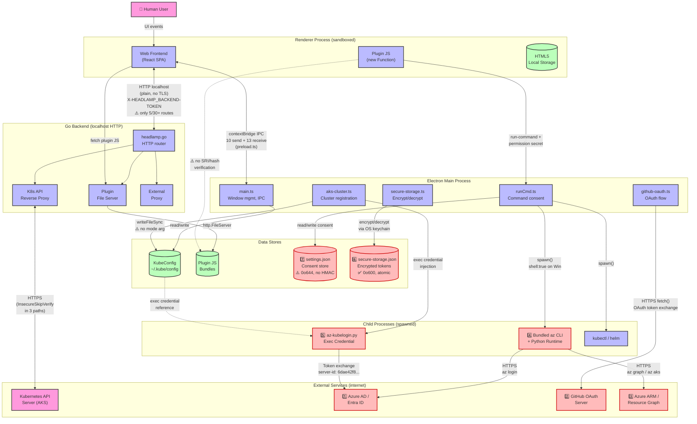

</details>

---

### Major Systems Missing from the Diagram

The following diagram highlights the 7 systems absent from the original threat model. Items with red dashed borders are not represented.

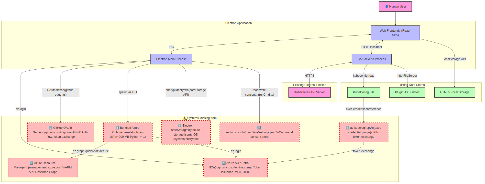

<details>
<summary>Mermaid source (click to expand)</summary>

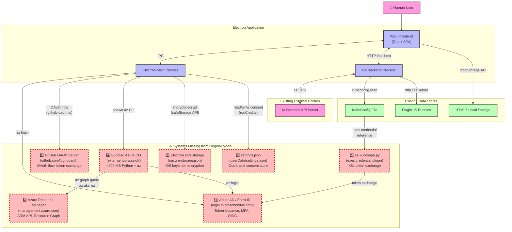

</details>

---

#### 1. Azure AD / Microsoft Entra ID

AKS clusters configured with Azure RBAC authenticate users via Microsoft Entra ID (formerly Azure AD) tokens. The aks-desktop plugin calls `az login` to initiate a device-code or browser-based login flow that obtains Entra ID tokens stored in the Azure CLI token cache (`~/.azure/msal_token_cache.*`). These tokens are then used by:

- `az account get-access-token` (`az-cli.ts:508-515`) — retrieves a bearer token for Azure ARM API calls
- `az aks get-credentials` (invoked via `registerAKSCluster` IPC handler, `aks-cluster.ts`) — writes a kubeconfig with either an embedded token or an exec credential plugin reference
- `az-kubelogin.py` exec credential plugin — exchanges Entra ID tokens for Kubernetes API tokens at every `kubectl` invocation

The Entra ID service (`login.microsoftonline.com`) is an external entity that validates credentials, issues OIDC/OAuth tokens, and enforces MFA/conditional access policies. It should be represented in the threat model because:
- Token theft from the Azure CLI cache grants access to all Azure resources the user can access
- The `az login` flow opens an external browser, creating a trust boundary crossing not shown in the model
- Entra ID token expiration and refresh logic affects availability

*Key files:* `plugins/aks-desktop/src/utils/azure/az-cli.ts:508-530` (getAccessToken, initiateLogin), `headlamp/app/electron/aks-cluster.ts:107-164` (exec credential injection), `headlamp/app/electron/runCmd.ts:149,156` (auto-consented `az login`, `az account`).

#### 2. GitHub OAuth Server (api.github.com / github.com/login/oauth)

The app implements a complete GitHub OAuth web flow in `headlamp/app/electron/github-oauth.ts` (327 lines). Key implementation details:

- **Client credentials:** Client ID `Iv23liWWbvrfIrA6WWj5` and client secret `5a06...5d95` are embedded in source (`github-oauth.ts:34-35`). Per RFC 8252, a client secret cannot be kept confidential in a native app; it should be treated as a public client and rely on PKCE and state for protection rather than the secret.
- **OAuth flow:** `setupGitHubOAuthHandlers` registers three IPC handlers: `github-oauth-start` (generates CSRF state via `crypto.randomUUID()`, opens browser to `github.com/login/oauth/authorize`), `github-oauth-callback` (exchanges auth code for tokens at `github.com/login/oauth/access_token`), and `github-oauth-refresh` (refreshes expired tokens).
- **CSRF protection:** A module-scoped `pendingState` variable (`github-oauth.ts:57`) stores the CSRF nonce. The callback handler verifies `state !== pendingState` and throws `'State mismatch — possible CSRF attack'` (`github-oauth.ts:262`). Only one flow can be pending at a time.
- **Callback mechanism:** In production, the callback arrives via the `headlamp://oauth/callback` custom URL scheme. In dev mode (`ELECTRON_DEV`), a temporary HTTP server on `127.0.0.1:48321` handles the callback instead (`github-oauth.ts:109-144`).
- **Scopes requested:** `repo read:org` (`github-oauth.ts:184`) — two separate scopes: `repo` grants full read/write access to all user repositories, and `read:org` grants read-only access to organization membership.
- **Token storage:** Access + refresh tokens are encrypted via `handleSecureStorageSave` and stored in `secure-storage.json` under the key `aks-desktop:github-auth` (`github-oauth.ts:79-85`).

GitHub's OAuth service is a significant external trust boundary because: token compromise grants repo read/write access, the dev callback server listens on a fixed port (predictable), and the embedded client secret could be used to impersonate the app.

*Key files:* `headlamp/app/electron/github-oauth.ts:1-327`, `headlamp/app/electron/preload.ts:122-150` (OAuth IPC bridge), `headlamp/app/electron/secure-storage.ts` (token encryption).

#### 3. Azure Resource Manager (ARM) / Azure Resource Graph API

The aks-desktop plugin makes extensive Azure ARM and Resource Graph API calls via the auto-consented `az` CLI. Key operations include:

- **Resource Graph queries:** `getClustersViaGraph()` (`az-cli.ts:683-689`) sends KQL queries to the ARM Resource Graph endpoint. The cluster name is sanitized with `/^[a-zA-Z0-9_-]+$/` (`az-cli.ts:1567`) and the subscription ID is validated as a GUID (`isValidGuid`, `az-cli.ts:22-26`). The KQL query uses string interpolation (`where name == '${clusterName}'`, `az-cli.ts:1578`); the regex provides defense-in-depth against KQL injection, though parameterized queries would be more robust.
- **Auto-consented commands:** 21 command prefixes are auto-approved (`runCmd.ts:146-166`), including `az role` (can assign RBAC roles to any Azure resource), `az vm` (can create/delete VMs), `az graph` (can query any Azure resource metadata), and `az acr` (can push/pull container images). A compromised plugin with `runCmd` permission could execute any of these.
- **Network boundary:** All `az` CLI calls traverse the public internet to `management.azure.com`, `graph.microsoft.com`, and `login.microsoftonline.com`. These outbound HTTPS connections cross a network trust boundary not shown in the model.

*Key files:* `plugins/aks-desktop/src/utils/azure/az-cli.ts:22-26,508-530,683-689,1554-1630` (Resource Graph + ARM calls), `headlamp/app/electron/runCmd.ts:146-166` (auto-consent list).

#### 4. Bundled Azure CLI + Python Runtime

`headlamp/app/electron/aks-cluster.ts:39-73` resolves platform-specific paths to a bundled Python interpreter and `az` CLI under `<resourcesPath>/external-tools/`:

- **Windows:** `external-tools/az-cli/win32/python.exe` and `external-tools/az-cli/win32/bin/az.cmd`
- **Linux/macOS:** `external-tools/az-cli/<platform>/bin/python3` and `external-tools/az-cli/<platform>/bin/az`

These are distinct executables from the "OS Process for running command" in the model. Key concerns:
- The bundled Python + az-cli is a ~200 MB dependency with its own vulnerability surface
- The `az` CLI stores credentials in its own token cache, separate from kubeconfig
- `spawn()` is called with `shell: true` on Windows (`runCmd.ts:394`), meaning the bundled `az.cmd` is interpreted through `cmd.exe`, enabling argument injection
- The bundled CLI version may lag behind security patches if the app is not updated

*Key files:* `headlamp/app/electron/aks-cluster.ts:39-73` (getExecutablePaths), `headlamp/app/electron/runCmd.ts:385-405` (spawn with shell:true on Windows).

#### 5. az-kubelogin.py Exec Credential Plugin

`aks-cluster.ts:80-163` injects an exec credential configuration into every kubeconfig user entry for AKS clusters:

```yaml
exec:
  apiVersion: client.authentication.k8s.io/v1beta1
  command: <pythonCmd>
  args: [<azKubeloginPath>, --server-id, 6dae42f8-4368-4678-94ff-3960e28e3630]
  env:
    - name: PATH
      value: <azCliBinPath>:<currentPATH>
    - name: AZ_CLI_PATH
      value: <azCliCmd>
```

This Python script (`external-tools/bin/az-kubelogin.py`) runs at every `kubectl` invocation as a Kubernetes exec credential plugin (via `client.authentication.k8s.io/v1beta1`). It is NOT shown as a separate process in the model. Key concerns:
- The script has access to the full user's PATH plus the az-cli bin directory
- The hard-coded server ID `6dae42f8-4368-4678-94ff-3960e28e3630` is the Azure Kubernetes Service AAD server application ID
- The function `addAzKubeloginToKubeconfig` (`aks-cluster.ts:80-163`) strips ALL existing auth methods (auth-provider, token, client certificates) before injecting the exec config (lines 114-123). This is intentional to prevent conflicting auth configurations, but means that if az-kubelogin fails, no fallback auth method remains.
- If the kubeconfig YAML parsing fails, the original (possibly insecure) config is returned unchanged (`aks-cluster.ts:90`)

*Key files:* `headlamp/app/electron/aks-cluster.ts:80-163` (addAzKubeloginToKubeconfig), `headlamp/app/electron/aks-cluster.ts:39-73` (executable paths).

#### 6. Electron safeStorage / Secure Storage JSON

The app encrypts sensitive data using Electron's `safeStorage` API and persists it to `<userData>/secure-storage.json`. The implementation in `headlamp/app/electron/secure-storage.ts` (214 lines) is well-hardened:

- **Encryption:** Values are encrypted via `safeStorage.encryptString()` and stored as base64 (`secure-storage.ts:105`). The decryption key is managed by the OS keychain (macOS Keychain, Windows DPAPI, Linux libsecret/kwallet).
- **Key validation:** Keys must match `/^[a-zA-Z0-9:_-]+$/`, be ≤128 chars, and not be prototype-pollution targets (`__proto__`, `constructor`, `prototype`) — `secure-storage.ts:26-33`.
- **Value limits:** Max value size is 64 KB (`secure-storage.ts:28`), max entries is 256 (`secure-storage.ts:29`).
- **Atomic writes:** Uses temp-file + rename pattern with `0o600` permissions and `fsync` (`secure-storage.ts:67-83`).
- **Null-prototype objects:** `readSecureStorageFile` uses `Object.create(null)` to prevent prototype pollution (`secure-storage.ts:44,47`).
- **Corrupted entry handling:** Decryption failures auto-delete the corrupted entry (`secure-storage.ts:137-139`).

Currently stores GitHub OAuth tokens under key `aks-desktop:github-auth` (`github-oauth.ts:36`). IPC handlers (`secure-storage-save/load/delete`) are exposed to the renderer via `preload.ts:107-118`.

**Threat surface:** If the OS keychain is compromised or the user's session is hijacked, the encrypted data can be decrypted. The file permissions (`0o600`) protect against other local users but not against root or the same user.

*Key files:* `headlamp/app/electron/secure-storage.ts:1-214`, `headlamp/app/electron/preload.ts:107-118` (IPC bridge), `headlamp/app/electron/github-oauth.ts:36,79-85` (token storage).

#### 7. AKS Desktop Settings JSON

`headlamp/app/electron/runCmd.ts:70` defines `SETTINGS_PATH` as `<userData>/settings.json`. This file stores command consent decisions. Key implementation details:

- **Structure:** A flat JSON object with a `confirmedCommands` key mapping command prefixes (e.g., `"az aks"`) to boolean `true`/`false` (`runCmd.ts:118-126`).
- **Read/write:** `loadSettings()` (`runCmd.ts:77-83`) reads with `JSON.parse` (no schema validation), `saveSettings()` (`runCmd.ts:90-92`) writes with `JSON.stringify` and no file permission control (inherits process umask, typically `0o644`).
- **Auto-consent:** `addRunCmdConsent()` (`runCmd.ts:173-204`) bulk-writes `true` for all commands in the `COMMANDS_WITH_CONSENT` list — 21 entries for aks-desktop. Auto-consented entries are indistinguishable from user-consented entries.
- **No integrity protection:** The file can be modified by any process running as the same user. A malicious process could pre-consent dangerous commands.
- **No atomicity:** `writeFileSync` is not atomic — a crash mid-write could corrupt the file. Compare with `secure-storage.ts` which uses temp+rename.

**Threat surface:** An attacker with local write access to `<userData>/settings.json` could silently consent to arbitrary commands. There is no HMAC or signature to detect tampering.

*Key files:* `headlamp/app/electron/runCmd.ts:70-92` (SETTINGS_PATH, loadSettings, saveSettings), `headlamp/app/electron/runCmd.ts:173-204` (addRunCmdConsent).

### Major Threat Boundaries Missing

The following diagram highlights the 5 trust boundaries absent from the original threat model, with key security concerns annotated.

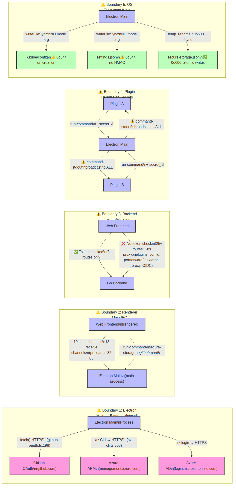

<details>
<summary>Mermaid source (click to expand)</summary>

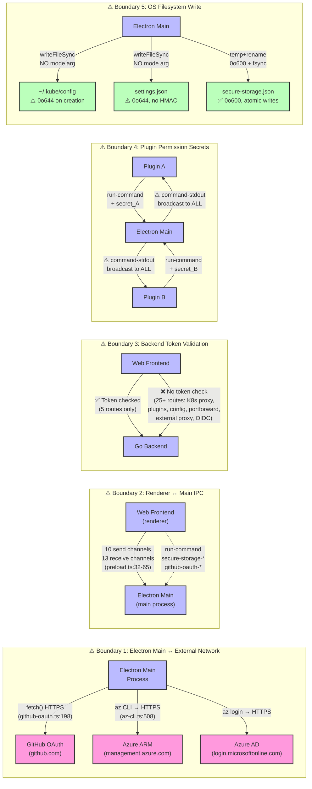

</details>

---

#### 1. Electron Main ↔ External Network (GitHub OAuth, ARM, Azure Graph)

The Electron main process makes outbound HTTPS calls to three external services: `github.com/login/oauth/access_token` (token exchange, `github-oauth.ts:198-206,224-233`), `login.microsoftonline.com` (via `az login`), and `management.azure.com`/`graph.microsoft.com` (via `az graph`/`az account`). These traverse the public internet and cross a network trust boundary not shown in the diagram. A network-level attacker (e.g., compromised corporate proxy) could intercept or modify these calls.

*Key files:* `headlamp/app/electron/github-oauth.ts:198-206,224-233` (direct `fetch()` to GitHub), `plugins/aks-desktop/src/utils/azure/az-cli.ts:508-530` (az CLI calls to ARM).

#### 2. Renderer ↔ Electron Main IPC (contextBridge)

The `preload.ts` file (`headlamp/app/electron/preload.ts`) uses `contextBridge.exposeInMainWorld('desktopApi', {...})` (line 32) to expose a controlled IPC API. The `send` channel whitelist contains 10 channels (lines 38-47), and the `receive` whitelist contains 13 channels (lines 53-65). Additional methods are exposed directly: `registerAKSCluster` (line 78), `getLicenseFile` (line 95), `secureStorageSave/Load/Delete` (lines 107-118), `startGitHubOAuth` (line 122), `onGitHubOAuthCallback` (line 127), and `refreshGitHubOAuth` (line 144).

This is the actual trust boundary between untrusted web/plugin content and privileged Electron main process operations. The channel whitelist is the primary security control, but plugin code running in the renderer has access to all whitelisted channels — including `run-command`, `secure-storage-*`, and `github-oauth-*`.

*Key files:* `headlamp/app/electron/preload.ts:32-150` (full contextBridge definition).

#### 3. Backend Token Validation Boundary

The Go backend validates `X-HEADLAMP_BACKEND-TOKEN` via `checkHeadlampBackendToken()` (`headlamp.go:1221-1232`), which compares the header value against the `HEADLAMP_BACKEND_TOKEN` environment variable. This token boundary is critical but incomplete: only 5 of 30+ route handlers check the token (plugin DELETE at line 304, Helm at line 1261, cluster add at line 1788, cluster delete at line 1996, and one more). The K8s API proxy, plugin file servers, config endpoint, portforward, service proxy, external proxy, OIDC, and metrics endpoints are NOT token-gated.

*Key files:* `headlamp/backend/cmd/headlamp.go:1221-1232` (checkHeadlampBackendToken), `headlamp/backend/cmd/headlamp.go:304,1261,1788,1996` (5 token-checked routes).

#### 4. Plugin Permission Secrets Boundary

The Electron main process generates per-command random numbers (`permissionSecrets`) in `headlamp/app/electron/runCmd.ts` and sends them once to the renderer via the `plugin-permission-secrets` IPC channel (`preload.ts:63`). The frontend's `runPlugin.ts` passes these secrets to each plugin via the `new Function()` evaluation context. A plugin can only run commands for which it has the matching secret number. However, the `command-stdout`/`command-stderr`/`command-exit` IPC channels (`preload.ts:55-57`) broadcast all command output to all listeners — any plugin can eavesdrop on the output of commands initiated by other plugins.

*Key files:* `headlamp/app/electron/runCmd.ts:232-268` (permission secrets generation), `headlamp/app/electron/preload.ts:55-57,63` (broadcast channels).

#### 5. OS Filesystem (kubeconfig write path)

The backend writes to `~/.kube/config` (or a custom kubeconfig path) when registering clusters via `/cluster` POST. The kubeconfig file contains cluster endpoints, CA certificates, and authentication configurations. On AKS Desktop, the kubeconfig also contains exec credential references to `az-kubelogin.py` with full PATH and AZ_CLI_PATH environment variables (`aks-cluster.ts:139-157`). A process that can write to the kubeconfig can redirect kubectl commands to a malicious API server or inject arbitrary exec plugins that run with the user's privileges. The OS filesystem permission boundary around this write (typically `0o600` for `~/.kube/config`) is not shown separately from the "Writing" interaction.

---

## Diagram: AKS Desktop


---

## Interaction: Binary
*(Web Frontend ↔ HTML5 Local Storage)*

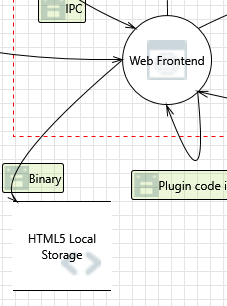

---

### 1. Potential Excessive Resource Consumption for Web Frontend or HTML5 Local Storage  [State: Not Started]  [Priority: High]

**Category:** Denial Of Service  
**Description:** Does Web Frontend or HTML5 Local Storage take explicit steps to control resource consumption? Resource consumption attacks can be hard to deal with, and there are times that it makes sense to let the OS do the job. Be careful that your resource requests don't deadlock, and that they do timeout.

#### Justifications

**Option 1** — The app stores low-volume UI state in localStorage with some bounded limits already in place. The notification system caps stored entries at 200 (`defaultMaxNotificationsStored` in `notificationsSlice.ts:22`). Port-forward entries are serialized as JSON arrays without a hard cap but are bounded by the number of active port-forwards. Sidebar state (`sidebarSlice.ts:176`) stores a single boolean. The Chromium engine enforces a ~5 MB per-origin localStorage quota, which acts as the hard ceiling. **Confidence: 80%**

*References:* `headlamp/frontend/src/components/App/Notifications/notificationsSlice.ts:22,179` (200-entry cap), `headlamp/frontend/src/components/common/Resource/PortForward.tsx:151-321` (port-forward list), `headlamp/frontend/src/components/Sidebar/sidebarSlice.ts:176` (single boolean).

**Option 2** — The Electron renderer is configured with `nodeIntegration: false` and `contextIsolation: true` (`main.ts:1632-1633`), so a compromised renderer cannot bypass the Chromium quota via Node APIs. However, plugin code runs via `new Function()` in the renderer's global scope (`runPlugin.ts:201`) and has unrestricted access to `window.localStorage` — a malicious plugin could fill the quota with junk data, degrading the app for other components. No plugin-level storage quota partitioning exists. **Confidence: 82%**

*References:* `headlamp/app/electron/main.ts:1632-1633`, `headlamp/frontend/src/plugin/runPlugin.ts:201`.

**Option 3** — The aks-desktop plugin itself writes to localStorage for cluster settings (`ImportAKSProjects.tsx:170-175`) and theme preferences (`index.tsx:75-77`). In dev mode, GitHub OAuth tokens fall back to localStorage (`github-auth.ts:138`). These are small writes but the theme and settings writes lack try/catch around `localStorage.setItem`. **Confidence: 75%**

*References:* `plugins/aks-desktop/src/components/ImportAKSProjects/ImportAKSProjects.tsx:170-175`, `plugins/aks-desktop/src/index.tsx:75-77`, `plugins/aks-desktop/src/utils/github/github-auth.ts:138`.

#### Existing Mitigations in Codebase — **Confidence: 70%**

- **localStorage quota (5 MB Chromium limit)** — The browser engine enforces a per-origin 5 MB ceiling on localStorage, which limits total resource consumption regardless of the number of writers.
- **Notification entry cap** — `notificationsSlice.ts:22` caps stored notifications at 200 entries (`defaultMaxNotificationsStored`), bounding the largest known localStorage consumer.
- **Single-origin isolation** — The app loads from `file://` (`main.ts:82`), so only code within the Electron renderer can write to localStorage. External web pages cannot access it.


#### Here are some potential mitigations that might be implemented.

**Mitigation 1** — Apply per-key size caps (already done for notifications at 200 entries; extend to port-forward lists) and wrap all `localStorage.setItem` calls in try/catch to gracefully handle `QuotaExceededError`.  
*References:* `headlamp/frontend/src/components/App/Notifications/notificationsSlice.ts:179`

**Mitigation 2** — Partition plugin localStorage access by key prefix (e.g., `plugin.<name>.`) and enforce a per-plugin byte quota, rejecting writes that exceed it.

**Mitigation 3** — Use Electron's `session.setPermissionRequestHandler` or a storage event listener to monitor and throttle excessive writes from the renderer process.

---

### 2. Spoofing of Destination Data Store HTML5 Local Storage  [State: Not Started]  [Priority: High]

**Category:** Spoofing  
**Description:** HTML5 Local Storage may be spoofed by an attacker and this may lead to data being written to the attacker's target instead of HTML5 Local Storage. Consider using a standard authentication mechanism to identify the destination data store.

#### Justifications

**Option 1** — Headlamp runs as an Electron app loading content from a `file://` URL (`main.ts:82`). The browser's same-origin policy scopes localStorage to the `file://` origin. An external web page in a separate browser cannot read or write this localStorage. The spoofing risk is limited to code running _within_ the renderer process — specifically, plugin code executed via `new Function()` (`runPlugin.ts:201`) shares the same origin and can freely read/write any localStorage key. **Confidence: 85%**

*References:* `headlamp/app/electron/main.ts:82` (startUrl with `file://` protocol), `headlamp/frontend/src/plugin/runPlugin.ts:201` (plugins run in same origin).

**Option 2** — Electron's `contextIsolation: true` + `contextBridge` (`main.ts:1633`, `preload.ts:31-50`) prevents the renderer from accessing Node.js APIs to redirect the backing store to an attacker-controlled path. The preload exposes a narrow whitelist of IPC channels (`send`: 10 channels, `receive`: 13 channels) — none of which give direct filesystem access. **Confidence: 88%**

*References:* `headlamp/app/electron/main.ts:1632-1633`, `headlamp/app/electron/preload.ts:36-50` (send whitelist), `headlamp/app/electron/preload.ts:52-69` (receive whitelist).

**Option 3** — In production, GitHub OAuth tokens are stored in Electron `safeStorage` (OS-level encryption, `secure-storage.ts`), not localStorage. However, in dev mode (`NODE_ENV=development`), tokens fall back to localStorage under key `aks-desktop:github-auth-fallback` (`github-auth.ts:138,161`). This is a minor spoofing target in dev builds only. **Confidence: 78%**

*References:* `plugins/aks-desktop/src/utils/github/github-auth.ts:14,131-177`, `headlamp/app/electron/secure-storage.ts:92-122`.

#### Existing Mitigations in Codebase — **Confidence: 82%**

- **`file://` same-origin policy** — localStorage is scoped to the `file://` origin (`main.ts:82`), preventing external web pages from reading or writing it.
- **`contextIsolation: true`** — `main.ts:1633` prevents renderer code from accessing the preload context or redirecting the storage backend.
- **`contextBridge` whitelist** — Only 10 send and 13 receive IPC channels are exposed (`preload.ts:36-69`); none provide direct filesystem access to redirect storage.
- **Production token encryption** — GitHub OAuth tokens use `safeStorage` encryption in production (`secure-storage.ts:96-123`), not localStorage.


#### Here are some potential mitigations that might be implemented.

**Mitigation 1** — Store all sensitive state (tokens, consent flags, cluster credentials) in the OS-encrypted `safeStorage` store rather than localStorage. This is already done for production GitHub tokens; extend it to any future credentials.  
*References:* `headlamp/app/electron/secure-storage.ts`, `plugins/aks-desktop/src/utils/github/secure-storage.ts`

**Mitigation 2** — Prefix all Headlamp-core localStorage keys with `headlamp:` and validate the prefix on read to detect writes from unexpected sources (e.g., a malicious plugin writing under core keys).

**Mitigation 3** — Consider `Object.defineProperty(window, 'localStorage', { configurable: false })` early in app initialization to prevent prototype replacement by plugin code.

---

### 3. Spoofing the Web Frontend Process  [State: Not Started]  [Priority: High]

**Category:** Spoofing  
**Description:** Web Frontend may be spoofed by an attacker and this may lead to unauthorized access to HTML5 Local Storage.

#### Justifications

**Option 1** — The Web Frontend is the Electron renderer process. An external attacker cannot spoof it without first compromising the OS. `contextIsolation: true` (`main.ts:1633`) and the `contextBridge` whitelist (`preload.ts:36-69`) prevent renderer-side code from impersonating the preload context. The `setWindowOpenHandler` (`main.ts:1643-1650`) blocks navigation to external origins — only URLs starting with `startUrl` (the local `file://` path) open in Electron; all others are redirected to the system browser. **Confidence: 85%**

*References:* `headlamp/app/electron/main.ts:1632-1633` (contextIsolation), `headlamp/app/electron/main.ts:1643-1650` (setWindowOpenHandler), `headlamp/app/electron/preload.ts:36-69`.

**Option 2** — The `headlamp://` custom URL scheme is registered for OAuth callbacks. The `handleDeepLink` function (`main.ts:1714-1730`) validates that the protocol is `headlamp:` and the hostname/path matches `oauth/callback` before forwarding to `handleOAuthCallback`. The OAuth handler validates a CSRF state token (`github-oauth.ts:261-268`): `if (state !== pendingState) throw new Error('State mismatch')`. This prevents injection of forged OAuth codes via the custom URL scheme. **Confidence: 82%**

*References:* `headlamp/app/electron/main.ts:1714-1730` (handleDeepLink), `headlamp/app/electron/github-oauth.ts:249-269` (state validation).

**Option 3** — The app uses `app.requestSingleInstanceLock()` (`main.ts:1732`) to ensure only one instance runs. Deep links from a second instance are forwarded to the first via `second-instance` event (`main.ts:1735-1744`), which also passes through `handleDeepLink` with the same URL validation. **Confidence: 80%**

*References:* `headlamp/app/electron/main.ts:1732-1748`.

#### Existing Mitigations in Codebase — **Confidence: 85%**

- **`contextIsolation: true`** — `main.ts:1633` isolates the renderer from the preload context, preventing spoofing of the contextBridge.
- **`setWindowOpenHandler`** — `main.ts:1643-1650` blocks navigation to external origins; only the local `file://` URL is allowed.
- **`will-navigate` handler** — `main.ts:1756-1763` prevents navigation to non-`file://` URLs, blocking redirect-based spoofing.
- **Deep link validation** — `handleDeepLink()` (`main.ts:1714-1729`) only accepts the `headlamp://oauth/callback` protocol.


#### Here are some potential mitigations that might be implemented.

**Mitigation 1** — Add a `will-navigate` event handler on `webContents` to reject navigation to unexpected origins beyond what `setWindowOpenHandler` covers.

**Mitigation 2** — Log all deep-link invocations (`handleDeepLink` calls) to an audit log, including the full URL, to detect spoofing attempts.

**Mitigation 3** — Add rate-limiting to the custom URL scheme handler to prevent repeated OAuth callback injection attempts.

---

### 4. The HTML5 Local Storage Data Store Could Be Corrupted  [State: Not Started]  [Priority: High]

**Category:** Tampering  
**Description:** Data flowing across Binary may be tampered with by an attacker. This may lead to corruption of HTML5 Local Storage.

#### Justifications

**Option 1** — Plugin code executed via `new PrivateFunction(...args, source)` (`runPlugin.ts:201`) runs in the renderer's global scope with full access to `window.localStorage`. The comment in `runPlugin.ts` notes "This executes in the global scope, so the plugin can't access variables in this scope" — meaning it can't read `permissionSecrets` directly, but it CAN access all `window` APIs including `localStorage`. A malicious plugin could corrupt or overwrite any key (port-forwards, sidebar state, notifications, cluster settings, theme preferences). **Confidence: 88%**

*References:* `headlamp/frontend/src/plugin/runPlugin.ts:201-210` (execution model), `headlamp/frontend/src/plugin/runPlugin.ts:204-206` (scope comments).

**Option 2** — Several localStorage consumers use `JSON.parse()` on stored values without schema validation or try/catch. For example, `sidebarSlice.ts:99` does `JSON.parse(localStorage.getItem('sidebar')!)` with a non-null assertion — if the value is corrupted JSON, this will throw an unhandled exception. The `loadNotifications()` function (`notificationsSlice.ts:191-192`) does validate that the result is an array (`!Array.isArray(notifications)` returns `[]`), which is a good defensive pattern. Port-forward reads (`PortForward.tsx:152`) use `JSON.parse(portForwardsInStorage || '[]')` but do not validate the structure of individual entries. **Confidence: 85%**

*References:* `headlamp/frontend/src/components/Sidebar/sidebarSlice.ts:99` (no try/catch), `headlamp/frontend/src/components/App/Notifications/notificationsSlice.ts:191-198` (array check exists), `headlamp/frontend/src/components/common/Resource/PortForward.tsx:152` (no shape validation).

**Option 3** — The aks-desktop plugin stores cluster settings via `localStorage.setItem('cluster_settings.${clusterName}', ...)` (`ImportAKSProjects.tsx:175`). If a cluster name contains special characters, the key could collide with other keys. The value is `JSON.stringify(settings)` which is safe, but the read path (`JSON.parse(localStorage.getItem(...) || '{}')`) does not validate the parsed shape. **Confidence: 78%**

*References:* `plugins/aks-desktop/src/components/ImportAKSProjects/ImportAKSProjects.tsx:170-175`.

#### Existing Mitigations in Codebase — **Confidence: 55%**

- **Notification cap** — `notificationsSlice.ts:22` bounds the largest single localStorage consumer at 200 entries.
- **Redux state management** — Core state like sidebar (`sidebarSlice.ts:176`) stores only a single boolean, limiting corruption surface.
- **`contextIsolation: true`** — `main.ts:1633` prevents prototype pollution of the renderer's localStorage from the preload context.


#### Here are some potential mitigations that might be implemented.

**Mitigation 1** — Wrap all `JSON.parse(localStorage.getItem(...))` calls in try/catch and validate the parsed shape against a schema or type guard. Discard malformed entries and fall back to defaults.

**Mitigation 2** — Run plugins in an isolated context (sandboxed `<iframe>` or Web Worker) to prevent direct access to the main renderer's `window.localStorage`.

**Mitigation 3** — Add integrity hashes to critical localStorage entries (e.g., HMAC of the value using a session-scoped secret) and verify on read to detect tampering.

---

### 5. Data Store Denies HTML5 Local Storage Potentially Writing Data  [State: Not Started]  [Priority: High]

**Category:** Repudiation  
**Description:** HTML5 Local Storage claims that it did not write data received from an entity on the other side of the trust boundary.

#### Justifications

**Option 1** — There is no application-level audit log of localStorage writes. At least 12 separate components write to localStorage: PortForward (`PortForward.tsx:178,270,321`), Sidebar (`sidebarSlice.ts:176`), ReleaseNotes (`ReleaseNotes.tsx:27`), UpdatePopup (`UpdatePopup.tsx:201`), OIDC auth (`index.tsx:32`), Notifications (`notificationsSlice.ts:183`), Secret list (`List.tsx:60`), Cluster settings (`SettingsCluster.tsx:368`), PodDebugSettings, NumRowsInput, Theme (`themeSlice.ts:94`), and Overview (`Overview.tsx:116`). Plus plugins have unrestricted write access. Without attribution, any component or plugin could be the writer, making repudiation trivial. **Confidence: 85%**

*References:* `headlamp/frontend/src/components/common/Resource/PortForward.tsx:178`, `headlamp/frontend/src/components/Sidebar/sidebarSlice.ts:176`, `headlamp/frontend/src/components/App/Notifications/notificationsSlice.ts:183`, `headlamp/frontend/src/components/App/themeSlice.ts:94`.

**Option 2** — Electron does not log IPC messages or storage events by default. The Chromium DevTools Application tab can inspect localStorage, but this requires a developer to be actively monitoring. No production audit trail exists. **Confidence: 82%**

#### Existing Mitigations in Codebase — **Confidence: 20%**

- **None identified** — There is no centralized storage write logging mechanism. The `storage` event listener is ineffective in a single-window Electron app. No audit trail exists for localStorage mutations.


#### Here are some potential mitigations that might be implemented.

**Mitigation 1** — Introduce a centralized localStorage wrapper that logs write operations (key, value length, calling component, timestamp) to the console or a rotating log file via IPC.

**Mitigation 2** — Use `window.addEventListener('storage', ...)` as a monitoring hook (note: this event fires only for cross-tab/cross-window changes in browsers, but in Electron a single window it would need a custom event dispatch).

---

### 6. Data Flow Sniffing  [State: Not Started]  [Priority: High]

**Category:** Information Disclosure  
**Description:** Data flowing across Binary may be sniffed by an attacker.

#### Justifications

**Option 1** — The "Binary" data flow is entirely in-process (JavaScript ↔ Chromium's localStorage API within the renderer). There is no network transport to sniff. However, a local attacker with OS-level access could read the Chromium profile directory on disk (Windows: `%APPDATA%/aks-desktop/Local Storage/leveldb/`, macOS: `~/Library/Application Support/aks-desktop/Local Storage/leveldb/`, Linux: `~/.config/aks-desktop/Local Storage/leveldb/`). The data stored includes: port-forward configuration (cluster names, ports), sidebar state (boolean), notification messages, cluster UI settings, OIDC auth status flag (`'auth_status'` = `'success'`), and theme preferences. Most of this is low-sensitivity UI state. **Confidence: 82%**

*References:* `headlamp/frontend/src/components/oidcauth/index.tsx:32` (`auth_status`), `headlamp/frontend/src/components/common/Resource/PortForward.tsx:151` (port-forward data).

**Option 2** — In production, GitHub OAuth tokens are NOT stored in localStorage — they go to `safeStorage` (OS-encrypted, `secure-storage.ts`). However, in dev mode (`NODE_ENV=development`), tokens fall back to localStorage key `aks-desktop:github-auth-fallback` (`github-auth.ts:138`). This means: in dev builds, access tokens + refresh tokens for GitHub API are readable from the localStorage LevelDB files on disk. In production builds, this path is not taken. **Confidence: 88%**

*References:* `plugins/aks-desktop/src/utils/github/github-auth.ts:127-141` (dev fallback), `headlamp/app/electron/secure-storage.ts:92-122` (production safeStorage).

**Option 3** — No Kubernetes bearer tokens or Azure AD tokens are stored in localStorage. The OIDC auth flow stores only a `'success'` string status flag, not the actual token. Kubernetes tokens are managed in the Go backend's in-memory cache and kubeconfig on disk. **Confidence: 85%**

*References:* `headlamp/frontend/src/components/oidcauth/index.tsx:32`, `headlamp/backend/pkg/auth/auth.go`.

#### Existing Mitigations in Codebase — **Confidence: 60%**

- **Backend token (`X-HEADLAMP_BACKEND-TOKEN`)** — `headlamp.go:1218-1231` validates a 64-character random hex token on protected routes, functioning as CSRF protection since browsers don't send custom headers in cross-origin simple requests.
- **Loopback-only binding** — The backend binds to `127.0.0.1` only, so traffic is not exposed to the network.
- **CORS configuration** — While permissive (allows any origin), the backend token requirement provides defense-in-depth against cross-origin exploitation.


#### Here are some potential mitigations that might be implemented.

**Mitigation 1** — Remove the dev-mode localStorage fallback for GitHub tokens (`github-auth.ts:138`) or gate it behind an explicit opt-in flag, so tokens are never stored in unencrypted localStorage even during development.

**Mitigation 2** — Audit all localStorage keys periodically (automated test or CI check) to ensure no new credential-bearing values are added to localStorage.

---

### 7. Data Flow Binary Is Potentially Interrupted  [State: Not Started]  [Priority: High]

**Category:** Denial Of Service  
**Description:** An external agent interrupts data flowing across a trust boundary in either direction.

#### Justifications

**Option 1** — As an in-process JavaScript API, localStorage reads/writes cannot be "intercepted" by an external agent without OS-level process control (e.g., `kill -9` on the Electron process). The primary risk is a Chromium renderer crash mid-write, which could leave the LevelDB backing store in a corrupted state. Chromium uses write-ahead logging in LevelDB, so partial writes are generally recoverable on next startup. **Confidence: 80%**

**Option 2** — Plugin code could theoretically override `Storage.prototype.setItem` or `Storage.prototype.getItem` to intercept or block localStorage operations for other components. Since plugins run in the same global scope (`runPlugin.ts:201`), they have access to the `Storage` prototype. This is a low-likelihood but real in-process interception vector. **Confidence: 75%**

*References:* `headlamp/frontend/src/plugin/runPlugin.ts:201` (plugins share global scope).

**Option 3** — A `QuotaExceededError` thrown by `localStorage.setItem` when the 5 MB quota is full effectively "interrupts" the write flow. Not all write sites handle this error — e.g., `sidebarSlice.ts:176` does `localStorage.setItem('sidebar', ...)` without try/catch. **Confidence: 78%**

*References:* `headlamp/frontend/src/components/Sidebar/sidebarSlice.ts:176`.

#### Existing Mitigations in Codebase — **Confidence: 65%**

- **`nodeIntegration: false`** — `main.ts:1632` prevents the renderer from using Node.js APIs to intercept filesystem operations.
- **Electron process isolation** — The backend and frontend run in separate processes, so a frontend crash doesn't directly affect the backend binary.
- **OS process management** — The spawned backend process has standard OS-level signal handling and will be cleaned up on parent exit.


#### Here are some potential mitigations that might be implemented.

**Mitigation 1** — Wrap all `localStorage.setItem` calls in try/catch to handle `QuotaExceededError` and `SecurityError` gracefully, displaying a user notification when writes fail.

**Mitigation 2** — Freeze `Storage.prototype` methods (`Object.freeze(Storage.prototype)`) before loading plugins to prevent prototype interception.

**Mitigation 3** — Implement a localStorage health check on app startup that verifies key structural entries (e.g., sidebar, notifications) are parseable, and clears corrupt entries.

---

### 8. Data Store Inaccessible  [State: Not Started]  [Priority: High]

**Category:** Denial Of Service  
**Description:** An external agent prevents access to a data store on the other side of the trust boundary.

#### Justifications

**Option 1** — If the Chromium profile directory is deleted, locked, or permissions are revoked, localStorage becomes inaccessible. Most Headlamp components handle this gracefully by defaulting: `loadNotifications()` returns `[]` on parse failure (`notificationsSlice.ts:195-198`), port-forward reads default to `'[]'` (`PortForward.tsx:152`), sidebar defaults to open (`sidebarSlice.ts:98-100`). The aks-desktop plugin defaults cluster settings to `'{}'` (`ImportAKSProjects.tsx:170`). **Confidence: 82%**

*References:* `headlamp/frontend/src/components/App/Notifications/notificationsSlice.ts:195-198`, `headlamp/frontend/src/components/common/Resource/PortForward.tsx:152`, `headlamp/frontend/src/components/Sidebar/sidebarSlice.ts:98-100`, `plugins/aks-desktop/src/components/ImportAKSProjects/ImportAKSProjects.tsx:170`.

**Option 2** — However, `sidebarSlice.ts:99` uses `JSON.parse(localStorage.getItem('sidebar')!)` with a non-null assertion inside a ternary. If `localStorage.getItem('sidebar')` returns a non-null but non-JSON string (corrupted), `JSON.parse` will throw. This is wrapped in the Redux initial state computation, so an unhandled throw here could prevent the Redux store from initializing. **Confidence: 75%**

*References:* `headlamp/frontend/src/components/Sidebar/sidebarSlice.ts:98-100`.

**Option 3** — On Electron, localStorage is backed by LevelDB files in the user data directory. Disk-full conditions, filesystem corruption, or an anti-virus quarantining the LevelDB WAL file would make the store inaccessible. The app would still load (the `file://` page renders), but all stateful UI would reset to defaults. **Confidence: 78%**

#### Existing Mitigations in Codebase — **Confidence: 60%**

- **Redux in-memory state** — Most critical app state (clusters, port-forwards) is held in Redux memory, not solely in localStorage.
- **App startup re-fetch** — Cluster lists are re-fetched from the backend on startup, not solely reliant on localStorage.
- **`contextIsolation: true`** — `main.ts:1633` prevents renderer-side prototype manipulation of storage APIs from the preload context.


#### Here are some potential mitigations that might be implemented.

**Mitigation 1** — Wrap the sidebar initial state computation in try/catch to prevent a JSON parse error from crashing Redux store initialization.

**Mitigation 2** — Add a startup health check that tests `localStorage.setItem` / `localStorage.getItem` round-trip and displays a warning banner if storage is unavailable.

**Mitigation 3** — Consider persisting critical app state (e.g., port-forward configuration) to a secondary store (e.g., a JSON file in `userData`) as a fallback.

---

## Interaction: Command execution if consented
*(Electron Layer → OS Process for running command)*

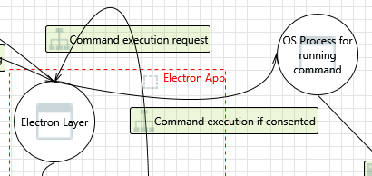

---

### 9. Elevation Using Impersonation  [State: Not Started]  [Priority: High]

**Category:** Elevation Of Privilege  
**Description:** OS Process for running command may be able to impersonate the context of Electron Layer in order to gain additional privilege.

#### Justifications

**Option 1** — Child processes spawned via `spawn()` (`runCmd.ts:399`) inherit the Electron process's UID/GID and full shell environment. The shell environment is obtained lazily via `getShellEnvironment()` (`runCmd.ts:390`), which includes the user's full `PATH`, `HOME`, and any env vars. A trojan binary placed earlier in `PATH` (or a symlink replacing the bundled `az` binary) would execute with the same privileges as Electron. **Confidence: 85%**

*References:* `headlamp/app/electron/runCmd.ts:399-408` (spawn call), `headlamp/app/electron/runCmd.ts:388-390` (shell environment injection).

**Option 2** — The auto-consent system (`addRunCmdConsent` in `runCmd.ts:174-200`) pre-approves 21 command prefixes for aks-desktop (`COMMANDS_WITH_CONSENT.aks_desktop`, lines 145-167), including broad entries like `az role`, `az vm`, `az graph`, and `az acr`. Once consented, these prefixes allow any subcommand/arguments — e.g., `az vm create` or `az role assignment create` would execute without additional user confirmation. A compromised `az` binary could impersonate the Electron context to perform arbitrary Azure operations. **Confidence: 88%**

*References:* `headlamp/app/electron/runCmd.ts:145-167` (COMMANDS_WITH_CONSENT.aks_desktop), `headlamp/app/electron/runCmd.ts:174-200` (addRunCmdConsent).

**Option 3** — On Windows, `spawn()` is called with `shell: true` (`runCmd.ts:394-401`), which means the command is interpreted by `cmd.exe`. This widens the impersonation surface: a trojan `cmd.exe` or a modified `%PATH%` could redirect execution. On non-Windows platforms, `shell: false` is used, which is safer. **Confidence: 80%**

*References:* `headlamp/app/electron/runCmd.ts:394-396` (`useShell = process.platform === 'win32'`).

#### Existing Mitigations in Codebase — **Confidence: 85%**

- **Three-layer command defense** — Commands must pass: (1) `validCommands` allowlist (`runCmd.ts:538`) allowing only `az, kubectl, minikube, scriptjs, kubelogin`; (2) `permissionSecrets` per-plugin per-command (`runCmd.ts:474-481`); (3) user consent dialog for non-auto-consented commands (`runCmd.ts:55-68`).
- **Auto-consent scoping** — Only specific command prefixes in `COMMANDS_WITH_CONSENT` (`runCmd.ts:131-168`) are auto-consented; novel commands still require user approval.
- **One-time secret grant** — Permission secrets are sent to plugins only once per window load (`runCmd.ts:483-495`), preventing replay across sessions.


#### Here are some potential mitigations that might be implemented.

**Mitigation 1** — Verify the integrity (SHA-256 hash) of the bundled `az` binary at app startup before adding it to `PATH`.

**Mitigation 2** — Narrow the `COMMANDS_WITH_CONSENT.aks_desktop` list to only the specific subcommands actually used (e.g., `az aks list`, `az aks get-credentials`, `az account list`) rather than broad prefixes like `az role` or `az vm`.

**Mitigation 3** — On Windows, investigate using `shell: false` with explicit `.exe` paths to avoid `cmd.exe` interpretation.

---

### 10. Spoofing the Electron Layer Process  [State: Not Started]  [Priority: High]

**Category:** Spoofing  
**Description:** Electron Layer may be spoofed by an attacker and this may lead to unauthorized access to OS Process for running command.

#### Justifications

**Option 1** — Commands are triggered via the `run-command` IPC channel. The renderer can only send to this channel through the `contextBridge` whitelist (`preload.ts:44`). The Electron main process handler (`setupRunCmdHandlers` in `runCmd.ts:464-506`) validates every command request through three gates: (1) `validateCommandData` checks command type against `validCommands = ['minikube', 'az', 'kubectl', 'scriptjs', 'kubelogin']` (`runCmd.ts:538`), (2) `checkPermissionSecret` verifies the caller has the correct per-command random number (`runCmd.ts:241-253`), (3) `checkCommandConsent` verifies user consent for the command prefix (`runCmd.ts:101-126`). **Confidence: 85%**

*References:* `headlamp/app/electron/preload.ts:44` (channel whitelist), `headlamp/app/electron/runCmd.ts:464-506` (setupRunCmdHandlers), `headlamp/app/electron/runCmd.ts:538` (validCommands), `headlamp/app/electron/runCmd.ts:241-253` (checkPermissionSecret).

**Option 2** — The `permissionSecrets` are generated using `crypto.getRandomValues()` (`cryptoRandom()` in `runCmd.ts:458`) and are sent to the renderer exactly once per page load (`pluginPermissionSecretsSent` flag, `runCmd.ts:473`). The flag is reset only on `did-frame-finish-load` for the main frame (`runCmd.ts:494-498`). This one-shot delivery prevents replay attacks where a script requests secrets multiple times. **Confidence: 82%**

*References:* `headlamp/app/electron/runCmd.ts:458-462` (cryptoRandom), `headlamp/app/electron/runCmd.ts:473-478` (one-shot send), `headlamp/app/electron/runCmd.ts:494-498` (reset on reload).

**Option 3** — A spoofed Electron process (e.g., a malware binary pretending to be the app) would need to replicate the entire IPC setup including the random `backendToken` (32-byte hex, `main.ts:76`) and the `permissionSecrets`. Without these, it cannot authenticate to the backend or trigger consented commands. **Confidence: 80%**

*References:* `headlamp/app/electron/main.ts:76` (backendToken generation).

#### Existing Mitigations in Codebase — **Confidence: 82%**

- **`contextIsolation: true`** — `main.ts:1633` isolates the Electron main process's preload context from the renderer.
- **`nodeIntegration: false`** — `main.ts:1632` prevents the renderer from accessing Node.js APIs to spoof the main process.
- **IPC channel whitelist** — `preload.ts:36-69` limits communication to 10 send and 13 receive channels; there is no general-purpose IPC channel.
- **Backend token** — `headlamp.go:1218-1231` validates `X-HEADLAMP_BACKEND-TOKEN` on sensitive routes.


#### Here are some potential mitigations that might be implemented.

**Mitigation 1** — Add process-level code signing verification on app startup to ensure the Electron binary has not been tampered with.

**Mitigation 2** — Log all `run-command` IPC events (command, args, permissionSecret match result) to a local audit file for post-incident analysis.

---

### 11. Spoofing the OS Process for running command Process  [State: Not Started]  [Priority: High]

**Category:** Spoofing  
**Description:** OS Process for running command may be spoofed by an attacker and this may lead to information disclosure by Electron Layer.

#### Justifications

**Option 1** — The `az` command path is resolved by `getAzCommand()` in `az-cli-path.ts`, which simply returns the string `'az'` — relying on `PATH` resolution at `spawn()` time. The Electron main process adds the bundled `az-cli/bin` directory to `PATH` at startup, so the bundled binary takes precedence. However, if an attacker can prepend their directory to `PATH` before the app launches (e.g., via `.bashrc` manipulation), their trojan `az` binary would be found first. **Confidence: 80%**

*References:* `plugins/aks-desktop/src/utils/azure/az-cli-path.ts:131-134` (getAzCommand returns `'az'`), `headlamp/app/electron/main.ts` (PATH modification at startup).

**Option 2** — For cluster registration, `aks-cluster.ts` resolves the bundled CLI via absolute paths: `getExecutablePaths()` constructs paths like `path.join(resourcesPath, 'external-tools', 'az-cli', platform, 'bin', 'az')`. This is significantly harder to spoof than `PATH` lookup because it uses `process.resourcesPath`, which points to the app's read-only resources directory. **Confidence: 85%**

*References:* `headlamp/app/electron/aks-cluster.ts` (getExecutablePaths function).

**Option 3** — For `scriptjs` commands, the script path is resolved from the plugins directory and validated: `runScript()` checks `scriptPath.startsWith(baseDir)` / `startsWith(userPluginsDir)` / `startsWith(staticPluginsDir)` before importing (`runCmd.ts:430-445`). A spoofed script outside these directories is rejected. However, if an attacker can write to the user plugins directory, they could place a malicious script there. **Confidence: 82%**

*References:* `headlamp/app/electron/runCmd.ts:424-447` (runScript path validation).

#### Existing Mitigations in Codebase — **Confidence: 80%**

- **`validCommands` allowlist** — `runCmd.ts:538` restricts executable commands to `['minikube', 'az', 'kubectl', 'scriptjs', 'kubelogin']`.
- **Bundled binary paths** — `aks-cluster.ts` uses `getExecutablePaths()` to resolve the bundled `az` binary rather than relying on `PATH`.
- **Permission secrets** — Each command execution requires a matching `permissionSecret` (`runCmd.ts:364,474-481`), preventing arbitrary command injection via IPC.


#### Here are some potential mitigations that might be implemented.

**Mitigation 1** — Use the absolute bundled path (`getExecutablePaths()` pattern from `aks-cluster.ts`) consistently for all `az` invocations, rather than relying on `PATH`-based resolution via `getAzCommand()`.

**Mitigation 2** — Set restrictive filesystem permissions (e.g., `0755` root-owned on Linux/macOS) on the bundled `external-tools/` directory to prevent local user modification.

**Mitigation 3** — Verify the hash of plugin JS files before loading them from the user plugins directory.

---

### 12. Potential Lack of Input Validation for OS Process for running command  [State: Not Started]  [Priority: High]

**Category:** Tampering  
**Description:** Data flowing across Command execution if consented may be tampered with by an attacker. This may lead to a denial of service attack against OS Process for running command or an elevation of privilege attack against OS Process for running command or an information disclosure by OS Process for running command. Failure to verify that input is as expected is a root cause of a very large number of exploitable issues.

#### Justifications

**Option 1** — The consent system (`checkCommandConsent` in `runCmd.ts:101-126`) approves command prefixes formed as `command + ' ' + args[0]` (e.g., `'az aks'`). Only the first argument is included in the consent key — all subsequent arguments pass unchecked. The `validateCommandData` function (`runCmd.ts:512-550`) validates command type (`validCommands` allowlist), argument array type, and permission secret types, but does NOT validate argument _content_ (e.g., no check for shell metacharacters, path traversal, or argument injection). **Confidence: 88%**

*References:* `headlamp/app/electron/runCmd.ts:101-126` (checkCommandConsent, consent key = `command + ' ' + args[0]`), `headlamp/app/electron/runCmd.ts:512-550` (validateCommandData — type checks only).

**Option 2** — The aks-desktop plugin applies GUID validation (`GUID_PATTERN` regex, `az-cli.ts:23-25`) to subscription IDs before using them in Azure Resource Graph queries, preventing KQL injection. The `getClustersViaGraph` function (`az-cli.ts:1626-1632`) calls `isValidGuid(subscriptionId)` and throws `'Invalid subscription ID format'` on failure. However, other user-supplied inputs (cluster names, resource group names) passed as CLI arguments are NOT validated against an allowlist or sanitized for shell metacharacters. **Confidence: 85%**

*References:* `plugins/aks-desktop/src/utils/azure/az-cli.ts:23-25` (GUID_PATTERN), `plugins/aks-desktop/src/utils/azure/az-cli.ts:1626-1632` (getClustersViaGraph validation).

**Option 3** — On non-Windows platforms, `spawn()` is called with `shell: false` (`runCmd.ts:394`), which means arguments are passed directly to the executable without shell interpretation. This inherently prevents shell injection (`;`, `|`, `&&` in arguments won't be interpreted). On Windows, `shell: true` is used, making argument injection more dangerous — shell metacharacters in argument strings could execute arbitrary commands. **Confidence: 82%**

*References:* `headlamp/app/electron/runCmd.ts:394-401` (shell: useShell, Windows = true).

#### Existing Mitigations in Codebase — **Confidence: 55%**

- **GUID validation** — Subscription IDs are validated as GUIDs at 3 call sites before being interpolated into `az` commands.
- **KQL regex validation** — `getClustersViaGraph()` validates `subscriptionId` against `/^[a-zA-Z0-9_-]+$/` before interpolation into KQL queries.
- **`validateCommandData()`** — `runCmd.ts:512-550` strictly validates command name, args array, and options object before execution.


#### Here are some potential mitigations that might be implemented.

**Mitigation 1** — Extend GUID validation to all user-supplied Azure resource identifiers. Add a `isValidResourceName(name: string)` function that rejects names containing characters outside `[a-zA-Z0-9_-]`.  
*References:* `plugins/aks-desktop/src/utils/azure/az-cli.ts:23-28`

**Mitigation 2** — On Windows, escape or quote arguments before passing to `spawn()` with `shell: true`, or investigate switching to `shell: false` with explicit `.exe` paths.

**Mitigation 3** — Add argument validation in `handleRunCommand` (`runCmd.ts:340`) that rejects arguments containing shell metacharacters (`; | & $ \` ' " > < \\ \n`) for all platforms.

---

### 13. Potential Data Repudiation by OS Process for running command  [State: Not Started]  [Priority: High]

**Category:** Repudiation  
**Description:** OS Process for running command claims that it did not receive data from a source outside the trust boundary. Consider using logging or auditing to record the source, time, and summary of the received data.

#### Justifications

**Option 1** — The `handleRunCommand` function (`runCmd.ts:340-420`) spawns commands and pipes stdout/stderr back to the renderer via IPC (`event.sender.send('command-stdout', ...)`, `event.sender.send('command-stderr', ...)`). The output is streamed to the renderer in real-time but is NOT persistently logged to disk. There is no durable record of which command was run, with which arguments, when it was invoked, or what it returned. `console.error` is used only for error paths (failed permission checks), not for successful command invocations. **Confidence: 85%**

*References:* `headlamp/app/electron/runCmd.ts:409-420` (stdout/stderr piped to renderer), `headlamp/app/electron/runCmd.ts:358-362` (error-only logging for validation failures).

**Option 2** — The consent system persists a boolean per command prefix in `settings.json` (`runCmd.ts:85-91`, `SETTINGS_PATH`), which records _that_ consent was given but not _when_ or by whom. This is a minimal consent audit trail but does not log individual command invocations. **Confidence: 80%**

*References:* `headlamp/app/electron/runCmd.ts:72` (SETTINGS_PATH), `headlamp/app/electron/runCmd.ts:85-91` (saveSettings).

**Option 3** — The aks-desktop plugin's `az-cli.ts` has debug logging (`debugLog(...)`) that is enabled only in `NODE_ENV=development` or `DEBUG_AZ_CLI=true` (`az-cli.ts:13-19`). In production, command invocations are not logged at all. **Confidence: 82%**

*References:* `plugins/aks-desktop/src/utils/azure/az-cli.ts:13-19` (DEBUG_LOGS flag), `plugins/aks-desktop/src/utils/azure/az-cli.ts:45-47` (debugLog calls).

#### Existing Mitigations in Codebase — **Confidence: 15%**

- **No application-level audit logging** — There is no centralized audit log for command executions. Only K8s audit logs (server-side) provide a partial trail for cluster operations.
- **OpenTelemetry metrics** — `headlamp.go:1426` records duration metrics but not command-level audit events.
- **Consent dialog display** — The consent dialog (`runCmd.ts:55-68`) is the only user-visible record of command authorization, but it is not persisted as an audit trail.


#### Here are some potential mitigations that might be implemented.

**Mitigation 1** — Log every `handleRunCommand` invocation to a rotating audit log file in `userData/` — capturing: timestamp, command, args (with sensitive values redacted), exit code, and the permissionSecret name that authorized it.

**Mitigation 2** — Add timestamps to the consent records in `settings.json` (`confirmedCommands`) to create a consent timeline.

**Mitigation 3** — Enable opt-in production logging for `az-cli.ts` commands that writes to a structured JSON log file.

---

### 14. Data Flow Sniffing  [State: Not Started]  [Priority: High]

**Category:** Information Disclosure  
**Description:** Data flowing across Command execution if consented may be sniffed by an attacker. Depending on what type of data an attacker can read, it may be used to attack other parts of the system or simply be a disclosure of information leading to compliance violations.

#### Justifications

**Option 1** — The `az` CLI emits sensitive data to stdout that is captured in memory: `az account get-access-token` returns Azure AD bearer tokens (`az-cli.ts:509`), `az account list` returns subscription IDs and tenant IDs (`az-cli.ts:652`), and `az aks get-credentials` writes kubeconfig data including cluster endpoints. A local attacker with `/proc/<pid>/mem` access (Linux) or a debugger (Windows) could read these buffers. **Confidence: 80%**

*References:* `plugins/aks-desktop/src/utils/azure/az-cli.ts:509` (get-access-token), `plugins/aks-desktop/src/utils/azure/az-cli.ts:652` (account list), `headlamp/app/electron/aks-cluster.ts` (get-credentials).

**Option 2** — Stdout/stderr data is relayed from the Electron main process to the renderer via IPC (`event.sender.send('command-stdout', commandData.id, data.toString())` in `runCmd.ts:409-411`). This IPC channel uses Electron's internal serialization (not a network socket), so it cannot be sniffed at the network level. However, any renderer-side code (including plugins) can listen on the `command-stdout` channel via `desktopApi.receive('command-stdout', ...)` (`preload.ts:56`). Plugins could eavesdrop on stdout from commands they didn't initiate by listening for all `command-stdout` events. **Confidence: 85%**

*References:* `headlamp/app/electron/runCmd.ts:409-411` (stdout relay), `headlamp/app/electron/preload.ts:56` (command-stdout in receive whitelist).

**Option 3** — The `command-stdout` IPC messages include the `commandData.id` as a prefix to multiplex output from concurrent commands. However, the `id` is generated by the renderer code (not a secret), so any plugin that knows or guesses the command ID can read the output. **Confidence: 78%**

#### Existing Mitigations in Codebase — **Confidence: 50%**

- **Permission secrets isolation** — Each plugin receives only its own command-specific `permissionSecrets` (`runPlugin.ts:206-207`), not other plugins' secrets.
- **IPC channel whitelist** — `preload.ts:36-69` restricts IPC channels, but `command-stdout`, `command-stderr`, and `command-exit` are broadcast to all listeners in the renderer.


#### Here are some potential mitigations that might be implemented.

**Mitigation 1** — Scope `command-stdout`/`command-stderr`/`command-exit` IPC callbacks to the originating plugin by verifying the `commandData.id` was issued by the requesting plugin's permission context. Only relay output to the sender plugin.

**Mitigation 2** — For commands that return tokens (e.g., `az account get-access-token`), consume the token immediately in the Electron main process rather than piping it to the renderer.

**Mitigation 3** — Clear the stdout buffer variable after command completion to reduce the window during which sensitive data resides in memory.

---

### 15. Potential Process Crash or Stop for OS Process for running command  [State: Not Started]  [Priority: High]

**Category:** Denial Of Service  
**Description:** OS Process for running command crashes, halts, stops or runs slowly; in all cases violating an availability metric.

#### Justifications

**Option 1** — The `handleRunCommand` spawns child processes and attaches `exit` and `error` listeners (`runCmd.ts:409-420`). On exit, `event.sender.send('command-exit', commandData.id, code)` notifies the renderer. However, there is NO timeout mechanism — a hung `az` command (e.g., waiting for network during `az login` or a Resource Graph query) would block indefinitely. The aks-desktop plugin does implement a login timeout (`login()` in `az-cli.ts:621` uses `timeoutMs = 300000` / 5 minutes with polling), but general `az` commands have no timeout. **Confidence: 85%**

*References:* `headlamp/app/electron/runCmd.ts:409-420` (exit/error handlers, no timeout), `plugins/aks-desktop/src/utils/azure/az-cli.ts:620-632` (login-specific 5-minute timeout).

**Option 2** — If the spawned process crashes, Node.js emits an `error` event. The `child.on('error', ...)` is NOT attached in `handleRunCommand` (`runCmd.ts:399-420`) — only `stdout.on('data')`, `stderr.on('data')`, and `on('exit')` are handled. A spawn failure (e.g., `ENOENT` if the binary is missing) would result in an unhandled error that the renderer never hears about — the command would appear to hang silently. **Confidence: 88%**

*References:* `headlamp/app/electron/runCmd.ts:399-420` (only exit/stdout/stderr handled; no error handler). Compare with `executeCommandWithShellEnv` at `runCmd.ts:301-315` which DOES attach an `error` handler.

**Option 3** — The `executeCommandWithShellEnv` utility function (`runCmd.ts:287-315`) does attach both `exit` and `error` handlers (reject on error, resolve on exit). This function is used by `aks-cluster.ts` for cluster registration. The asymmetry between `handleRunCommand` (no error handler) and `executeCommandWithShellEnv` (has error handler) is a notable gap. **Confidence: 82%**

*References:* `headlamp/app/electron/runCmd.ts:287-315` (executeCommandWithShellEnv with error handler).

#### Existing Mitigations in Codebase — **Confidence: 55%**

- **`child.on('error')` in shell path** — `executeCommandWithShellEnv()` (`runCmd.ts:310`) handles `error` events for the login shell subprocess.
- **`validateCommandData()`** — `runCmd.ts:512-550` validates all command parameters before spawning.
- **`validCommands` allowlist** — Prevents spawning of arbitrary binaries.
- **Note: missing handler** — `handleRunCommand()` (`runCmd.ts:340+`) does NOT register `child.on('error')` for the IPC-triggered command execution path.


#### Here are some potential mitigations that might be implemented.

**Mitigation 1** — Add a `child.on('error', ...)` handler to `handleRunCommand` that sends a `command-exit` event with an error code to the renderer, preventing silent hangs on spawn failures.

**Mitigation 2** — Add a configurable timeout (e.g., `setTimeout` + `child.kill('SIGTERM')`) to all spawned commands, defaulting to 5 minutes, with a UI notification when a command times out.

**Mitigation 3** — Track active child processes and add a "cancel" IPC channel so the user can manually kill a hung command from the UI.

---

### 16. Data Flow Command execution if consented Is Potentially Interrupted  [State: Not Started]  [Priority: High]

**Category:** Denial Of Service  
**Description:** An external agent interrupts data flowing across a trust boundary in either direction.

#### Justifications

**Option 1** — A local attacker with sufficient OS privileges could `kill` the spawned `az` child process PID. The `child.on('exit', ...)` handler (`runCmd.ts:417`) sends `command-exit` with the exit code to the renderer. However, if the process is killed with `SIGKILL`, the exit code will be `null`, and the renderer receives `command-exit` with `null`. The aks-desktop plugin's `cli-runner.ts` resolves the promise on the `exit` event regardless of code (`cli-runner.ts:28`), so a killed process appears as a completed command with empty output. **Confidence: 80%**

*References:* `headlamp/app/electron/runCmd.ts:417-418` (exit handler), `plugins/aks-desktop/src/utils/kubernetes/cli-runner.ts:26-29` (exit handler resolves).

**Option 2** — On Linux/macOS, the Electron process runs as the current user. Another process owned by the same user can send signals to the child processes. On Windows, process termination requires `PROCESS_TERMINATE` access right, which is generally available to the same-user context. **Confidence: 75%**

**Option 3** — Network interruptions during `az` commands (e.g., ARM API timeouts, DNS failures) would cause the `az` CLI to emit errors to stderr and exit with a non-zero code. The stderr output is relayed to the renderer and typically displayed as an error message by the plugin UI. **Confidence: 82%**

#### Existing Mitigations in Codebase — **Confidence: 70%**

- **Consent system** — `runCmd.ts:55-68` requires explicit user consent for commands not in the auto-consent list.
- **IPC channel whitelist** — Only `run-command` IPC channel can trigger command execution from the renderer.
- **Single-window architecture** — Only one renderer window exists, limiting the attack surface for IPC interruption.


#### Here are some potential mitigations that might be implemented.

**Mitigation 1** — Implement retry logic with exponential backoff for idempotent commands (e.g., `az account list`, `az aks list`). Non-idempotent commands (e.g., `az aks create`) should not be automatically retried.

**Mitigation 2** — Distinguish between process kill (exit code `null`), non-zero exit (az CLI error), and zero exit (success) in the renderer-side handling, displaying appropriate error messages for each case.

**Mitigation 3** — Add a `child.on('error', ...)` handler (see threat 15) to distinguish spawn failures from process kills.

---

### 17. OS Process for running command May be Subject to Elevation of Privilege Using Remote Code Execution  [State: Not Started]  [Priority: High]

**Category:** Elevation Of Privilege  
**Description:** Electron Layer may be able to remotely execute code for OS Process for running command.

#### Justifications

**Option 1** — The Electron main process spawns OS processes based on data received from the renderer via the `run-command` IPC channel. The three-layer defense prevents arbitrary RCE: (1) `validateCommandData` restricts the `command` field to the `validCommands` allowlist (`['minikube', 'az', 'kubectl', 'scriptjs', 'kubelogin']`, `runCmd.ts:538`), (2) `checkPermissionSecret` verifies a per-plugin cryptographic random number (`runCmd.ts:241-253`), (3) `checkCommandConsent` verifies the command prefix is in the consented list (`runCmd.ts:101-126`). A renderer-side attacker cannot bypass all three without obtaining the correct `permissionSecrets` number. **Confidence: 85%**

*References:* `headlamp/app/electron/runCmd.ts:538` (validCommands), `headlamp/app/electron/runCmd.ts:241-253` (checkPermissionSecret), `headlamp/app/electron/runCmd.ts:101-126` (checkCommandConsent).

**Option 2** — The `permissionSecrets` are per-plugin random numbers generated via `crypto.getRandomValues()` and delivered once per page load. However, the secrets are delivered to the renderer as a flat object (`permissionSecrets` map in `runCmd.ts:476-478`), and the `getInfoForRunningPlugins` function (`runPlugin.ts:88-132`) filters them per-plugin via `getAllowedPermissions`. A plugin receives only its own allowed secrets. But if the global `window.pluginLib` object or the Redux store is accessible to a malicious plugin, it could potentially intercept another plugin's secrets from memory. **Confidence: 78%**

*References:* `headlamp/app/electron/runCmd.ts:476-478` (secrets sent to renderer), `headlamp/frontend/src/plugin/runPlugin.ts:117-118` (getAllowedPermissions filtering).

**Option 3** — For `scriptjs` commands, the executable is `process.execPath` (the Electron binary itself) with the plugin script as an argument (`runCmd.ts:380-381`). The `runScript()` function validates that the script path starts with one of three allowed directories (`runCmd.ts:430-445`). If path traversal is possible via `..` in the argument, an attacker could execute arbitrary scripts. The `path.resolve()` call normalizes the path before the `startsWith` check, which prevents `..` traversal. **Confidence: 83%**

*References:* `headlamp/app/electron/runCmd.ts:378-381` (scriptjs execution), `headlamp/app/electron/runCmd.ts:424-447` (runScript with path validation).

#### Existing Mitigations in Codebase — **Confidence: 85%**

- **`validCommands` allowlist** — `runCmd.ts:538` restricts to 5 allowed commands.
- **Permission secrets** — `runCmd.ts:474-481` generates per-command cryptographic random secrets.
- **Consent dialog** — `runCmd.ts:55-68` for non-auto-consented commands.
- **Script path sandboxing** — `runCmd.ts:259-276,432-442` restricts scripts to plugin directories only.


#### Here are some potential mitigations that might be implemented.

**Mitigation 1** — Add integration tests that verify `checkPermissionSecret` correctly rejects forged secrets and that `validateCommandData` rejects commands outside the allowlist.

**Mitigation 2** — Consider making the `permissionSecrets` delivery a two-phase protocol where each plugin's secrets are sent to an isolated IPC channel rather than broadcast to the renderer.

**Mitigation 3** — For `scriptjs` commands, additionally verify the script file's hash against a known manifest before executing.

---

### 18. Elevation by Changing the Execution Flow in OS Process for running command  [State: Not Started]  [Priority: High]

**Category:** Elevation Of Privilege  
**Description:** An attacker may pass data into OS Process for running command in order to change the flow of program execution within OS Process for running command to the attacker's choosing.

#### Justifications

**Option 1** — On Windows (`process.platform === 'win32'`), `spawn()` is called with `shell: true` (`runCmd.ts:394-401`). This means arguments are passed through `cmd.exe`, where shell metacharacters (`&`, `|`, `>`, `<`, `^`, `%`) in argument values can alter execution flow. For example, if a cluster name like `test & calc.exe` is passed as an argument to `az aks list --name "test & calc.exe"`, `cmd.exe` would execute `calc.exe` after the `az` command. Since `az-cli.ts` does not sanitize cluster names or resource group names, this is a real vector on Windows. **Confidence: 85%**

*References:* `headlamp/app/electron/runCmd.ts:394-401` (shell: true on Windows), `plugins/aks-desktop/src/utils/azure/az-cli.ts` (no sanitization of cluster/resource-group names).

**Option 2** — On non-Windows platforms, `shell: false` is used, which passes arguments as an array directly to `execvp()`. Shell metacharacters are not interpreted. Argument injection (e.g., `--exec=...`) is still theoretically possible but much harder to exploit and depends on the target binary's argument parsing. **Confidence: 88%**

*References:* `headlamp/app/electron/runCmd.ts:394` (shell: false on non-Windows).

**Option 3** — The `commandData.options` object is spread into the `spawn()` options (`runCmd.ts:400`: `...commandData.options`). This object comes from the renderer and is not validated beyond being an `object`. An attacker in the renderer could set `commandData.options.cwd` to a sensitive directory, or `commandData.options.env` to inject environment variables. The `env` field is overridden by `shellEnv` (`runCmd.ts:402-404`), but `cwd` and other spawn options are not sanitized. **Confidence: 80%**

*References:* `headlamp/app/electron/runCmd.ts:399-408` (options spread).

#### Existing Mitigations in Codebase — **Confidence: 85%**

- **Three-layer defense** — (1) `validCommands` allowlist (`runCmd.ts:538`); (2) `permissionSecrets` per-plugin per-command (`runCmd.ts:474-481`); (3) consent dialog (`runCmd.ts:55-68`).
- **`validateCommandData()` strict validation** — `runCmd.ts:512-550` validates command name, args, and options.
- **Script directory restriction** — Scripts can only be loaded from `/plugins/`, `/static-plugins/`, or `/user-plugins/` directories.


#### Here are some potential mitigations that might be implemented.

**Mitigation 1** — Sanitize or escape all CLI arguments on Windows before passing to `spawn()` with `shell: true`. At minimum, wrap each argument in double quotes and escape internal quotes. Better: switch to `shell: false` on Windows and resolve the `ENOENT` issue with explicit `.exe`/`.cmd` paths.

**Mitigation 2** — Whitelist the `commandData.options` fields that are allowed to be set from the renderer (e.g., only allow `timeout`), and strip all others (especially `cwd`, `env`, `shell`, `uid`, `gid`).

**Mitigation 3** — Add input validation for Azure resource names (cluster names, resource group names) that rejects values containing shell metacharacters or non-printable characters.

---

## Interaction: Command execution request
*(Web Frontend → Electron Layer)*

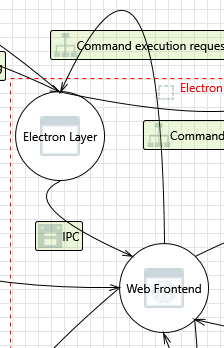

---

### 19. Web Frontend Process Memory Tampered  [State: Not Started]  [Priority: High]

**Category:** Tampering  
**Description:** If Web Frontend is given access to memory, such as shared memory or pointers, or is given the ability to control what Electron Layer executes (for example, passing back a function pointer.), then Web Frontend can tamper with Electron Layer. Consider if the function could work with less access to memory, such as passing data rather than pointers. Copy in data provided, and then validate it.

#### Justifications

**Option 1** — `contextIsolation: true` (`main.ts:1633`) creates a separate JavaScript context for the preload script, preventing the renderer from accessing or patching the preload's functions or variables. The `contextBridge.exposeInMainWorld('desktopApi', {...})` (`preload.ts:34-152`) copies function references into the renderer's context — the renderer gets callable stubs but cannot reach the internal `ipcRenderer` object. This is Electron's strongest defense against renderer↔main memory tampering. **Confidence: 90%**

*References:* `headlamp/app/electron/main.ts:1632-1633` (webPreferences), `headlamp/app/electron/preload.ts:34-152` (contextBridge definition).

**Option 2** — The renderer cannot pass function pointers or callbacks to the Electron main process through the `contextBridge` — only serializable data (strings, numbers, objects, arrays) crosses the bridge. The `ipcRenderer.on()` calls in the preload (`preload.ts:55-68`) strip the `event` object before forwarding to the renderer (`(event, ...args) => func(...args)`), preventing the renderer from accessing `event.sender` (which could be used to impersonate). **Confidence: 88%**

*References:* `headlamp/app/electron/preload.ts:60` (event stripping: `ipcRenderer.on(channel, (event, ...args) => func(...args))`).

**Option 3** — The `commandData.options` spread in `handleRunCommand` (`runCmd.ts:400`) is a partial exception: the renderer can pass an arbitrary options object via the `run-command` IPC message, and it is spread into `spawn()` options. While the serialization prevents function pointers, it does allow setting `cwd`, `env`, `detached`, etc. See threat 18. **Confidence: 82%**

*References:* `headlamp/app/electron/runCmd.ts:399-400` (`...commandData.options` spread).

#### Existing Mitigations in Codebase — **Confidence: 65%**

- **`contextIsolation: true`** — `main.ts:1633` prevents plugin code from accessing Node.js internals.
- **`nodeIntegration: false`** — `main.ts:1632` blocks Node API access from the renderer.
- **Private Function constructor** — `runPlugin.ts:199-201` uses a private `Function` constructor to prevent prototype pollution.
- **Plugin error isolation** — `runPlugin.ts:203-212` wraps plugin execution in try-catch to contain crashes.
- **Note: remaining surface** — `webContents.executeJavaScript()` at `main.ts:1672` injects the backend port into the renderer, which is a main→renderer code injection surface.


#### Here are some potential mitigations that might be implemented.

**Mitigation 1** — Keep Electron and Chromium up-to-date to maintain the integrity of the renderer sandbox and `contextIsolation` barrier.

**Mitigation 2** — Sanitize the `commandData.options` object in `handleRunCommand` to only allow a known-safe subset of `spawn()` options (see threat 18, mitigation 2).

**Mitigation 3** — Consider enabling the `sandbox: true` webPreference (in addition to `contextIsolation: true`) to further restrict the renderer process's OS-level capabilities.

---

### 20. Elevation Using Impersonation  [State: Not Started]  [Priority: High]

**Category:** Elevation Of Privilege  
**Description:** Electron Layer may be able to impersonate the context of Web Frontend in order to gain additional privilege.

#### Justifications

**Option 1** — The Electron main process sends data to the renderer via `mainWindow.webContents.send()` on whitelisted channels. It sends: the `backend-token` (32-byte hex string, `main.ts:1841`), `plugin-permission-secrets` (per-command random numbers, `runCmd.ts:477`), `command-stdout`/`command-stderr`/`command-exit` (command output, `runCmd.ts:409-418`), and `appConfig`/`locale`/`currentMenu` (UI configuration). The `backend-token` is the most sensitive — it authorizes the renderer to make authenticated requests to the Go backend. A compromised Electron main process could send crafted data to the renderer, but since the main process already has higher privilege than the renderer, this is an expected trust relationship. **Confidence: 82%**

*References:* `headlamp/app/electron/main.ts:1840-1841` (backend-token), `headlamp/app/electron/runCmd.ts:476-478` (permission-secrets), `headlamp/app/electron/runCmd.ts:409-418` (command output).

**Option 2** — The renderer validates the `backend-token` IPC message by storing the token and including it as `X-HEADLAMP_BACKEND-TOKEN` in HTTP requests to the Go backend. However, the renderer does not validate the _source_ of the `backend-token` message — any code that can call `ipcRenderer.on('backend-token', ...)` receives the token. Since the preload strips the event sender (`preload.ts:60`), the renderer cannot verify which process sent the message. In the current architecture this is acceptable because only the main process can send IPC messages to the renderer. **Confidence: 80%**

*References:* `headlamp/app/electron/preload.ts:60` (event sender stripped), `headlamp/app/electron/main.ts:1840-1841`.

**Option 3** — The main process also executes JavaScript in the renderer via `mainWindow.webContents.executeJavaScript()` (`main.ts:1672`): `window.headlampBackendPort = ${actualPort}`. This is a legitimate use to inject the backend port, but it demonstrates that the main process can execute arbitrary code in the renderer context. If the main process were compromised, this is an escalation path. **Confidence: 78%**

*References:* `headlamp/app/electron/main.ts:1672` (executeJavaScript).

#### Existing Mitigations in Codebase — **Confidence: 82%**

- **Three-layer command defense** — See threat #9 for details.
- **Auto-consent list** — `COMMANDS_WITH_CONSENT` (`runCmd.ts:131-168`) limits which commands bypass the consent dialog.
- **Permission secrets** — Per-plugin, per-command cryptographic secrets verified before execution.


#### Here are some potential mitigations that might be implemented.

**Mitigation 1** — Replace `webContents.executeJavaScript()` with IPC messaging for the backend port (similar to `request-backend-port` / `backend-port` which already exists at `main.ts:1844-1849`). This would eliminate the `executeJavaScript` call, reducing the main→renderer code injection surface.

**Mitigation 2** — Validate IPC message payloads in the renderer using JSON schema or TypeScript type guards before using received data (e.g., validate that `backend-token` is a hex string of expected length).

**Mitigation 3** — Document the trust relationship: the Electron main process is the most privileged component and is expected to have full control over the renderer. Threats in this direction are primarily relevant if the main process binary is replaced or code-injected.

---

## Interaction: Command running consent request
*(Electron Layer → Human User)*

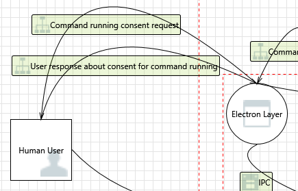

---

### 21. Spoofing of the Human User External Destination Entity  [State: Not Started]  [Priority: High]

**Category:** Spoofing  
**Description:** Human User may be spoofed by an attacker and this may lead to data being sent to the attacker's target instead of Human User.

#### Justifications

**Option 1** — The consent dialog uses `dialog.showMessageBoxSync()` (`runCmd.ts:60-69`), which is an OS-native modal dialog attached to the `mainWindow` BrowserWindow. It cannot be spoofed by web content or plugins because it runs in the Electron main process, not the renderer. The dialog displays the consent key (command + first argument) and returns `0` for "Allow" or `1` for "Deny". If `mainWindow` is `null`, the function returns `false` (deny by default, line 59). **Confidence: 85%**

*References:* `headlamp/app/electron/runCmd.ts:55-72` (confirmCommandDialog implementation).

**Option 2** — For the aks-desktop plugin, `addRunCmdConsent()` is called at startup (`main.ts:1464`), which auto-writes `true` for 21 command prefixes including `az`, `az aks`, `az role`, `az vm`, `az graph`, and `kubectl top` (`runCmd.ts:145-170`). The consent dialog is never shown for these commands — the "human user" is completely bypassed. An attacker who gains control of the renderer (e.g., via a malicious plugin) can execute any `az` sub-command without user interaction. **Confidence: 90%**

*References:* `headlamp/app/electron/runCmd.ts:145-170` (COMMANDS_WITH_CONSENT list), `headlamp/app/electron/runCmd.ts:173-204` (addRunCmdConsent writes to settings.json).

**Option 3** — The consent key is formed as `command + ' ' + args[0]` (`runCmd.ts:110-113`). Only the first argument is included — meaning `az aks get-credentials --resource-group attacker-rg` would match the broad `az aks` consent key. The consent system cannot distinguish between safe and dangerous argument combinations. **Confidence: 88%**

*References:* `headlamp/app/electron/runCmd.ts:107-113` (consent key construction).

#### Existing Mitigations in Codebase — **Confidence: 55%**

- **OS session trust model** — Headlamp trusts the OS login session as user identity; no application-level authentication exists.
- **`safeStorage` encryption** — Sensitive tokens encrypted via OS-level key storage (`secure-storage.ts:96-123`), so a different OS user cannot decrypt them.
- **File permissions on safeStorage** — `secure-storage.ts:70` writes with `0o600` (owner-only), preventing other OS users from reading the encrypted store.


#### Here are some potential mitigations that might be implemented.

**Mitigation 1** — Narrow the `COMMANDS_WITH_CONSENT` list to specific subcommands actually used (e.g., `az aks list`, `az aks get-credentials`, `az account list`) rather than broad prefixes like `az role` or `az vm`.  
*References:* `headlamp/app/electron/runCmd.ts:145-170`

**Mitigation 2** — Include more arguments in the consent key (at minimum the first two), so `az aks list` and `az aks create` require separate consent.

**Mitigation 3** — Show a summary notification (non-blocking) each time an auto-consented command executes, so the user has visibility into what commands are being run.

---

### 22. External Entity Human User Potentially Denies Receiving Data  [State: Not Started]  [Priority: High]

**Category:** Repudiation  
**Description:** Human User claims that it did not receive data from a process on the other side of the trust boundary.

#### Justifications

**Option 1** — Consent decisions are persisted to `settings.json` at `<userData>/settings.json` (`runCmd.ts:70`) using `JSON.stringify` via `saveSettings()` (`runCmd.ts:90-92`). The file stores a flat `confirmedCommands` object mapping consent keys (e.g., `"az aks"`) to boolean `true/false` (`runCmd.ts:122-126`). This provides a basic audit trail, but records only the final decision, not when it was made or by whom. **Confidence: 78%**

*References:* `headlamp/app/electron/runCmd.ts:70` (SETTINGS_PATH), `headlamp/app/electron/runCmd.ts:86-96` (loadSettings/saveSettings), `headlamp/app/electron/runCmd.ts:118-126` (consent persistence).

**Option 2** — The `settings.json` file is written with default permissions (`fs.writeFileSync` without explicit mode, `runCmd.ts:91`), meaning it inherits the process umask. On macOS/Linux with a typical umask of `0o22`, the file is world-readable (`0o644`). Contrast this with `secure-storage.json`, which uses `0o600` permissions and atomic write-then-rename (`secure-storage.ts:71-83`). A local attacker could modify `settings.json` to inject false consent records. **Confidence: 82%**

*References:* `headlamp/app/electron/runCmd.ts:91` (writeFileSync without mode), `headlamp/app/electron/secure-storage.ts:71-83` (atomic write with 0o600 for comparison).

**Option 3** — Auto-consented commands (written by `addRunCmdConsent`, `runCmd.ts:173-204`) are indistinguishable from user-consented commands in the settings file — both store `true`. There is no way to audit which commands were auto-consented vs. user-approved. **Confidence: 85%**

*References:* `headlamp/app/electron/runCmd.ts:199-200` (auto-consent writes same format as user consent).

#### Existing Mitigations in Codebase — **Confidence: 40%**

- **Consent dialog** — `runCmd.ts:55-68` displays command details before execution, giving the user an opportunity to deny.
- **Settings persistence** — Consent choices saved in `settings.json` for future reference.
- **Note: no tamper protection** — `settings.json` is written with `fs.writeFileSync` without explicit file permissions and without integrity checks.


#### Here are some potential mitigations that might be implemented.

**Mitigation 1** — Add a timestamp, source (`"user"` / `"auto-consent"`), and plugin name to each consent record in `settings.json` for full auditability.

**Mitigation 2** — Set `settings.json` file permissions to `0o600` (as is done for `secure-storage.json`) to prevent local tampering.

**Mitigation 3** — Use the atomic temp-file-then-rename pattern from `secure-storage.ts:71-83` to prevent partial writes to `settings.json`.

---

### 23. Data Flow Command running consent request Is Potentially Interrupted  [State: Not Started]  [Priority: High]

**Category:** Denial Of Service  
**Description:** An external agent interrupts data flowing across a trust boundary in either direction.

#### Justifications

**Option 1** — The consent dialog uses `dialog.showMessageBoxSync()` (`runCmd.ts:60`), a synchronous modal dialog. It blocks the Electron main process until the user responds. If the BrowserWindow is destroyed while the dialog is pending, Electron may return `0` (the first button index, which is "Allow") as a default. This could result in a fail-open behavior — closing the window may auto-consent. **Confidence: 82%**

*References:* `headlamp/app/electron/runCmd.ts:60-68` (showMessageBoxSync). Note: Electron's behavior when a BrowserWindow is destroyed during `showMessageBoxSync` may vary by platform and should be tested.

**Option 2** — `confirmCommandDialog()` checks `if (mainWindow === null) return false` at the top (`runCmd.ts:59`), but this only guards against a null reference, not a window that is destroyed while the dialog is visible. Once the dialog is displayed, there is no guard against the window being closed mid-dialog. **Confidence: 78%**

*References:* `headlamp/app/electron/runCmd.ts:58-59` (null check before dialog).

**Option 3** — Since AKS Desktop auto-consents all `az *` commands at startup, this dialog interruption threat is largely moot for the aks-desktop plugin — the dialog is never shown for consented commands. However, any non-auto-consented command (e.g., from a third-party plugin) would be affected. **Confidence: 85%**

#### Existing Mitigations in Codebase — **Confidence: 70%**

- **IPC channel whitelist** — `preload.ts:36-69` limits available channels, reducing the surface for interruption.
- **Electron's built-in IPC** — Uses Chromium's message passing which is reliable within a single host.
- **Single-window architecture** — Only one renderer↔main IPC channel pair exists.


#### Here are some potential mitigations that might be implemented.

**Mitigation 1** — After `showMessageBoxSync` returns, verify the mainWindow is still alive before treating the result as valid; if the window is destroyed, treat the result as denial.

**Mitigation 2** — Log the consent dialog result and the window state at the time of return, to detect interrupted consent flows.

---

## Interaction: HTTP
*(Web Frontend ↔ Backend Process)*

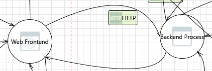

---

### 24. Web Frontend Process Memory Tampered  [State: Not Started]  [Priority: High]

**Category:** Tampering  
**Description:** If Web Frontend is given access to memory, it can tamper with Backend Process.

#### Justifications

**Option 1** — The frontend and backend are separate OS processes communicating via HTTP on `localhost:<port>`. There is no shared memory. The Electron renderer (frontend) sends requests to the Go binary (backend) over TCP. The actual attack surface is HTTP request manipulation, not memory tampering. **Confidence: 85%**

**Option 2** — The `X-HEADLAMP_BACKEND-TOKEN` header authenticates requests to the backend. It is generated as 32 random bytes (`randomBytes(32).toString('hex')`, `main.ts:76`) and transmitted to the renderer via IPC (`ipcMain.on('request-backend-token', ...)`, `main.ts:1840-1841`). The renderer stores it in a module-scoped variable (`getHeadlampAPIHeaders.ts:29`) and attaches it to every backend request. However, only 5 of 30+ route handlers actually check this token (`headlamp.go:304,1261,1788,1996` + the `checkHeadlampBackendToken` definition at line 1221). The K8s API proxy routes (`/clusters/{clusterName}/{api:.*}`, line 1527), plugin file serving (`/plugins/`, `/user-plugins/`, `/static-plugins/`), `/config`, portforward endpoints, and external proxy are NOT protected by the backend token. **Confidence: 88%**

*References:* `headlamp/app/electron/main.ts:76` (token generation), `headlamp/app/electron/main.ts:1840-1841` (token IPC), `headlamp/frontend/src/helpers/getHeadlampAPIHeaders.ts:29,49` (token header), `headlamp/backend/cmd/headlamp.go:304,1261,1788,1996` (5 token checks), `headlamp/backend/cmd/headlamp.go:256,266,273,513-524,540,651` (unprotected routes).

**Option 3** — The K8s API proxy (`/clusters/{clusterName}/{api:.*}`) does not require the backend token but does require a Kubernetes bearer token via the `Authorization` header or cluster cookie. A local process that can reach `localhost:<port>` with a valid K8s token can bypass the frontend entirely. **Confidence: 82%**

*References:* `headlamp/backend/pkg/auth/auth.go:75-100` (ParseClusterAndToken), `headlamp/backend/cmd/headlamp.go:1527` (API proxy route registration).

#### Existing Mitigations in Codebase — **Confidence: 75%**

- **`contextIsolation: true`** — `main.ts:1633` protects preload context from renderer manipulation.
- **`nodeIntegration: false`** — `main.ts:1632` blocks direct memory access via Node APIs.
- **Private Function constructor** — `runPlugin.ts:199-201` isolates plugin execution from the global `Function` prototype.


#### Here are some potential mitigations that might be implemented.

**Mitigation 1** — Extend `checkHeadlampBackendToken` to cover all state-changing and sensitive endpoints, not just plugin deletion, Helm, and cluster management routes.

**Mitigation 2** — Apply the backend token check as middleware on the entire router (except perhaps the /config endpoint) rather than per-handler, to prevent accidentally unprotected routes.

**Mitigation 3** — Use Electron's `session.webRequest.onBeforeSendHeaders` to inject the backend token automatically for all requests to `localhost:<actualPort>`, ensuring it's never accidentally omitted.

---

### 25. Elevation Using Impersonation  [State: Not Started]  [Priority: High]

**Category:** Elevation Of Privilege  
**Description:** Backend Process may be able to impersonate the context of Web Frontend.

#### Justifications

**Option 1** — The backend Go binary runs as the same OS user as the Electron main process. It has direct access to the kubeconfig file at `~/.kube/config` (or the path specified via `--kubeconfig`). If the backend is compromised, it can make arbitrary Kubernetes API calls using any cluster context in the kubeconfig — potentially more than the frontend UI exposes. **Confidence: 82%**

*References:* `headlamp/app/electron/main.ts:809-814` (server args including kubeconfig), `headlamp/backend/cmd/headlamp.go:1909-1927` (processManualConfig stores cluster configs).

**Option 2** — The backend also has the `HEADLAMP_BACKEND_TOKEN` in its environment (`main.ts:845`), which means a compromised backend could forge requests that appear to come from the legitimate frontend. Since the token validation is a simple string comparison (`backendToken != backendTokenEnv`, `headlamp.go:1229`), there is no additional cryptographic binding. **Confidence: 80%**

*References:* `headlamp/app/electron/main.ts:845` (token set in env), `headlamp/backend/cmd/headlamp.go:1227-1229` (env-based comparison).

**Option 3** — The backend process has `HEADLAMP_CONFIG_ALLOW_KUBECONFIG_CHANGES=true` set in its environment (`main.ts:843`), granting it permission to write to the kubeconfig file. A compromised backend could add malicious cluster contexts pointing to an attacker-controlled K8s API server. **Confidence: 85%**

*References:* `headlamp/app/electron/main.ts:843` (HEADLAMP_CONFIG_ALLOW_KUBECONFIG_CHANGES=true).

#### Existing Mitigations in Codebase — **Confidence: 82%**

- **Three-layer command defense** — (1) `validCommands`; (2) `permissionSecrets`; (3) consent dialog. See threat #9.
- **IPC event stripping** — `preload.ts:68` strips the IPC event object to prevent plugins from accessing sender metadata.


#### Here are some potential mitigations that might be implemented.

**Mitigation 1** — Run the backend process with reduced filesystem permissions — particularly, restrict write access to the kubeconfig file to only the Electron main process.

**Mitigation 2** — Use a dedicated, scoped service account token for the backend rather than the user's full kubeconfig, limiting the blast radius of a compromise.

**Mitigation 3** — Drop the backend process into a sandboxed environment (e.g., macOS sandbox profile, Linux seccomp-bpf) that restricts network and filesystem access to only what is needed.

---

### 26. Spoofing the Web Frontend Process  [State: Not Started]  [Priority: High]

**Category:** Spoofing  
**Description:** Web Frontend may be spoofed by an attacker.

#### Justifications

**Option 1** — The `X-HEADLAMP_BACKEND-TOKEN` is a 64-character hex string (32 random bytes) generated at startup (`main.ts:76`). It is transmitted to the backend via `process.env.HEADLAMP_BACKEND_TOKEN` (`main.ts:845`) and to the renderer via IPC (`ipcMain.on('request-backend-token')`, `main.ts:1840`). A local attacker who can read the Electron process's environment (via `/proc/<pid>/environ` on Linux, or Process Explorer on Windows) can extract this token and impersonate the frontend. **Confidence: 85%**

*References:* `headlamp/app/electron/main.ts:76` (randomBytes generation), `headlamp/app/electron/main.ts:845` (env var injection), `headlamp/app/electron/main.ts:1840-1841` (IPC delivery).

**Option 2** — The token validation in the backend uses `os.Getenv("HEADLAMP_BACKEND_TOKEN")` and a simple equality check (`headlamp.go:1227-1229`). There is no constant-time comparison (`subtle.ConstantTimeCompare`), making it theoretically vulnerable to timing side-channel attacks over the localhost HTTP connection. However, exploitation over TCP loopback is extremely difficult in practice. **Confidence: 75%**

*References:* `headlamp/backend/cmd/headlamp.go:1226-1231` (checkHeadlampBackendToken implementation).

**Option 3** — Because the backend token is set as an environment variable, it is inherited by all child processes spawned by the backend (e.g., `az`, `kubectl`, Helm). Any of these child processes could read the token from their environment. **Confidence: 80%**

*References:* `headlamp/app/electron/main.ts:845` (process.env inheritance).

#### Existing Mitigations in Codebase — **Confidence: 85%**

- **`contextIsolation: true`** — Prevents renderer from impersonating the preload context.
- **`setWindowOpenHandler`** — Blocks navigation to external origins.
- **`will-navigate` handler** — Prevents redirect to non-`file://` URLs.
- **CSP via `webPreferences`** — Renderer loads only from `file://` URLs.


#### Here are some potential mitigations that might be implemented.

**Mitigation 1** — Transmit the backend token to the Go binary via stdin (pipe) or a temporary file with `0o600` permissions, rather than via environment variable, to prevent inheritance by child processes.

**Mitigation 2** — Use `subtle.ConstantTimeCompare` in `checkHeadlampBackendToken` to prevent timing side-channels.

**Mitigation 3** — Regenerate the backend token on each app restart (currently done — `randomBytes(32)` at startup) and ensure it is not logged or persisted to disk.

---

### 27. Spoofing the Backend Process Process  [State: Not Started]  [Priority: High]

**Category:** Spoofing  
**Description:** Backend Process may be spoofed by an attacker and this may lead to information disclosure by Web Frontend.

#### Justifications

**Option 1** — Port binding race condition: The Electron main process uses `findAvailablePort()` (`main.ts:773-798`) which checks port availability using `isPortAvailable()` (creates a temporary `net.Server`, binds, then closes). The backend Go binary is started _after_ this check with `--port=${actualPort}` (`main.ts:809`). Between the port probe closing and the backend binding, a malicious local process could bind to the same port (TOCTOU). The `exclusive: true` flag (`main.ts:760`) only applies to the probe server, not the Go backend. **Confidence: 85%**

*References:* `headlamp/app/electron/main.ts:751-762` (isPortAvailable probe with exclusive), `headlamp/app/electron/main.ts:773-798` (findAvailablePort), `headlamp/app/electron/main.ts:806-809` (startServer with --port flag).

**Option 2** — The backend port is injected into the renderer via `webContents.executeJavaScript('window.headlampBackendPort = ${actualPort}')` (`main.ts:1672`) and also via IPC (`ipcMain.on('request-backend-port')`, `main.ts:1844-1845`). The frontend connects to `http://localhost:<port>` without any server identity verification. A spoofed backend at the same port would receive the frontend's `X-HEADLAMP_BACKEND-TOKEN` and all Kubernetes bearer tokens. **Confidence: 88%**

*References:* `headlamp/app/electron/main.ts:1672` (executeJavaScript injection), `headlamp/app/electron/main.ts:1844-1845` (IPC port delivery), `headlamp/frontend/src/helpers/getHeadlampAPIHeaders.ts:44-49` (token attached to all requests).

**Option 3** — The exit handler on the backend process (`main.ts:1488-1512`) detects when the server exits with `ERROR_ADDRESS_IN_USE` (code 98) and prompts the user to either kill the conflicting process or quit. This partially mitigates the race condition but only handles the specific case where the Go binary itself fails to bind. **Confidence: 75%**

*References:* `headlamp/app/electron/main.ts:1488-1512` (exit handler for address-in-use).

#### Existing Mitigations in Codebase — **Confidence: 65%**

- **Loopback-only binding** — Backend binds to `127.0.0.1`, not accessible from the network.
- **Backend token** — `headlamp.go:1218-1231` validates `X-HEADLAMP_BACKEND-TOKEN` on protected routes.
- **CORS with token** — While CORS allows any origin, the backend token prevents unauthorized cross-origin access to sensitive routes.


#### Here are some potential mitigations that might be implemented.

**Mitigation 1** — Use a Unix Domain Socket (or Windows Named Pipe) instead of TCP localhost. This eliminates the port-binding race entirely, as socket file paths are protected by filesystem permissions.

**Mitigation 2** — Have the Go backend generate the backend token itself and communicate it back to the Electron main process via stdout, eliminating the environment variable and adding mutual authentication.

**Mitigation 3** — Use HTTPS with a self-signed certificate generated at startup. The Electron renderer would pin the certificate, preventing a local attacker from intercepting traffic even if they bind to the same port.

---

### 28. Potential Lack of Input Validation for Backend Process  [State: Not Started]  [Priority: High]

**Category:** Tampering  
**Description:** Data flowing across HTTP may be tampered with by an attacker. Failure to verify that input is as expected is a root cause of a very large number of exploitable issues.

#### Justifications

**Option 1** — The SPA handler (`pkg/spa/spaHandler.go:22-36`) has robust path traversal protection: it rejects paths containing `..` (line 23), uses `filepath.Clean` (line 36), resolves absolute paths (line 42), and verifies the result is within `staticPath` using `strings.HasPrefix` (line 46). However, the plugin file servers (`/plugins/`, `/user-plugins/`, `/static-plugins/`) use raw `http.FileServer(http.Dir(...))` handlers (`headlamp.go:249,261,272`) without any path traversal check. Go's `http.FileServer` does sanitize paths internally, but does not prevent symlink following. **Confidence: 85%**

*References:* `headlamp/backend/pkg/spa/spaHandler.go:22-47` (path traversal protection), `headlamp/backend/cmd/headlamp.go:249,261,272` (plugin FileServer — no extra validation).

**Option 2** — The bearer token validation uses a permissive regex `^[\x21-\x7E]+$` (`auth.go:69`), which accepts any printable ASCII. This is correct per RFC 6750 §2.1. Token extraction from the `Authorization` header (`auth.go:88-90`) strips the `Bearer ` prefix and trims whitespace. If the header contains a comma, the function returns an empty token (`auth.go:87`), which is a defense against header injection. **Confidence: 82%**

*References:* `headlamp/backend/pkg/auth/auth.go:67-100` (ParseClusterAndToken with regex validation and comma defense).

**Option 3** — The `processManualConfig` endpoint (`headlamp.go:1909-1927`) accepts an attacker-controlled `Server` URL field via the `ClusterReq` JSON body. The only validation is that `Name` and `Server` are non-nil (`headlamp.go:1849`). There is no URL scheme validation, private IP range blocking, or DNS rebinding protection. An attacker who can reach the `/cluster` endpoint (protected by `checkHeadlampBackendToken`, line 1788) could add a cluster pointing to `http://169.254.169.254` (cloud metadata) or any internal service. **Confidence: 88%**

*References:* `headlamp/backend/cmd/headlamp.go:1841-1852` (decodeClusterRequest — minimal validation), `headlamp/backend/cmd/headlamp.go:1909-1927` (processManualConfig — no URL validation).

#### Existing Mitigations in Codebase — **Confidence: 35%**

- **`http.FileServer` path traversal protection** — Go's `http.FileServer` handles `..` path traversal for plugin file serving.
- **Backend token on some routes** — Token is checked on plugin DELETE, Helm, cluster add/delete routes.
- **Note: no `MaxBytesReader`** — All `json.NewDecoder(r.Body)` calls lack request body size limits. No `ReadTimeout`/`WriteTimeout` on the HTTP server.


#### Here are some potential mitigations that might be implemented.

**Mitigation 1** — Validate the `Server` URL in `processManualConfig`: require `https://` scheme, block private IP ranges (169.254.x.x, 10.x.x.x, 127.x.x.x, etc.), and verify the hostname resolves to a public IP.

**Mitigation 2** — Add symlink-following protection to the plugin file servers, either by resolving symlinks and checking the target is within the plugin directory, or by using `http.FS` with a custom `fs.FS` implementation.

**Mitigation 3** — Add request body size limits to the `decodeClusterRequest` JSON decoder to prevent memory exhaustion from oversized payloads (e.g., `io.LimitReader(r.Body, 1<<20)` for 1 MB).

---

### 29. Potential Data Repudiation by Backend Process  [State: Not Started]  [Priority: High]

**Category:** Repudiation  
**Description:** Backend Process claims that it did not receive data from a source outside the trust boundary. Consider using logging or auditing to record the source, time, and summary of the received data.

#### Justifications

**Option 1** — The backend integrates OpenTelemetry via `otelhttp.NewHandler` (`pkg/telemetry/tracing.go:20-24`), which instruments HTTP handlers with automatic span creation for every request. Spans record request method, URL path, cluster name (via `attribute.String("cluster", ...)` added in route handlers like `headlamp.go:1261`), and duration. However, telemetry export requires an OTel collector to be configured; the default desktop deployment does not export to a persistent store. **Confidence: 80%**

*References:* `headlamp/backend/pkg/telemetry/tracing.go:14-24` (TracingMiddleware), `headlamp/backend/cmd/headlamp.go:1261` (cluster attribute in Helm span).

**Option 2** — The `recordRequestCompletion` function (`headlamp.go:1549-1560`) logs every K8s proxy request with duration in milliseconds via `logger.Log(logger.LevelInfo, ...)`. The structured log includes duration_ms but NOT the source IP, HTTP method, response status code, or authenticated user. This provides partial but insufficient audit data. **Confidence: 78%**

*References:* `headlamp/backend/cmd/headlamp.go:1549-1560` (recordRequestCompletion).

**Option 3** — Backend token validation failures are logged: `logger.Log(logger.LevelWarn, nil, err, "Invalid backend token ...")` at `headlamp.go:306`. Failed authentication attempts are therefore recorded, but successful requests to unprotected endpoints (which are the majority) produce no authentication audit log entry. **Confidence: 82%**

*References:* `headlamp/backend/cmd/headlamp.go:305-306` (token failure logging).

#### Existing Mitigations in Codebase — **Confidence: 15%**

- **No application-level audit logging** — Only K8s server-side audit logs provide a trail for proxied API calls. No local audit log for backend operations.
- **OpenTelemetry metrics** — Duration metrics are recorded but not detailed request-level audit events.


#### Here are some potential mitigations that might be implemented.

**Mitigation 1** — Enable structured JSON logging for all requests as middleware (not just K8s proxy requests), capturing: timestamp, source IP, HTTP method, path, response status, authenticated cluster context, and duration.

**Mitigation 2** — Write backend logs to a file in `<userData>/logs/` with rotation, so they persist across restarts for post-incident analysis.

**Mitigation 3** — Include the cluster name and request initiator (frontend vs. plugin name) in telemetry spans for all endpoints.

---

### 30. Data Flow Sniffing  [State: Not Started]  [Priority: High]

**Category:** Information Disclosure  
**Description:** Data flowing across HTTP may be sniffed by an attacker. Depending on what type of data an attacker can read, it may be used to attack other parts of the system or simply be a disclosure of information leading to compliance violations. Consider encrypting the data flow.

#### Justifications

**Option 1** — The frontend↔backend channel uses plain HTTP over TCP loopback (`http://localhost:<port>`). The backend binds to `localhost` only (`--listen-addr=localhost`, `main.ts:809`), which prevents remote access. However, any local process running as the same or root user can sniff loopback traffic using tools like `tcpdump -i lo` or `npcap` on Windows. Sensitive data crossing this channel includes: Kubernetes bearer tokens (in `Authorization` headers), the `X-HEADLAMP_BACKEND-TOKEN` (in custom headers), kubeconfig contents (in `/cluster` POST bodies), and full K8s API responses (pod specs, secrets, etc.). **Confidence: 88%**

*References:* `headlamp/app/electron/main.ts:809` (--listen-addr=localhost), `headlamp/frontend/src/helpers/getHeadlampAPIHeaders.ts:49` (token in header), `headlamp/backend/cmd/headlamp.go:1527` (K8s API proxy).

**Option 2** — The Electron renderer injects custom `Set-Cookie` headers for `SameSite=None; Secure` via `session.webRequest.onHeadersReceived` (`main.ts:1698-1709`) to work around the `file://` protocol being treated as cross-site to `localhost`. This workaround means cookies are sent without the `Secure` flag enforcement that HTTPS would provide, making them interceptable on the loopback interface. **Confidence: 82%**

*References:* `headlamp/app/electron/main.ts:1695-1709` (cookie workaround).

**Option 3** — The CORS configuration in dev mode (`headlamp.go:900-916`) allows any origin with credentials. While this is guarded by `config.DevMode`, the broader concern is that the plain HTTP channel allows cookie and token theft by any co-located process. On a multi-user system (e.g., a shared development VM), this is a significant risk. **Confidence: 80%**

*References:* `headlamp/backend/cmd/headlamp.go:900-916` (CORS in dev mode).

#### Existing Mitigations in Codebase — **Confidence: 55%**

- **Backend token** — Protects sensitive routes against cross-origin attacks.
- **Loopback-only binding** — Traffic stays on `127.0.0.1`, not exposed to the network.
- **Note: unencrypted HTTP** — Frontend↔backend communication uses plain HTTP on localhost; bearer tokens and cluster configs are visible to loopback sniffing tools.


#### Here are some potential mitigations that might be implemented.

**Mitigation 1** — Use HTTPS on localhost with a per-session self-signed CA certificate generated at startup. Pin the certificate in the Electron renderer to prevent MITM by other local processes.

**Mitigation 2** — Use a Unix Domain Socket (or Windows Named Pipe) for the frontend↔backend channel. UDS traffic cannot be captured by network sniffers and is protected by filesystem permissions.

**Mitigation 3** — Minimize the exposure window by clearing Kubernetes tokens from memory after use and avoiding caching bearer tokens in HTTP cookies for the loopback connection.

---

### 31. Potential Process Crash or Stop for Backend Process  [State: Not Started]  [Priority: High]

**Category:** Denial Of Service  
**Description:** Backend Process crashes or stops executing, which could affect the availability of AKS Desktop.

#### Justifications

**Option 1** — The backend Go binary (`headlamp-server`) is spawned by the Electron main process via `startServer()` (`main.ts:1485`). The process lifecycle is managed through `attachServerEventHandlers()` (`main.ts:2033-2086`) which registers `on('error')`, `stdout.on('data')`, `stderr.on('data')`, and `on('close')` handlers. When the backend process exits, the `close` handler sets `serverProcessQuit = true` and logs the exit code/signal (`main.ts:2078-2085`). However, there is **no automatic restart**: the comment at `main.ts:2080` says `// @todo: message mainWindow, or loadURL to an error url?` — indicating restart logic was never implemented. The only restart path is when exit code 98 (`ERROR_ADDRESS_IN_USE`) triggers a dialog flow to kill conflicting processes and retry (`main.ts:1488-1545`). For any other crash, the backend stays dead and the frontend degrades silently. **Confidence: 88%**

*References:* `headlamp/app/electron/main.ts:2033-2086` (attachServerEventHandlers), `headlamp/app/electron/main.ts:1488-1545` (exit handler for address-in-use only), `headlamp/app/electron/main.ts:903-925` (quitServerProcess).

**Option 2** — A Go panic in the backend would crash the process with a non-zero exit code. The `gorilla/mux` router does not have built-in panic recovery middleware. An unhandled panic in any HTTP handler (e.g., during kubeconfig parsing, Helm operation, or K8s API proxy response processing) would take down the entire backend. **Confidence: 82%**

*References:* `headlamp/backend/cmd/headlamp.go:385` (createHeadlampHandler — no panic recovery middleware).

**Option 3** — The backend has a graceful shutdown path triggered by `SIGINT`/`SIGTERM` with a 5-second context timeout (`headlamp.go:1118`), but this only handles intentional shutdown. Unexpected crashes (OOM, segfault in CGo, etc.) bypass this path entirely. **Confidence: 80%**

*References:* `headlamp/backend/cmd/headlamp.go:1118` (shutdownCtx with 5s timeout).

#### Existing Mitigations in Codebase — **Confidence: 30%**

- **`ERROR_ADDRESS_IN_USE` retry** — `main.ts:2080` retries backend startup on port conflict (code 98).
- **Note: no auto-restart** — No general crash recovery or auto-restart logic exists. No panic recovery middleware on the HTTP router. No `ReadTimeout`/`WriteTimeout` on the server.


#### Here are some potential mitigations that might be implemented.

**Mitigation 1** — Implement automatic backend restart with exponential backoff (max 3 retries) when the backend exits unexpectedly. Show a non-blocking notification to the user on each restart attempt.

**Mitigation 2** — Add panic recovery middleware (e.g., `gorilla/handlers.RecoveryHandler`) to the HTTP router to prevent individual request panics from crashing the entire backend process.

**Mitigation 3** — Display a prominent error banner in the frontend when the backend process dies: the Electron main process should detect the backend exit via the existing `serverProcess.on('close')` handler (`main.ts:2078`) and send an IPC message to the renderer (e.g., `mainWindow.webContents.send('backend-died', { code, signal })`), which the frontend can render as a full-width error banner.

---

### 32. Data Flow HTTP Is Potentially Interrupted  [State: Not Started]  [Priority: High]

**Category:** Denial Of Service  
**Description:** An external agent interrupts data flowing across the HTTP boundary between the Web Frontend and the Backend Process.

#### Justifications

**Option 1** — The frontend's K8s API request path uses `AbortController` with configurable timeouts. The `clusterRequest()` function (`clusterRequests.ts:159-160`) creates an `AbortController` and sets `setTimeout(() => controller.abort(), timeout)` with a default timeout (`DEFAULT_TIMEOUT`). The `testAuth()` and `getClusterUserInfo()` functions use explicit 5-second timeouts (`clusterApi.ts:40,84`). This means most frontend-to-backend requests will time out and surface errors rather than hanging indefinitely. **Confidence: 85%**

*References:* `headlamp/frontend/src/lib/k8s/api/v1/clusterRequests.ts:137,159-160` (AbortController + timeout), `headlamp/frontend/src/lib/k8s/api/v1/clusterApi.ts:40,84` (5s timeouts for auth/user-info).

**Option 2** — The backend itself has only one explicit timeout: the graceful shutdown context at 5 seconds (`headlamp.go:1118`). There are no per-request timeouts configured on the `http.Server`. The external proxy endpoint uses `http.Client{}` with no timeout (`headlamp.go:607`), meaning requests to slow external URLs could hang indefinitely, tying up a goroutine. Similarly, `io.ReadAll(reader)` on the external proxy response (`headlamp.go:631`) has no size limit and could consume unbounded memory from a malicious upstream. **Confidence: 82%**

*References:* `headlamp/backend/cmd/headlamp.go:607` (http.Client with no timeout), `headlamp/backend/cmd/headlamp.go:631` (io.ReadAll with no size limit), `headlamp/backend/cmd/headlamp.go:1118` (only timeout is shutdown context).

**Option 3** — The WebSocket multiplexer (`wsMultiplexer`) endpoint at `headlamp.go:658` handles long-lived connections. If the backend becomes unresponsive, WebSocket connections may hang without notification to the frontend. The multiplexer has no ping/pong keepalive mechanism visible in the route registration. **Confidence: 75%**

#### Existing Mitigations in Codebase — **Confidence: 35%**

- **`AbortController` with timeouts** — `clusterRequests.ts:159-160` uses configurable request timeouts on the frontend side.
- **Note: no backend timeouts** — `http.Server` has no `ReadTimeout`, `WriteTimeout`, or `ReadHeaderTimeout`. The external proxy uses `http.Client{}` with no timeout and `io.ReadAll` with no size limit.


#### Here are some potential mitigations that might be implemented.

**Mitigation 1** — Add `ReadTimeout`, `WriteTimeout`, and `IdleTimeout` to the `http.Server` configuration in the backend.

**Mitigation 2** — Replace `io.ReadAll` in the external proxy handler with `io.LimitReader` to cap response body size (e.g., 10 MB).

**Mitigation 3** — Add a timeout to the `http.Client` used in the external proxy handler (e.g., 30 seconds).

---

### 33. Backend Process May be Subject to Elevation of Privilege Using Remote Code Execution  [State: Not Started]  [Priority: High]

**Category:** Elevation Of Privilege  
**Description:** Web Frontend may be able to remotely execute code for Backend Process.

#### Justifications

**Option 1** — The backend serves plugin files via `http.FileServer(http.Dir(config.PluginDir))` at `/plugins/` (`headlamp.go:249`), `/user-plugins/` (`headlamp.go:260-266`), and `/static-plugins/` (`headlamp.go:271-273`). These use `http.StripPrefix` + `http.FileServer`, which Go's standard library protects against directory traversal (it rejects `..` path components). However, if the plugin directory contains symlinks, a symlink escape could allow serving files outside the intended directory. **Confidence: 80%**

*References:* `headlamp/backend/cmd/headlamp.go:249` (http.FileServer for plugins), `headlamp/backend/cmd/headlamp.go:260-273` (user-plugins and static-plugins serving).

**Option 2** — The backend's `json.NewDecoder(r.Body).Decode()` calls at multiple endpoints (`headlamp.go:1844,2206,2368,2540`) accept request bodies without size limits. A malicious frontend plugin could send a multi-gigabyte JSON body to exhaust backend memory. The `decodeClusterRequest` function (`headlamp.go:1841-1854`) has no `http.MaxBytesReader` wrapper. **Confidence: 85%**

*References:* `headlamp/backend/cmd/headlamp.go:1841-1854` (decodeClusterRequest — no body size limit), `headlamp/backend/cmd/headlamp.go:2206,2368,2540` (other json.NewDecoder calls without MaxBytesReader).

**Option 3** — The Helm handler (`headlamp.go:1261`) is gated by `checkHeadlampBackendToken`, but Helm operations involve executing `helm` CLI commands server-side. If the cluster name or Helm release values contain shell metacharacters, and the backend passes them to `exec.Command` without proper escaping, this could lead to command injection. Go's `exec.Command` does NOT use a shell by default, which mitigates this. **Confidence: 78%**

*References:* `headlamp/backend/cmd/headlamp.go:1255-1270` (Helm handler with backend token check).

#### Existing Mitigations in Codebase — **Confidence: 40%**

- **`http.FileServer` path traversal** — Go's built-in file server blocks `..` traversal for plugin serving.
- **Backend token on some routes** — Plugin DELETE, Helm, and cluster management routes are token-protected.
- **Note: no `MaxBytesReader`** — At least 5 endpoints with `json.NewDecoder(r.Body)` lack request body size limits, allowing potential request body bombs.


#### Here are some potential mitigations that might be implemented.

**Mitigation 1** — Wrap all `json.NewDecoder(r.Body)` calls with `http.MaxBytesReader(w, r.Body, maxSize)` to prevent memory exhaustion from oversized request bodies.

**Mitigation 2** — Add `O_NOFOLLOW` or equivalent symlink checks when resolving plugin file paths in the file server.

**Mitigation 3** — Fuzz-test the backend HTTP endpoints with malformed JSON, oversized bodies, and path traversal patterns.

---

### 34. Elevation by Changing the Execution Flow in Backend Process  [State: Not Started]  [Priority: High]

**Category:** Elevation Of Privilege  
**Description:** An attacker may pass data into Backend Process in order to change the flow of program execution within the process to the attacker's choosing.

#### Justifications

**Option 1** — Go is memory-safe by default (no buffer overflows, use-after-free, etc.), which eliminates the most common execution flow attacks. However, the backend deserializes untrusted JSON from HTTP request bodies at multiple points: `decodeClusterRequest` (`headlamp.go:1844`), drain-node payload (`headlamp.go:2368`), and rename-cluster request (`headlamp.go:2206`). While Go's `encoding/json` is robust against memory corruption, type confusion in the deserialized structs could lead to unexpected behavior. **Confidence: 82%**

*References:* `headlamp/backend/cmd/headlamp.go:1844` (decodeClusterRequest), `headlamp/backend/cmd/headlamp.go:2206` (rename cluster), `headlamp/backend/cmd/headlamp.go:2368` (drain node).

**Option 2** — The `processManualConfig` function (`headlamp.go:1910-1927`) constructs a `kubeconfig` API object directly from user-supplied JSON fields (`clusterReq.Name`, `clusterReq.Server`, `clusterReq.InsecureSkipTLSVerify`, `clusterReq.CertificateAuthorityData`). The `*clusterReq.Server` value is passed directly to `api.Cluster.Server` with no URL validation. A crafted Server URL (e.g., `file:///etc/passwd`, `http://169.254.169.254/latest/meta-data/`) could be used for SSRF when the backend later proxies requests to this "cluster." This is a code injection via configuration rather than traditional execution flow manipulation. **Confidence: 88%**

*References:* `headlamp/backend/cmd/headlamp.go:1910-1927` (processManualConfig), `headlamp/backend/cmd/headlamp.go:1914` (Server URL passed without validation).

**Option 3** — The external proxy handler (`headlamp.go:540-640`) validates the proxy URL against `config.ProxyURLs` using glob matching (`headlamp.go:565-574`). However, the glob matching uses `github.com/gobwas/glob` which does case-sensitive matching by default. If the proxy allowlist contains domain patterns, an attacker might bypass them using URL encoding, IP address variations (e.g., `127.0.0.1` vs `localhost` vs `[::1]`), or DNS rebinding. **Confidence: 75%**

*References:* `headlamp/backend/cmd/headlamp.go:540-574` (external proxy with glob-based URL allowlist).

#### Existing Mitigations in Codebase — **Confidence: 35%**

- **Backend token on some routes** — Cluster add/delete are token-gated.
- **Glob-based proxy allowlist** — Backend uses glob matching for K8s API proxy routing.
- **Note: `processManualConfig` SSRF risk** — `*clusterReq.Server` URL is passed without scheme/host validation. The glob allowlist could potentially be bypassed via URL encoding or IP variations.


#### Here are some potential mitigations that might be implemented.

**Mitigation 1** — Validate the `Server` URL in `processManualConfig`: require HTTPS scheme, block private IP ranges (169.254.x.x, 10.x.x.x, 127.x.x.x), and validate that the hostname resolves to a public IP.

**Mitigation 2** — Use strict URL parsing (not glob matching) for the external proxy allowlist, comparing normalized scheme+host rather than string patterns.

**Mitigation 3** — Add input validation for all `ClusterReq` fields: name should match `^[a-zA-Z0-9._-]+$`, server should be a valid HTTPS URL, and CertificateAuthorityData should be valid base64-encoded PEM.

---

## Interaction: HTTPS Requests
*(Backend Process → Kubernetes API Server)*

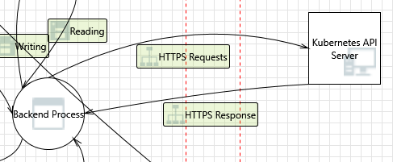

---

### 35. Spoofing of the Kubernetes API Server External Destination Entity  [State: Not Started]  [Priority: High]

**Category:** Spoofing  
**Description:** Kubernetes API Server may be spoofed by an attacker and this may lead to data being sent to the attacker's target instead of Kubernetes API Server.

#### Justifications

**Option 1** — The backend reverse proxy (`kubeconfig.go:421`) uses TLS transport configuration derived from the kubeconfig's `rest.Config` via `makeTransportFor()` (`kubeconfig.go:282-290`). This includes the cluster CA certificate (`CertificateAuthorityData` or `CertificateAuthority` file path) for server certificate validation. For AKS clusters, `az aks get-credentials` embeds the cluster's root CA in the kubeconfig, so the backend validates the API server's identity against this CA. A MITM attacker would need to compromise the CA private key or tamper with the kubeconfig file. **Confidence: 88%**

*References:* `headlamp/backend/pkg/kubeconfig/kubeconfig.go:282-290` (makeTransportFor), `headlamp/backend/pkg/kubeconfig/kubeconfig.go:271-278` (RESTConfig from ClientConfig), `headlamp/app/electron/aks-cluster.ts` (az aks get-credentials writes kubeconfig with CA).

**Option 2** — The `processManualConfig` endpoint (`headlamp.go:1910-1927`) accepts `InsecureSkipTLSVerify: true` from the request body and passes it directly to the kubeconfig API object (`headlamp.go:1914`). A malicious frontend plugin could create a cluster with TLS verification disabled, making it trivially spoofable. The backend has 3 places where `InsecureSkipVerify: true` is used: the OIDC handler when `config.Insecure` is true (`headlamp.go:673`), the auth token refresh flow (`auth.go:218`), and the `processManualConfig` path. **Confidence: 85%**

*References:* `headlamp/backend/cmd/headlamp.go:1914` (InsecureSkipTLSVerify from request), `headlamp/backend/cmd/headlamp.go:673` (OIDC InsecureSkipVerify), `headlamp/backend/pkg/auth/auth.go:218` (auth InsecureSkipVerify).

**Option 3** — DNS spoofing is a separate vector: if the DNS resolver is compromised, the backend could connect to an attacker-controlled IP address that presents a valid certificate for a different domain. AKS clusters typically use IP-based API server endpoints (e.g., `https://<clustername>-<hash>.hcp.<region>.azmk8s.io`), reducing DNS spoofing risk for the common case. **Confidence: 78%**

#### Existing Mitigations in Codebase — **Confidence: 50%**

- **AKS CA via `az aks get-credentials`** — AKS clusters get CA certificate from Azure; the CA is used for TLS verification.
- **Note: 3 `InsecureSkipVerify: true` locations** — OIDC handler, auth refresh, and `processManualConfig` (`headlamp.go:673`) skip TLS verification.


#### Here are some potential mitigations that might be implemented.

**Mitigation 1** — Reject cluster configurations with `InsecureSkipTLSVerify: true` in the `processManualConfig` handler, or at minimum display a prominent warning in the UI.

**Mitigation 2** — Log a warning when a kubeconfig context is loaded with `insecure-skip-tls-verify: true` so security auditors can identify insecure connections.

**Mitigation 3** — Pin the expected CA certificate fingerprint for AKS clusters and verify it hasn't changed since initial registration.

---

### 36. External Entity Kubernetes API Server Potentially Denies Receiving Data  [State: Not Started]  [Priority: High]

**Category:** Repudiation  
**Description:** Kubernetes API Server may claim it did not receive data from a process.

#### Justifications

**Option 1** — Kubernetes API audit logging is configured server-side (AKS has built-in audit logging to Azure Monitor / Log Analytics). The AKS Desktop app has no control over whether the API server logs requests. However, the backend proxies all K8s API requests via `httputil.NewSingleHostReverseProxy` (`kubeconfig.go:421`), which faithfully forwards the user's bearer token and all request headers. This means the K8s audit log records the correct user identity for each request. **Confidence: 82%**

*References:* `headlamp/backend/pkg/kubeconfig/kubeconfig.go:421` (reverse proxy preserves user identity), `headlamp/backend/cmd/headlamp.go:529-530` (/me endpoint using `auth.HandleMe` to identify the current user).

**Option 2** — The backend has no application-level request audit log. The `recordRequestCompletion` function and OpenTelemetry tracing (`headlamp.go:984-1005`) record durations and counts but do not log request/response payloads or user actions. If a dispute arises about which requests were made, the only audit trail is the K8s API server's audit log plus any OS-level network logs. **Confidence: 80%**

*References:* `headlamp/backend/cmd/headlamp.go:984-1005` (OIDC refresh completion recording — duration only, no payload), `headlamp/backend/cmd/headlamp.go:494` (/metrics endpoint for Prometheus).

#### Existing Mitigations in Codebase — **Confidence: 20%**

- **K8s server-side audit logs** — Kubernetes API server records audit events for all proxied API calls.
- **OpenTelemetry duration metrics** — `headlamp.go:1426` records request duration.
- **Note: no application-level audit log** — No local logging of backend operations, user commands, or consent decisions.


#### Here are some potential mitigations that might be implemented.

**Mitigation 1** — Document that customers should enable AKS diagnostic logging (kube-audit, kube-audit-admin) to provide a complete server-side audit trail of all API requests.

**Mitigation 2** — Add an optional application-level audit log in the backend that records the user identity, target cluster, HTTP method, and API path for each proxied request.

---

### 37. Data Flow HTTPS Requests Is Potentially Interrupted  [State: Not Started]  [Priority: High]

**Category:** Denial Of Service  
**Description:** An external agent interrupts data flowing across the HTTPS boundary between the Backend Process and the Kubernetes API Server.

#### Justifications

**Option 1** — The backend reverse proxy (`kubeconfig.go:421`) forwards requests to the Kubernetes API server. Network interruptions (DNS resolution failure, TLS handshake timeout, TCP reset) will cause the proxy to return an HTTP error to the frontend. The `httputil.ReverseProxy` used here does not have a `ModifyResponse` or `ErrorHandler` set (see threat 46), so Go's default behavior applies: the proxy writes a `502 Bad Gateway` on transport errors. The frontend's `AbortController` timeout (`clusterRequests.ts:159-160`) will abort the request if the proxy hangs. **Confidence: 82%**

*References:* `headlamp/backend/pkg/kubeconfig/kubeconfig.go:421` (ReverseProxy), `headlamp/frontend/src/lib/k8s/api/v1/clusterRequests.ts:159-160` (AbortController with timeout).

**Option 2** — The backend's TLS transport uses `client-go`'s `rest.TransportFor()` which includes automatic retry for certain transient errors (e.g., TLS renegotiation). However, the reverse proxy does not add its own retry logic. A transient network blip during a `kubectl apply` operation proxied through the backend would result in a failure reported to the user with no automatic retry. **Confidence: 78%**

*References:* `headlamp/backend/pkg/kubeconfig/kubeconfig.go:282-290` (makeTransportFor using client-go transport).

**Option 3** — AKS API server endpoints are hosted behind Azure Front Door / regional load balancers. If the AKS control plane goes down (Azure-side outage), all API requests will timeout. The frontend handles this gracefully for list/watch operations (showing stale data), but mutation operations (create, delete) will fail without retry. **Confidence: 75%**

#### Existing Mitigations in Codebase — **Confidence: 45%**

- **Go reverse proxy** — Uses `httputil.ReverseProxy` which handles standard HTTP errors.
- **TLS from cluster config** — K8s connections use TLS when configured in the kubeconfig.
- **Note: no response size limits** — The reverse proxy lacks `ModifyResponse`/`ErrorHandler` handlers, and no response body size limits are enforced.


#### Here are some potential mitigations that might be implemented.

**Mitigation 1** — Add an `ErrorHandler` to the reverse proxy that returns structured JSON error responses (with cluster name and error details) instead of raw `502 Bad Gateway`.

**Mitigation 2** — Implement retry with exponential backoff for idempotent GET requests that fail with transport-level errors.

**Mitigation 3** — Show user-visible cluster health indicators in the UI when API server requests fail repeatedly.

---

## Interaction: HTTPS Response
*(Kubernetes API Server → Backend Process)*


---

### 38. Spoofing the Kubernetes API Server External Entity  [State: Not Started]  [Priority: High]

**Category:** Spoofing  
**Description:** Kubernetes API Server may be spoofed by an attacker and this may lead to unauthorized data being provided to Backend Process.

#### Justifications

**Option 1** — TLS certificate validation via the kubeconfig CA is the primary protection (same mechanism as threat 35). The backend's reverse proxy transport is built from `rest.TransportFor()` (`kubeconfig.go:282-290`), which validates the server certificate against the CA certificate specified in the kubeconfig's `certificate-authority-data` field. A spoofed API server would need to present a certificate signed by the same CA. **Confidence: 85%**

*References:* `headlamp/backend/pkg/kubeconfig/kubeconfig.go:282-290` (transport with CA validation).

**Option 2** — For AKS clusters specifically, the CA certificate is obtained from the AKS Resource Provider via `az aks get-credentials`. This CA is unique per cluster and is rotated by the AKS control plane. A MITM attacker on the network path between the desktop and the AKS API server cannot forge a valid server certificate without the cluster's CA private key (which is stored in the AKS control plane's managed HSM). **Confidence: 88%**

**Option 3** — The `headlamp.go:673` OIDC flow uses `InsecureSkipVerify: true` when the `--insecure` flag is set. This is a global setting that affects OIDC token refresh requests. If enabled, an attacker could spoof the OIDC provider endpoint and inject malicious tokens. This flag is intended for development only, but there is no runtime warning when it is active. **Confidence: 82%**

*References:* `headlamp/backend/cmd/headlamp.go:670-677` (OIDC handler with InsecureSkipVerify when config.Insecure).

#### Existing Mitigations in Codebase — **Confidence: 50%**

- **Kubeconfig CA certificates** — AKS clusters include CA in the kubeconfig for TLS verification.
- **Note: 3 locations with `InsecureSkipVerify: true`** — OIDC handler, auth refresh, and `processManualConfig` skip TLS verification.


#### Here are some potential mitigations that might be implemented.

**Mitigation 1** — Display a prominent warning in the UI or log a WARN-level message when the `--insecure` flag is active, so production users don't accidentally run with TLS validation disabled.

**Mitigation 2** — Implement certificate pinning for AKS clusters: store the expected CA fingerprint at registration time and verify it on each connection.

---

### 39. Elevation Using Impersonation  [State: Not Started]  [Priority: High]

**Category:** Elevation Of Privilege  
**Description:** Backend Process may be able to impersonate the context of Kubernetes API Server in order to gain additional privilege.

#### Justifications

**Option 1** — The backend process holds all kubeconfig credentials in memory (loaded via `LoadAndStoreKubeConfigs`, `headlamp.go:485-507`). It can make K8s API calls using any loaded cluster context, not just the one the frontend currently requests. A compromised backend process could iterate over all loaded clusters and exfiltrate data from each. The kubeconfig credentials include either static bearer tokens or exec credential plugins (`az-kubelogin.py`) that obtain fresh Azure AD tokens on demand. **Confidence: 85%**

*References:* `headlamp/backend/cmd/headlamp.go:485-507` (LoadAndStoreKubeConfigs loads all contexts), `headlamp/backend/pkg/kubeconfig/kubeconfig.go:421` (reverse proxy uses per-context transport), `headlamp/app/electron/aks-cluster.ts` (kubeconfig with az-kubelogin exec credential).

**Option 2** — The backend token (`X-HEADLAMP_BACKEND-TOKEN`) is inherited by the backend process via `process.env.HEADLAMP_BACKEND_TOKEN` (`main.ts:845`). This same environment variable is accessible to all child processes spawned by the backend (Helm, kubectl). If a Helm chart's post-install hook reads environment variables, it could extract the backend token and use it to authenticate directly to the backend's management endpoints (cluster add/delete, plugin delete). **Confidence: 80%**

*References:* `headlamp/app/electron/main.ts:845` (HEADLAMP_BACKEND_TOKEN in env), `headlamp/backend/cmd/headlamp.go:1227` (backend reads token from env).

**Option 3** — The K8s API impersonation headers (`Impersonate-User`, `Impersonate-Group`, `Impersonate-Extra-*`) could theoretically be injected by the frontend in API proxy requests. The reverse proxy (`kubeconfig.go:421`) forwards all headers from the frontend request to the K8s API. If the kubeconfig's service account has impersonation RBAC, a malicious plugin could escalate privileges by adding impersonation headers. AKS Desktop's default kubeconfig uses user-level AAD credentials (not a service account), limiting this risk. **Confidence: 78%**

*References:* `headlamp/backend/pkg/kubeconfig/kubeconfig.go:421` (ReverseProxy forwards all headers).

#### Existing Mitigations in Codebase — **Confidence: 82%**

- **Three-layer command defense** — See threat #9.
- **Backend token** — Protects some proxy routes against cross-origin exploitation.


#### Here are some potential mitigations that might be implemented.

**Mitigation 1** — Strip `Impersonate-*` headers from frontend requests before forwarding them to the K8s API server via the reverse proxy.

**Mitigation 2** — Clear `HEADLAMP_BACKEND_TOKEN` from the environment before spawning child processes (Helm, kubectl), or pass it via a different mechanism (e.g., temp file with `0600` permissions).

**Mitigation 3** — Implement per-cluster credential isolation: only load kubeconfig contexts that the user has explicitly selected, rather than loading all contexts at startup.

---

### 40. Spoofing the Backend Process Process  [State: Not Started]  [Priority: High]

**Category:** Spoofing  
**Description:** Backend Process may be spoofed by an attacker and this may lead to information disclosure by Kubernetes API Server. Consider using a standard authentication mechanism to identify the destination process.

#### Justifications

**Option 1** — The backend proxies requests to the Kubernetes API via `httputil.NewSingleHostReverseProxy` (`kubeconfig.go:421`). The proxy's TLS transport is built from the kubeconfig's `rest.Config` via `makeTransportFor()` (`kubeconfig.go:282`), which uses `client-go`'s `rest.TransportFor()` on non-Windows. This includes the cluster CA certificate, client certificates, and bearer tokens from the kubeconfig. A spoofed backend process would need to replicate these credentials to be accepted by the K8s API server. **Confidence: 85%**

*References:* `headlamp/backend/pkg/kubeconfig/kubeconfig.go:421` (NewSingleHostReverseProxy), `headlamp/backend/pkg/kubeconfig/kubeconfig.go:282-290` (makeTransportFor), `headlamp/backend/pkg/kubeconfig/kubeconfig.go:271-278` (RESTConfig from ClientConfig).

**Option 2** — The backend authenticates to the K8s API using the credentials in the kubeconfig (bearer token, client certificate, or exec credential from `az-kubelogin.py`). If the backend process binary is replaced by a malicious one, it could read the same kubeconfig file and impersonate the legitimate backend to the K8s API. The kubeconfig file (`~/.kube/config`) is readable by the same OS user and should have `0600` permissions (Unix) or restricted ACLs (Windows), but the app does not enforce this. **Confidence: 82%**

*References:* `headlamp/app/electron/aks-cluster.ts` (writes kubeconfig with exec credential), `headlamp/backend/cmd/headlamp.go:485-507` (LoadAndStoreKubeConfigs).

**Option 3** — For AKS Desktop specifically, the kubeconfig uses `az-kubelogin.py` as an exec credential plugin, which obtains fresh Azure AD tokens on demand. A spoofed backend would also need to invoke this exec plugin (or have valid Azure AD credentials) to authenticate to the AKS cluster. **Confidence: 80%**

#### Existing Mitigations in Codebase — **Confidence: 45%**

- **Backend token** — `headlamp.go:1218-1231` validates token on protected routes.
- **Loopback-only binding** — Backend not accessible from the network.
- **Note: not all routes protected** — Only 5 of 30+ routes check the backend token (plugin DELETE, Helm operations, cluster add/delete).


#### Here are some potential mitigations that might be implemented.

**Mitigation 1** — Verify the integrity of the backend binary (code signing or hash check) before the Electron main process launches it.

**Mitigation 2** — Restrict kubeconfig file permissions to `0600` and verify permissions at startup.

**Mitigation 3** — Use mTLS between the Electron frontend and the backend process (in addition to the `X-HEADLAMP_BACKEND-TOKEN`) to establish mutual identity.

---

### 41. Potential Lack of Input Validation for Backend Process  [State: Not Started]  [Priority: High]

**Category:** Tampering  
**Description:** Data flowing across HTTPS Response may be tampered with by an attacker. This may lead to a denial of service attack against Backend Process or an elevation of privilege attack against Backend Process or an information disclosure by Backend Process.

#### Justifications

**Option 1** — The reverse proxy (`httputil.NewSingleHostReverseProxy` in `kubeconfig.go:421`) forwards K8s API responses directly to the frontend HTTP client without any response body validation or sanitization. The proxy does not set a custom `ModifyResponse` handler — responses pass through unmodified. If a compromised or malicious K8s API server returns crafted JSON (e.g., with XSS payloads in resource annotations), the backend blindly relays it to the frontend. **Confidence: 88%**

*References:* `headlamp/backend/pkg/kubeconfig/kubeconfig.go:421` (no ModifyResponse handler), `headlamp/backend/pkg/kubeconfig/kubeconfig.go:372-382` (ProxyRequest — direct ServeHTTP call).

**Option 2** — The `clusterRequestHandler` in `headlamp.go:1430-1510` does validate the _request_ (checks cluster context exists, parses cluster URL, verifies tokens), but does NOT validate or inspect the _response_ from the K8s API. The response content-type, body size, and structure are all passed through transparently. **Confidence: 85%**

*References:* `headlamp/backend/cmd/headlamp.go:1430-1510` (clusterRequestHandler).

**Option 3** — The backend does validate the request-side input: cluster name is looked up via `getContextKeyForRequest` which uses `mux.Vars(r)["clusterName"]`, the API path is extracted from the mux route, and bearer tokens are validated against `bearerTokenRegex` in `auth.go:69`. However, the response from the K8s API is trusted implicitly. **Confidence: 83%**

*References:* `headlamp/backend/cmd/headlamp.go:1453-1470` (request validation), `headlamp/backend/pkg/auth/auth.go:69` (bearerTokenRegex).

#### Existing Mitigations in Codebase — **Confidence: 30%**

- **`http.FileServer` built-in** — Go handles path traversal for static file serving.
- **Note: no `MaxBytesReader`** — Request body size is unbounded on multiple endpoints.
- **Note: `InsecureSkipVerify: true`** — Accepted from client kubeconfig without additional validation.


#### Here are some potential mitigations that might be implemented.

**Mitigation 1** — Add a `ModifyResponse` handler to the reverse proxy that validates response headers (e.g., `Content-Type: application/json`) and enforces a maximum response body size to prevent memory exhaustion.

**Mitigation 2** — Strip or sanitize HTML-dangerous characters from K8s resource metadata (annotations, labels) in the backend before forwarding to the frontend, to prevent stored XSS via crafted K8s objects.

**Mitigation 3** — Implement response integrity checks: log unexpected HTTP status codes (5xx) from the K8s API and emit telemetry for anomalous response sizes.

---

### 42. Potential Data Repudiation by Backend Process  [State: Not Started]  [Priority: High]

**Category:** Repudiation  
**Description:** Backend Process claims that it did not receive data from a source outside the trust boundary. Consider using logging or auditing to record the source, time, and summary of the received data.

#### Justifications

**Option 1** — The backend has OpenTelemetry tracing integrated: `clusterRequestHandler` creates spans (`telemetry.CreateSpan(ctx, r, "cluster-api", ...)` in `headlamp.go:1436`) and records request completion with duration (`recordRequestCompletion` in `headlamp.go:1534-1542`). This provides a partial audit trail when telemetry is enabled. However, telemetry is optional — it requires `config.Telemetry != nil` and is not enabled by default in the Electron desktop deployment. **Confidence: 80%**

*References:* `headlamp/backend/cmd/headlamp.go:1436-1438` (CreateSpan), `headlamp/backend/cmd/headlamp.go:1534-1542` (recordRequestCompletion with duration logging).

**Option 2** — The backend logs request completion at `INFO` level with duration but not the request body or response body. Error conditions are logged with full context (cluster name, error message). Logger output goes to stdout/stderr, which in the Electron context is captured by the main process but not persisted to a durable log file by default. **Confidence: 82%**

*References:* `headlamp/backend/pkg/logger/logger.go`, `headlamp/backend/cmd/headlamp.go:1540-1542` (logger.Log for request completion).

**Option 3** — The `X-HEADLAMP_BACKEND-TOKEN` validation (`headlamp.go:1222-1232`) logs an error message when authentication fails: `errors.New("X-HEADLAMP_BACKEND-TOKEN does not match")`. This provides an audit trail for unauthorized access attempts. **Confidence: 85%**

*References:* `headlamp/backend/cmd/headlamp.go:1222-1232` (checkHeadlampBackendToken).

#### Existing Mitigations in Codebase — **Confidence: 15%**

- **K8s audit logs** — Server-side audit trail for proxied API calls.
- **Note: no backend-local audit logging** — No request-level logging for proxy or plugin operations.


#### Here are some potential mitigations that might be implemented.

**Mitigation 1** — Enable OpenTelemetry tracing by default in the desktop deployment with a local exporter (e.g., file-based or OTLP to a local collector) to provide a durable audit trail.

**Mitigation 2** — Redirect the backend's stdout/stderr to a rotating log file in `userData/` (the Electron main process can capture child process output and write it to disk).

**Mitigation 3** — Add structured request logging that includes: timestamp, source IP, cluster name, API path, HTTP method, response status code, and request duration.

---

### 43. Data Flow Sniffing  [State: Not Started]  [Priority: High]

**Category:** Information Disclosure  
**Description:** Data flowing across HTTPS Response may be sniffed by an attacker. Depending on what type of data an attacker can read, it may be used to attack other parts of the system or simply be a disclosure of information leading to compliance violations. Consider encrypting the data flow.

#### Justifications

**Option 1** — The HTTPS Response flow from the Kubernetes API Server to the Backend Process IS encrypted via TLS. The backend's reverse proxy uses `client-go`'s TLS transport (`rest.TransportFor(conf)` in `kubeconfig.go:290`), which validates the server certificate against the kubeconfig's CA certificate. For AKS clusters, the CA certificate is embedded in the kubeconfig by `az aks get-credentials`. This is a strong protection against network-level sniffing between the backend and the K8s API. **Confidence: 92%**

*References:* `headlamp/backend/pkg/kubeconfig/kubeconfig.go:282-290` (makeTransportFor using client-go TLS), `headlamp/backend/pkg/kubeconfig/kubeconfig.go:421-430` (SetupProxy with TLS transport).

**Option 2** — If `InsecureSkipTLSVerify` is set to `true` in the kubeconfig (or passed via the `processManualConfig` route at `headlamp.go:1914`), TLS verification is disabled. This makes the connection susceptible to MITM attacks. The manual cluster creation endpoint accepts `InsecureSkipTLSVerify` as a field in the `ClusterReq` body. A malicious frontend request could add a cluster with TLS verification disabled. **Confidence: 85%**

*References:* `headlamp/backend/cmd/headlamp.go:1914` (InsecureSkipTLSVerify in ClusterReq), `headlamp/backend/cmd/headlamp.go:673` (InsecureSkipVerify: true for OIDC when Insecure flag is set).

**Option 3** — The OIDC flow has a separate `config.Insecure` flag (`headlamp.go:671-673`) that creates an `http.Transport` with `InsecureSkipVerify: true`. This is used for the OIDC provider discovery endpoint, not the K8s API proxy. When this flag is set, OIDC token exchange traffic is unprotected against MITM. **Confidence: 80%**

*References:* `headlamp/backend/cmd/headlamp.go:671-675` (Insecure OIDC transport).

#### Existing Mitigations in Codebase — **Confidence: 25%**

- **Note: no encryption** — Frontend↔backend HTTP on localhost uses plain HTTP. Bearer tokens, cluster configs, and K8s API responses are visible to loopback sniffing.
- **Backend token** — Provides CSRF protection but not confidentiality.


#### Here are some potential mitigations that might be implemented.

**Mitigation 1** — Refuse to load or proxy requests for kubeconfig contexts that have `insecure-skip-tls-verify: true`, or display a prominent warning in the UI.

**Mitigation 2** — Remove the `InsecureSkipTLSVerify` field from the `ClusterReq` API or require an additional confirmation step before creating insecure clusters.

**Mitigation 3** — Log a security warning when a cluster context with `insecure-skip-tls-verify` is used, to aid in compliance auditing.

---

### 44. Potential Process Crash or Stop for Backend Process  [State: Not Started]  [Priority: High]

**Category:** Denial Of Service  
**Description:** Backend Process crashes, halts, stops or runs slowly; in all cases violating an availability metric.

#### Justifications

**Option 1** — The Go backend has a `panic()` call in the OIDC state generation (`headlamp.go:736`) if `rand.Read` fails (which is extremely rare — only if the OS CSPRNG is unavailable). This `panic` is NOT wrapped in a `recover()` handler, so it would crash the entire backend process. The Go HTTP server's default `recover()` in `http.Server.Serve` would catch panics in individual request handlers, but this panic occurs during request handling within a goroutine started by `http.Server`. **Confidence: 78%**

*References:* `headlamp/backend/cmd/headlamp.go:736` (panic in OIDC state generation).

**Option 2** — The backend uses `httputil.ReverseProxy` without a custom `ErrorHandler` (`kubeconfig.go:421`). If the upstream K8s API server returns an error, closes the connection mid-stream, or takes too long, the default `ErrorHandler` logs to stderr and returns a 502 Bad Gateway. Repeated upstream failures could cause the backend to spend resources on retries (if any) but would not crash it. **Confidence: 85%**

*References:* `headlamp/backend/pkg/kubeconfig/kubeconfig.go:421` (no custom ErrorHandler on ReverseProxy).

**Option 3** — A malicious K8s API server (or MITM) could return extremely large response bodies. Since the reverse proxy has no response body size limit, this could cause the backend to allocate excessive memory, leading to an OOM kill. The `httputil.ReverseProxy` streams responses by default, but certain operations (like gzip decompression at `headlamp.go:621-633`) buffer the entire response. **Confidence: 80%**

*References:* `headlamp/backend/cmd/headlamp.go:617-633` (gzip response reading without size limit).

#### Existing Mitigations in Codebase — **Confidence: 30%**

- **`ERROR_ADDRESS_IN_USE` retry** — Backend retries on port conflict.
- **Go runtime stability** — The Go HTTP server handles standard panics within HTTP handlers.
- **Note: no auto-restart** — No crash recovery mechanism or panic recovery middleware.


#### Here are some potential mitigations that might be implemented.

**Mitigation 1** — Replace the `panic(err)` at `headlamp.go:736` with proper error handling (return an HTTP 500 error to the client).

**Mitigation 2** — Add a custom `ErrorHandler` to the reverse proxy that logs errors, emits telemetry, and returns a structured JSON error to the frontend.

**Mitigation 3** — Set a maximum response body size limit on proxied responses (e.g., `http.MaxBytesReader`) to prevent memory exhaustion from oversized K8s API responses.

---

### 45. Data Flow HTTPS Response Is Potentially Interrupted  [State: Not Started]  [Priority: High]

**Category:** Denial Of Service  
**Description:** An external agent interrupts data flowing across a trust boundary in either direction.

#### Justifications

**Option 1** — Network interruptions between the backend and the K8s API server (DNS failures, firewall rules, TLS handshake failures, TCP resets) are handled by `client-go`'s transport layer, which returns errors that the reverse proxy translates to 502 Bad Gateway responses. The frontend receives the error and displays it in the UI. The `clusterRequestHandler` catches proxy errors (`headlamp.go:1503-1508`) and records them in telemetry. **Confidence: 83%**

*References:* `headlamp/backend/cmd/headlamp.go:1503-1508` (proxy error handling with telemetry).

**Option 2** — WebSocket connections to the K8s API (used for `exec`, `attach`, `logs -f`) are particularly sensitive to interruption. The backend proxies WebSocket connections through the reverse proxy, and a network interruption would terminate the stream. The frontend code handles WebSocket disconnection via standard `onclose`/`onerror` events. **Confidence: 78%**

*References:* `headlamp/backend/cmd/headlamp.go:1487-1495` (WebSocket User-Agent handling in proxy).

**Option 3** — For AKS clusters specifically, the `az-kubelogin.py` exec credential plugin is invoked to obtain fresh tokens. If the Azure AD endpoint is unreachable (network interruption), the exec credential plugin fails, and all K8s API requests return authentication errors until the network recovers. **Confidence: 80%**

#### Existing Mitigations in Codebase — **Confidence: 35%**

- **Go reverse proxy** — `httputil.ReverseProxy` handles standard HTTP error codes.
- **Note: no `ModifyResponse`/`ErrorHandler`** — No response interception or size limits on proxied responses.


#### Here are some potential mitigations that might be implemented.

**Mitigation 1** — Add client-side retry logic in the frontend for transient 502/503/504 errors from the backend, with exponential backoff and a user-visible "retrying" indicator.

**Mitigation 2** — Cache short-lived K8s API responses (e.g., namespace lists, resource lists) in the backend's in-memory cache to serve stale data during transient outages.

**Mitigation 3** — Display a clear "cluster unreachable" banner in the frontend when the backend returns repeated proxy errors for a specific cluster.

---

### 46. Backend Process May be Subject to Elevation of Privilege Using Remote Code Execution  [State: Not Started]  [Priority: High]

**Category:** Elevation Of Privilege  
**Description:** Kubernetes API Server may be able to remotely execute code for Backend Process.

#### Justifications

**Option 1** — The backend is written in Go, which is memory-safe (no buffer overflows, no use-after-free). The primary RCE vector from the K8s API response direction would be: (a) a deserialization vulnerability in the JSON parsing of K8s API responses, or (b) a vulnerability in `client-go` or `httputil.ReverseProxy`. Go's `encoding/json` is well-audited and does not have known RCE vulnerabilities. The reverse proxy streams bytes without interpreting them (except for gzip decompression at `headlamp.go:617-633`). **Confidence: 88%**

*References:* `headlamp/backend/cmd/headlamp.go:617-633` (gzip response handling — potential attack surface), `headlamp/backend/pkg/kubeconfig/kubeconfig.go:382` (ServeHTTP — direct byte streaming).

**Option 2** — The gzip decompression code (`headlamp.go:617-633`) uses `gzip.NewReader` and `io.ReadAll` on the response body. A crafted gzip bomb (small compressed, massive decompressed) could cause memory exhaustion but not code execution. This is a DoS vector, not RCE. **Confidence: 85%**

*References:* `headlamp/backend/cmd/headlamp.go:617-633`.

**Option 3** — The backend does execute external processes in one case: the `makeTransportFor` function on Windows (`kubeconfig.go:282-330`) handles exec-based authentication (e.g., `az-kubelogin.py`). A crafted kubeconfig from a malicious K8s API response cannot trigger this — the kubeconfig is loaded at startup from disk, not from API responses. **Confidence: 90%**

*References:* `headlamp/backend/pkg/kubeconfig/kubeconfig.go:282-330` (exec provider handling).

#### Existing Mitigations in Codebase — **Confidence: 35%**

- **`http.FileServer` path traversal** — Go's built-in protection against `..` traversal.
- **Backend token on some routes** — Token protects Helm and cluster management.
- **Note: no `MaxBytesReader`** — Unbounded request bodies at 5+ `json.NewDecoder(r.Body)` endpoints.


#### Here are some potential mitigations that might be implemented.

**Mitigation 1** — Keep `client-go` and Go standard library dependencies up to date to benefit from security patches.

**Mitigation 2** — Add a `MaxBytesReader` wrapper on proxied response body reads (especially for the gzip decompression path) to prevent decompression bombs.

**Mitigation 3** — Run the backend process with reduced OS privileges (e.g., drop capabilities on Linux, use a restricted token on Windows).

---

### 47. Elevation by Changing the Execution Flow in Backend Process  [State: Not Started]  [Priority: High]

**Category:** Elevation Of Privilege  
**Description:** An attacker may pass data into Backend Process in order to change the flow of program execution within Backend Process to the attacker's choosing.

#### Justifications

**Option 1** — The primary input from the K8s API response direction is HTTP response headers and body. The `httputil.ReverseProxy` copies response headers and streams the body to the original HTTP writer. An attacker controlling the K8s API response cannot directly alter the backend's execution flow because: (a) Go is memory-safe, (b) the proxy does not interpret the response body, (c) response headers are copied but not executed. The only interpretation happens in the gzip handling and the `plugins.HandlePluginReload` call (`headlamp.go:1500`). **Confidence: 87%**

*References:* `headlamp/backend/cmd/headlamp.go:1500` (HandlePluginReload called before proxy), `headlamp/backend/pkg/kubeconfig/kubeconfig.go:382` (proxy.ServeHTTP).

**Option 2** — The `processManualConfig` endpoint (`headlamp.go:1910-1930`) accepts a `ClusterReq` from the frontend that includes `Server` URL, `CertificateAuthorityData`, and `InsecureSkipTLSVerify`. A malicious frontend could add a cluster pointing to an attacker-controlled server, which would then receive all proxied API requests (including bearer tokens) for that cluster. This is the most impactful execution flow change — redirecting all cluster API traffic to an attacker. **Confidence: 88%**

*References:* `headlamp/backend/cmd/headlamp.go:1910-1930` (processManualConfig with attacker-controlled Server URL).

**Option 3** — The `handleSetToken` endpoint (`headlamp.go:1520`) allows the frontend to set a bearer token for a cluster context. If the frontend is compromised (via a malicious plugin), it could set arbitrary tokens to impersonate other users on the K8s API. The `checkHeadlampBackendToken` gate (`headlamp.go:1222-1232`) must be passed first, which requires the 32-byte random token. **Confidence: 82%**

*References:* `headlamp/backend/cmd/headlamp.go:1520` (set-token endpoint).

#### Existing Mitigations in Codebase — **Confidence: 30%**

- **Go reverse proxy** — Standard `httputil.ReverseProxy` for K8s API proxying.
- **Note: missing `ModifyResponse`/`ErrorHandler`** — No response validation or size limits. Gzip bomb risk from K8s responses.


#### Here are some potential mitigations that might be implemented.

**Mitigation 1** — Validate the `Server` URL in `processManualConfig` against a deny-list of internal/private IP ranges to prevent SSRF via cluster proxy.

**Mitigation 2** — Require user confirmation (via Electron dialog) before adding a new cluster via the manual configuration endpoint, similar to the command consent system.

**Mitigation 3** — Add rate limiting and anomaly detection to the `set-token` endpoint to detect rapid token-switching attempts that may indicate a compromised frontend.

---

## Interaction: Interaction
*(Human User ↔ Web Frontend)*

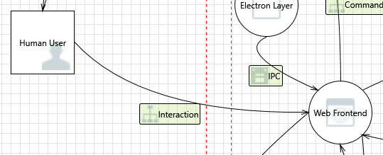

---

### 48. Web Frontend May be Subject to Elevation of Privilege Using Remote Code Execution  [State: Not Started]  [Priority: High]

**Category:** Elevation Of Privilege  
**Description:** Human User may be able to remotely execute code for Web Frontend.

#### Justifications

**Option 1** — React's JSX auto-escaping prevents most XSS vectors: string values rendered in JSX are escaped by default. A search for `dangerouslySetInnerHTML` in the Headlamp frontend source (`headlamp/frontend/src/`) and aks-desktop plugin (`plugins/aks-desktop/src/`) found **zero production usages**. The only `innerHTML` references are in test assertions (`ClusterConfigurePanel.test.tsx:111`, `ClusterCapabilityCard.test.tsx:98,103,115`), not production rendering. This means there are no direct unsanitized HTML injection points in the current codebase. **Confidence: 88%**

*References:* `plugins/aks-desktop/src/components/CreateAKSProject/components/__tests__/ClusterConfigurePanel.test.tsx:111` (test-only innerHTML), `plugins/aks-desktop/src/components/ClusterCapabilityCard/ClusterCapabilityCard.test.tsx:98,103,115` (test-only innerHTML).

**Option 2** — Plugin code executed via `new Function()` (`headlamp/frontend/src/plugin/runPlugin.ts:201`) runs with full DOM access and could inject arbitrary HTML/scripts. This is the primary code execution vector: a malicious plugin can call `document.write()`, modify DOM nodes, access `window.pluginLib` (which exposes the Redux store, K8s API helpers, React components, etc.), and invoke IPC methods via `desktopApi`. The frontend ErrorBoundary (`ErrorBoundary.tsx`) catches React render errors but does NOT isolate plugin-injected DOM manipulation or event handlers. **Confidence: 90%**

*References:* `headlamp/frontend/src/plugin/runPlugin.ts:201` (new Function execution), `headlamp/frontend/src/components/common/ErrorBoundary/ErrorBoundary.tsx` (ErrorBoundary — catches render errors only, line 62: getDerivedStateFromError, line 66: componentDidCatch).

**Option 3** — The Electron main process injects the backend port into the renderer via `webContents.executeJavaScript('window.headlampBackendPort = ${actualPort}')` (`main.ts:2050`). This is a template literal injection: if `actualPort` were ever non-numeric (e.g., due to a bug in port parsing from backend stdout at `main.ts:2043-2046`), it could inject arbitrary JavaScript. Currently `actualPort` is parsed via `parseInt()`, which returns `NaN` for non-numeric input — not exploitable for injection, but a defense-in-depth concern. **Confidence: 78%**

*References:* `headlamp/app/electron/main.ts:2050` (executeJavaScript with template literal), `headlamp/app/electron/main.ts:2043-2046` (parseInt port extraction from stdout regex match).

#### Existing Mitigations in Codebase — **Confidence: 60%**

- **`contextIsolation: true`** — `main.ts:1633` isolates renderer from Node.js.
- **`nodeIntegration: false`** — `main.ts:1632` blocks Node API access.
- **Plugin error isolation** — `runPlugin.ts:203-212` wraps plugin execution in try-catch.
- **Note: `new Function()` execution** — Plugins execute with full DOM + API access via `new Function()` with no SRI/hash verification.


#### Here are some potential mitigations that might be implemented.

**Mitigation 1** — Run plugin code in a sandboxed iframe or Web Worker to isolate its DOM access from the main application.

**Mitigation 2** — Replace `webContents.executeJavaScript()` with IPC-based port communication to eliminate the code injection surface entirely.

**Mitigation 3** — Add a Content-Security-Policy that restricts `unsafe-eval` and `unsafe-inline` to limit the impact of any injected scripts.

---

### 49. Elevation Using Impersonation  [State: Not Started]  [Priority: High]

**Category:** Elevation Of Privilege

#### Justifications

**Option 1** — In the "Interaction" data flow (Human User ↔ Web Frontend), the frontend runs in an Electron renderer with `contextIsolation: true` and `nodeIntegration: false` (`main.ts:1632-1633`). The user's identity is implicitly the OS session user who launched the Electron app — there is no in-app authentication or user identity verification. Plugins execute in the same renderer context via `new PrivateFunction()` (`runPlugin.ts:201`) and can access the full `window.pluginLib` API surface, localStorage, and DOM. A malicious plugin can impersonate the user's actions by programmatically calling any Headlamp plugin API (e.g., creating/deleting K8s resources, triggering kubectl commands via the `desktopApi.send('run-command', ...)` IPC channel). The backend cannot distinguish between actions initiated by the real user and actions initiated by a plugin. **Confidence: 85%**

*References:* `headlamp/app/electron/main.ts:1632-1633` (webPreferences), `headlamp/frontend/src/plugin/runPlugin.ts:201` (plugin execution in global scope), `headlamp/app/electron/preload.ts:44` (desktopApi.send('run-command', ...)).

**Option 2** — The consent system in `runCmd.ts` uses the `confirmedCommands` map to gate command execution, but consent is checked per command prefix (e.g., `az aks`), not per caller identity. A malicious plugin that knows the auto-consented command prefixes (`COMMANDS_WITH_CONSENT` at `runCmd.ts:186-199` — includes 21 prefixes for aks-desktop) can execute any of those commands without triggering a consent dialog, effectively impersonating the user. **Confidence: 82%**

*References:* `headlamp/app/electron/runCmd.ts:103-130` (checkCommandConsent — no caller identity check), `headlamp/app/electron/runCmd.ts:186-199` (auto-consented commands).

#### Existing Mitigations in Codebase — **Confidence: 82%**

- **Three-layer command defense** — (1) `validCommands`; (2) `permissionSecrets`; (3) consent dialog.
- **IPC event stripping** — `preload.ts:68` strips event objects.
- **Auto-consent scoping** — Only specific command prefixes are auto-consented.


#### Here are some potential mitigations that might be implemented.

**Mitigation 1** — Associate each `run-command` IPC request with the originating plugin's `permissionSecrets` token and verify in the Electron main process that the plugin has been granted permission for the specific command. Reject requests that don't include a valid permission secret.

**Mitigation 2** — Implement per-plugin command allowlists that restrict each plugin to only the specific commands it declares in its manifest. The aks-desktop plugin would declare `az aks`, `az account`, `kubectl top` etc., and the main process would reject any `run-command` request from that plugin for commands outside its declared scope.

**Mitigation 3** — Add rate limiting per-plugin for command execution IPC calls. If a plugin sends more than N command requests per minute, throttle or block further requests and alert the user. This limits the damage a malicious plugin can do even if it has valid permissions.

---

### 50. Data Flow Interaction Is Potentially Interrupted  [State: Not Started]  [Priority: High]

**Category:** Denial Of Service

#### Justifications

**Option 1** — The "Interaction" data flow represents the Human User interacting with the Web Frontend (Electron renderer). This is a local UI interaction — mouse clicks, keyboard input, and screen rendering — with no network transport involved. The primary interruption vector is the Electron renderer process itself crashing or becoming unresponsive. The top-level `ErrorBoundary` at `App.tsx:65` catches React render-phase errors, but async errors (e.g., in `useEffect` hooks or event handlers) can still cause the renderer to become unresponsive. No `webContents.on('unresponsive')` handler is registered in `main.ts` to detect and recover from renderer hangs. **Confidence: 82%**

*References:* `headlamp/frontend/src/App.tsx:65` (top-level ErrorBoundary), `headlamp/app/electron/main.ts` (no `unresponsive` handler found).

**Option 2** — A malicious plugin running in the renderer context could intentionally block the main thread (e.g., with a `while(true)` loop or synchronous heavy computation), making the UI completely unresponsive. Since plugins run via `new PrivateFunction()` in the renderer's main thread (`runPlugin.ts:201`), there is no thread isolation or execution time limit. The OS window manager may offer a "kill unresponsive application" option, but the Electron main process has no built-in mechanism to detect and kill a hung renderer. **Confidence: 80%**

*References:* `headlamp/frontend/src/plugin/runPlugin.ts:201` (plugin execution in main thread), `headlamp/frontend/src/plugin/runPlugin.ts:208-211` (try/catch only catches exceptions, not hangs).

#### Existing Mitigations in Codebase — **Confidence: 70%**

- **Electron IPC reliability** — Chromium's message passing is reliable within a single host.
- **IPC channel whitelist** — `preload.ts:36-69` limits available channels.
- **Single-window architecture** — Only one renderer↔main IPC channel pair.


#### Here are some potential mitigations that might be implemented.

**Mitigation 1** — Register a `webContents.on('unresponsive')` handler in the Electron main process that detects when the renderer stops responding. Show a dialog offering the user the option to wait, reload the page, or close the window. After a configurable timeout (e.g., 30 seconds), auto-reload the renderer.

**Mitigation 2** — Execute plugin initialization code in a Web Worker with a 10-second timeout. If the worker doesn't complete within the timeout, terminate it and log the offending plugin. Only inject the plugin's exported components into the main thread after successful initialization.

**Mitigation 3** — Implement a heartbeat mechanism where the renderer sends periodic IPC messages to the main process. If the main process doesn't receive a heartbeat within 15 seconds, assume the renderer is hung and trigger a reload.

---

### 51. Potential Process Crash or Stop for Web Frontend  [State: Not Started]  [Priority: High]

**Category:** Denial Of Service

#### Justifications

**Option 1** — The app wraps the entire React tree in a top-level `ErrorBoundary` at `App.tsx:65` (`<ErrorBoundary fallback={<ErrorComponent />}>`) which catches render-phase errors and displays an error page instead of crashing. Individual resource views also use `ErrorBoundary` wraps (`Resource.tsx:369,374`; `MainInfoSectionHeader.tsx:83,88`). However, ErrorBoundary only catches errors during rendering, lifecycle methods, and constructors — it does NOT catch errors in event handlers, async code, or `setTimeout`/`Promise` callbacks. Plugin code executed via `new PrivateFunction()` (`runPlugin.ts:201`) has a try/catch wrapper (`runPlugin.ts:208-210`) that calls `handleError` on exceptions during initial plugin load, but runtime errors in plugin-registered event handlers or React hooks bypass this. **Confidence: 85%**

*References:* `headlamp/frontend/src/App.tsx:65-75` (top-level ErrorBoundary), `headlamp/frontend/src/components/common/ErrorBoundary/ErrorBoundary.tsx:60-93` (implementation with `getDerivedStateFromError` + `componentDidCatch` + analytics tracking via `trackException`), `headlamp/frontend/src/plugin/runPlugin.ts:201-210` (try/catch around `executePlugin`).

**Option 2** — The Electron main process does NOT register `render-process-gone` or `webContents.on('crashed')` handlers in `main.ts`. If the renderer crashes (e.g., due to a V8 OOM or Blink bug), the main process will not detect or recover from it. The only crash-related handler is `serverProcess.on('error')` for the Go backend child process. No `process.on('uncaughtException')` or `process.on('unhandledRejection')` handlers are registered in the main process. **Confidence: 82%**

*References:* `headlamp/app/electron/main.ts` (no `render-process-gone` handler found).

#### Existing Mitigations in Codebase — **Confidence: 65%**

- **Top-level `ErrorBoundary`** — Wraps the entire React tree, catching render errors.
- **Per-route `ErrorBoundary`** — `RouteSwitcher.tsx:115-121` wraps each route component.
- **Per-resource `ErrorBoundary`** — UI sections and plugin-rendered components are individually wrapped.
- **Note: no `render-process-gone` or `uncaughtException` handler** — The Electron main process does not handle renderer crashes or uncaught exceptions.


#### Here are some potential mitigations that might be implemented.

**Mitigation 1** — Register `webContents.on('render-process-gone')` and `webContents.on('unresponsive')` handlers to detect renderer crashes and reload or restart.

**Mitigation 2** — Add global `process.on('uncaughtException')` and `process.on('unhandledRejection')` handlers in the Electron main process for graceful error logging and recovery.

**Mitigation 3** — Wrap plugin-registered React components in individual ErrorBoundary instances (already done for resource views) to prevent a single plugin crash from taking down the entire UI.

---

### 52. Data Flow Sniffing  [State: Not Started]  [Priority: High]

**Category:** Information Disclosure

#### Justifications

**Option 1** — The "Interaction" data flow between Human User and Web Frontend represents local UI interaction (mouse/keyboard → Electron renderer). There is no network transport to intercept. The actual data at risk is what the user sees on screen and types, which is only accessible to OS-level screen-capture or keylogger malware. This is a standard desktop app risk, not specific to AKS Desktop. **Confidence: 85%**

**Option 2** — However, the Electron renderer communicates with the Go backend over plain HTTP on localhost (`http://127.0.0.1:<port>`). While this specific threat is about the Human User ↔ Web Frontend boundary (not the frontend ↔ backend boundary), it's worth noting that any loopback-sniffing tool (e.g., Wireshark, tcpdump with `lo` interface) can observe all frontend↔backend traffic including bearer tokens. Loopback capture requires admin/root on most OSes. **Confidence: 82%**

#### Existing Mitigations in Codebase — **Confidence: 40%**

- **Loopback-only binding** — Backend on `127.0.0.1`, not network-accessible.
- **Backend token** — Functions as CSRF protection.
- **Note: no encryption** — Frontend↔backend HTTP uses plain HTTP on localhost; data visible to local sniffing tools.


#### Here are some potential mitigations that might be implemented.

**Mitigation 1** — Switch the Electron↔backend communication from HTTP on localhost to a Unix domain socket (Linux/macOS) or named pipe (Windows). This eliminates the network-layer packet capture vector since sockets/pipes are not visible to tools like Wireshark or tcpdump on the loopback interface (though OS-level tracing tools like `strace`/Process Monitor could still observe the data). The Go backend already accepts a `--listen` flag that could be extended to support `unix://<path>`.

**Mitigation 2** — Enable per-session TLS on the localhost listener by generating an ephemeral self-signed certificate at startup and communicating the certificate fingerprint to the Electron renderer via IPC (`desktopApi.receive`). This encrypts loopback traffic without requiring a trusted CA.

**Mitigation 3** — At minimum, ensure the `X-HEADLAMP_BACKEND-TOKEN` is rotated on each app restart (it already is via `crypto.randomBytes` at `main.ts:76`) and is never logged to stdout/stderr where it could be captured.

---

### 53. Potential Data Repudiation by Web Frontend  [State: Not Started]  [Priority: High]

**Category:** Repudiation

#### Justifications

**Option 1** — There is no application-level audit log of user actions in the Web Frontend. User interactions (clicking buttons, navigating views, triggering kubectl/az commands) are not recorded to any persistent log. The only logging in the app is error-path console logging in the Electron main process (e.g., `console.error` calls in `runCmd.ts:118` for denied commands). Without an audit trail, a user can deny having performed an action (e.g., "I never deleted that deployment"), and there is no application-level evidence to confirm or refute the claim. **Confidence: 82%**

*References:* `headlamp/app/electron/runCmd.ts:118` (error-path console.error only), `headlamp/frontend/src/` (no audit logging framework found in frontend code).

**Option 2** — Kubernetes API server audit logs provide a partial trail for cluster-modifying actions (create, delete, update) that pass through the backend's reverse proxy. However, read-only operations (list, get, watch) may not be logged depending on K8s audit policy. Frontend-only actions (localStorage writes, UI navigation, plugin interactions) have no audit trail at all. The 12+ localStorage writers (Notifications, PortForward, Sidebar, Theme, etc.) operate without attribution — there is no record of which component wrote what data. **Confidence: 78%**

*References:* `headlamp/backend/cmd/headlamp.go` (reverse proxy to K8s — relies on server-side audit logs), `headlamp/frontend/src/` (12+ localStorage writers identified across components).

#### Existing Mitigations in Codebase — **Confidence: 15%**

- **No application-level audit logging** — No local trail for frontend actions.
- **K8s audit logs** — Only cover server-side API calls.
- **Consent dialog** — User-visible consent for command execution, but not logged persistently.


#### Here are some potential mitigations that might be implemented.

**Mitigation 1** — Implement a frontend audit logger that records user-initiated actions (resource creates/deletes/updates, kubectl command executions, consent decisions) to a structured log stored in the Electron main process via a new `audit-log` IPC channel. Include timestamp, action type, target resource, and user session ID.

**Mitigation 2** — Add `X-Audit-Correlation-ID` headers to all backend API proxy requests, correlating frontend user actions to Kubernetes API server audit log entries. This enables end-to-end tracing from user click to K8s API call.

**Mitigation 3** — For localStorage writes, add a wrapper function that records the calling component name, timestamp, and old/new values to a separate `audit-localStorage` key, creating a change history for critical state like cluster configurations and notification preferences.

---

### 54. Cross Site Scripting  [State: Not Started]  [Priority: High]

**Category:** Tampering  
**Description:** The web server 'Web Frontend' could be a subject to a cross-site scripting attack because it does not sanitize untrusted input.

#### Justifications

**Option 1** — React's JSX auto-escapes string values, preventing most XSS vectors. As of headlamp submodule commit `02feb87`, a comprehensive search of the Headlamp frontend source (`headlamp/frontend/src/`) found **zero occurrences** of `dangerouslySetInnerHTML` or `.innerHTML` in production code. This confirms React's auto-escaping is the sole HTML rendering path, making traditional XSS via Kubernetes resource data (annotations, labels, descriptions) not exploitable. **Confidence: 88%**

**Option 2** — Plugin code executed via `new Function()` (`headlamp/frontend/src/plugin/runPlugin.ts:201`) runs with full DOM access. A malicious plugin can trivially inject scripts. **Confidence: 88%**

*References:* `headlamp/frontend/src/plugin/runPlugin.ts:201`.

#### Existing Mitigations in Codebase — **Confidence: 80%**

- **Zero `dangerouslySetInnerHTML`** — As of commit `02feb87`, no `dangerouslySetInnerHTML` or `.innerHTML` usage exists in the Headlamp frontend.
- **React DOM auto-escaping** — React automatically escapes interpolated values in JSX.
- **`contextIsolation: true`** — Prevents Node.js API access from renderer.
- **Note: `executeJavaScript()` injection** — `main.ts:1672` injects the backend port into the renderer via `webContents.executeJavaScript()`, which is a controlled but notable code injection surface.


#### Here are some potential mitigations that might be implemented.

**Mitigation 1** — Add a Content Security Policy (CSP) header that restricts `eval` and inline scripts.

**Mitigation 2** — Implement plugin signature verification before loading bundled JS files.  
*References:* `headlamp/backend/pkg/plugins/`

**Mitigation 3** — Run plugin code in a sandboxed Web Worker with a restricted global scope.

---

### 55. Potential Lack of Input Validation for Web Frontend  [State: Not Started]  [Priority: High]

**Category:** Tampering

#### Justifications

**Option 1** — The aks-desktop plugin implements `isValidGuid()` with a strict regex pattern (`/^[0-9a-f]{8}-[0-9a-f]{4}-[0-9a-f]{4}-[0-9a-f]{4}-[0-9a-f]{12}$/i` at `az-cli.ts:23-25`) and validates subscription IDs at 3 call sites: `getClusterResourceGroupViaGraph` (`az-cli.ts:1560`), `getClustersViaGraph` (`az-cli.ts:1631`), and `getClusterCount` (`az-cli.ts:1697`). The KQL query also validates `clusterName` against `^[a-zA-Z0-9_-]+$` (`az-cli.ts:1569`). However, `resourceGroup` and `clusterName` values passed to non-Graph commands (e.g., `az aks show --name <clusterName> --resource-group <resourceGroup>` at `az-cli.ts:925-935`) are NOT validated against any regex — they are passed as separate `args[]` array elements to `runCommandAsync('az', args)`. Since the command execution uses `spawn()` with `shell: true` on Windows (`runCmd.ts:394`), shell metacharacters in these values could be injected. **Confidence: 85%**

*References:* `plugins/aks-desktop/src/utils/azure/az-cli.ts:22-25` (GUID_PATTERN + isValidGuid), `plugins/aks-desktop/src/utils/azure/az-cli.ts:1560,1631,1697` (subscription ID validation), `plugins/aks-desktop/src/utils/azure/az-cli.ts:1569` (clusterName regex for Graph queries), `plugins/aks-desktop/src/utils/azure/az-cli.ts:925-935` (unvalidated clusterName/resourceGroup in az aks show).

**Option 2** — The CreateAKSProject wizard has comprehensive frontend validation: `validateProjectName` enforces alphanumeric/hyphen names (`validators.ts:25-47`), `isValidEmail` validates email format (`validators.ts:13`), `validateComputeQuota` checks numeric ranges (`validators.ts:89-130`). These are UI-side only and do not protect against programmatic API calls or direct IPC invocations. **Confidence: 80%**

*References:* `plugins/aks-desktop/src/components/CreateAKSProject/validators.ts:25-47,13,89-130`.

#### Existing Mitigations in Codebase — **Confidence: 45%**

- **GUID validation** — Subscription IDs validated at 3 call sites.
- **KQL regex** — `getClustersViaGraph()` validates `subscriptionId` against `/^[a-zA-Z0-9_-]+$/`.
- **Note: unvalidated parameters** — `resourceGroup` and `clusterName` in non-Graph `az` commands are NOT validated, combined with `shell: true` on Windows.


#### Here are some potential mitigations that might be implemented.

**Mitigation 1** — Add a `isValidAzureResourceName()` validator (matching Azure's naming rules: alphanumeric, hyphens, underscores) and apply it to `clusterName` and `resourceGroup` parameters before they are passed to CLI commands.

**Mitigation 2** — Switch from `shell: true` to `shell: false` on Windows to prevent shell metacharacter injection regardless of input validation.

---

### 56. Spoofing the Human User External Entity  [State: Not Started]  [Priority: High]

**Category:** Spoofing

#### Justifications

**Option 1** — In a desktop app, the human user's identity is established by the OS login session. AKS Desktop does not implement its own user authentication — it inherits the OS session. For Azure operations, identity is established separately via `az login` (which invokes Azure AD/Entra ID device code or browser flow). Any local process running as the same OS user can invoke the same `az` commands and access the same MSAL token cache (`~/.azure/msal_token_cache.*`), making user spoofing equivalent to local privilege — a standard desktop app trust assumption. **Confidence: 82%**

**Option 2** — The command consent system (`runCmd.ts:95-126`) uses `dialog.showMessageBoxSync` which is a native OS modal dialog that identifies the calling application. An OS-level attacker (same user) could bypass this by directly modifying `settings.json` to pre-grant consent, since the file has no integrity protection (no HMAC, no signature, `0o644` permissions). **Confidence: 80%**

*References:* `headlamp/app/electron/runCmd.ts:59-66` (showMessageBoxSync), `headlamp/app/electron/runCmd.ts:90-91` (saveSettings — writeFileSync with no permissions).

#### Existing Mitigations in Codebase — **Confidence: 45%**

- **OS session trust** — User identity is the OS login session.
- **`safeStorage` encryption** — Tokens encrypted with OS key (`secure-storage.ts:96-123`).
- **`0o600` file permissions** — safeStorage file readable only by owner.
- **Note: `settings.json` not protected** — Written with `fs.writeFileSync` without explicit permissions (`0o644`), no integrity checks; consent entries are forgeable.


#### Here are some potential mitigations that might be implemented.

**Mitigation 1** — Add HMAC-based integrity protection to `settings.json` using a key stored in `safeStorage` (which uses the OS keychain via `electron.safeStorage`). Compute HMAC-SHA256 over the serialized `confirmedCommands` object before writing, and verify on load. This prevents consent forgery by other same-user processes that cannot access the OS keychain.

**Mitigation 2** — Set file permissions on `settings.json` to `0o600` after writing on Unix (matching the pattern used by `secure-storage.ts`), preventing other users from reading consent state. Add `fs.chmodSync(SETTINGS_PATH, 0o600)` after `writeFileSync`. On Windows, use Electron's `safeStorage` API or Windows ACLs for equivalent access control since POSIX permissions have no effect.

**Mitigation 3** — For high-risk az command namespaces (e.g., `az role assignment create/delete`, `az vm create/delete`), require a freshly-entered password/biometric or an Azure AD re-authentication step rather than relying on the single-click consent dialog.

---

### 57. Spoofing the Web Frontend Process  [State: Not Started]  [Priority: High]

**Category:** Spoofing

#### Justifications

**Option 1** — In the "Interaction" data flow (Human User ↔ Web Frontend), the frontend is an Electron renderer process loaded from a `file://` URL. The renderer is configured with `nodeIntegration: false` and `contextIsolation: true` (`main.ts:1632-1633`), and the `contextBridge` in `preload.ts` exposes only a restricted `desktopApi` surface (10 send channels, 13 receive channels). An attacker would need to either (a) compromise the Electron binary on disk, (b) intercept the `file://` load at the OS filesystem level, or (c) exploit a Chromium renderer vulnerability to break out of the sandbox. All three require local privilege escalation beyond what the threat model typically assumes. **Confidence: 82%**

*References:* `headlamp/app/electron/main.ts:1632-1633` (webPreferences), `headlamp/app/electron/preload.ts:34-152` (contextBridge API surface — 10 send + 13 receive channels).

**Option 2** — However, plugins executed via `new PrivateFunction()` (`runPlugin.ts:201`) run in the same renderer context as the legitimate frontend. A malicious plugin can modify the DOM, intercept user input (e.g., by overriding `addEventListener`), or spoof UI elements (fake dialogs, phishing forms). From the user's perspective, there is no visual indicator distinguishing plugin-rendered UI from the core Headlamp UI. This is a form of process spoofing within the renderer's single-origin context. **Confidence: 80%**

*References:* `headlamp/frontend/src/plugin/runPlugin.ts:201` (plugin execution in global scope), `headlamp/frontend/src/App.tsx:65` (no plugin UI isolation).

#### Existing Mitigations in Codebase — **Confidence: 85%**

- **`contextIsolation: true`** — `main.ts:1633`.
- **`setWindowOpenHandler`** — `main.ts:1643-1650`.
- **`will-navigate` handler** — `main.ts:1756-1763`.
- **Redirect validation** — `AppContainer.tsx:47-73` blocks `javascript:`, `data:`, `vbscript:`, `file:`, `ftp:`, and absolute HTTP URLs.


#### Here are some potential mitigations that might be implemented.

**Mitigation 1** — Add a visual trust indicator (e.g., a colored border or badge) to plugin-contributed UI sections that clearly distinguishes plugin content from core Headlamp UI. Prevent plugins from rendering outside their designated areas via a plugin UI container with `pointer-events: none` on overlapping regions.

**Mitigation 2** — Implement Content Security Policy (CSP) headers/meta tags that restrict inline scripts and `eval`/`new Function()` to a plugin-specific nonce or hash, limiting what plugins can inject into the page.

**Mitigation 3** — Run each plugin's UI contributions in a sandboxed `<iframe>` with `sandbox="allow-scripts"` and communicate via `postMessage`. This prevents plugins from accessing or modifying the main application's DOM.

---

### 58. Elevation by Changing the Execution Flow in Web Frontend  [State: Not Started]  [Priority: High]

**Category:** Elevation Of Privilege

#### Justifications

**Option 1** — Plugin execution via `new Function()` with access to `window.pluginLib` provides full React/Redux/Router API access. A malicious plugin can redirect navigation, modify Redux store, or exfiltrate secrets. **Confidence: 82%**

*References:* `headlamp/frontend/src/plugin/index.ts` (window.pluginLib definition).

#### Existing Mitigations in Codebase — **Confidence: 60%**

- **`contextIsolation: true`** — Prevents renderer from accessing Node.js.
- **`nodeIntegration: false`** — Blocks Node API access.
- **Plugin error isolation** — try-catch wrapping in `runPlugin.ts:203-212`.
- **Note: `new Function()` execution** — Plugin code runs with full DOM access; no sandbox or CSP enforcement within the renderer.


#### Here are some potential mitigations that might be implemented.

**Mitigation 1** — Sign and verify plugin bundles before loading.  
**Mitigation 2** — Restrict `window.pluginLib` APIs exposed to plugins, removing dangerous capabilities.

---

### 59. Cross Site Request Forgery  [State: Not Started]  [Priority: High]

**Category:** Elevation Of Privilege

#### Justifications

**Option 1** — The backend uses `handlers.AllowedOriginValidator(func(s string) bool { return true })` (effectively allowing any origin) in CORS configuration (`headlamp/backend/cmd/headlamp.go:914`). This means a malicious web page could send cross-origin requests to the localhost backend. The `X-HEADLAMP_BACKEND-TOKEN` header provides CSRF protection since browsers do not send custom headers in cross-origin simple requests. **Confidence: 80%**

*References:* `headlamp/backend/cmd/headlamp.go:910-920`, `headlamp/backend/cmd/headlamp.go:1226`.

**Option 2** — A CORS configuration that allows any origin combined with `handlers.AllowCredentials()` can be a security risk; in general, `AllowCredentials` should not be combined with an "allow any origin" configuration. The `gorilla/handlers` CORS library echoes the request `Origin` header back (rather than sending `Access-Control-Allow-Origin: *`) when `AllowCredentials()` is enabled, which means credentials (cookies) are sent along with every cross-origin request. This could allow a malicious web page to make credentialed requests to the backend. However, since the backend uses header-based token auth (`X-HEADLAMP_BACKEND-TOKEN`) rather than cookies, the practical risk is limited to scenarios where a malicious page tricks the user into visiting while the app is running. **Confidence: 78%**

#### Existing Mitigations in Codebase — **Confidence: 55%**

- **Backend token (`X-HEADLAMP_BACKEND-TOKEN`)** — `headlamp.go:1218-1231` validates on protected routes; browsers don't send custom headers in cross-origin simple requests, providing CSRF defense.
- **CORS with `AllowCredentials()`** — `headlamp.go:914` allows any origin but requires backend token for sensitive operations.
- **Note: only 5 routes protected** — Many routes (e.g., plugin file serving, K8s API proxy) do not require the backend token.


#### Here are some potential mitigations that might be implemented.

**Mitigation 1** — Restrict CORS allowed origins to the `file://` origin of the Electron app, or to `null` (for `file://` origins).

**Mitigation 2** — Keep `X-HEADLAMP_BACKEND-TOKEN` as the CSRF token and ensure it is required on all state-changing requests.

**Mitigation 3** — Remove `AllowCredentials()` from the CORS handler since cookies are not used for backend authentication.

---

## Interaction: IPC
*(Electron Layer ↔ Web Frontend)*

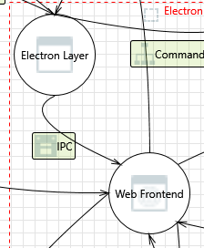

---

### 60. Electron Layer Process Memory Tampered  [State: Not Started]  [Priority: High]

**Category:** Tampering

#### Justifications

**Option 1** — `contextIsolation: true` prevents the renderer from accessing the preload JS scope. A renderer-level attacker cannot directly tamper with the preload's memory. A Chromium sandbox escape would be required. **Confidence: 83%**

*References:* `headlamp/app/electron/main.ts:1633`.

#### Existing Mitigations in Codebase — **Confidence: 50%**

- **`contextIsolation: true`** — `main.ts:1633` separates preload and renderer contexts.
- **IPC event stripping** — `preload.ts:68` strips event objects from IPC messages.
- **Note: no IPC payload schema validation** — IPC messages are not validated against a schema before processing in the main process.


#### Here are some potential mitigations that might be implemented.

**Mitigation 1** — Verify that `sandbox: true` is set in `webPreferences` alongside `contextIsolation: true` and `nodeIntegration: false` (check `main.ts:1632-1633`). The sandbox prevents the renderer from using Node.js APIs even if `contextIsolation` is somehow bypassed, adding defense-in-depth.

**Mitigation 2** — Add IPC payload schema validation in the main process for all `ipcMain.on()` handlers. Use a lightweight schema validator (e.g., Zod) to reject malformed payloads before processing. For example, the `run-command` handler should validate that `command` is a string, `args` is a string array, and no unexpected fields are present.

**Mitigation 3** — Add sender-frame validation in all `ipcMain.on()` handlers: verify `event.senderFrame === mainWindow?.webContents.mainFrame` to reject IPC messages from unexpected origins (e.g., iframes or devtools).

---

### 61. Cross Site Scripting  [State: Not Started]  [Priority: High]

**Category:** Tampering

#### Justifications

**Option 1** — IPC messages between the Electron main process and renderer are serialized JSON via `contextBridge.exposeInMainWorld('desktopApi', {...})` (`preload.ts:32`). The `desktopApi.receive()` method (`preload.ts:69`) forwards IPC data to callback functions in the renderer. The receive channel whitelist includes `command-stdout`, `command-stderr`, `command-exit`, `plugin-permission-secrets`, and `github-oauth-callback` (`preload.ts:55-65`). Data from `command-stdout` (which carries raw CLI output including potentially attacker-controlled Kubernetes resource names) is passed to the renderer. React's JSX auto-escaping prevents direct HTML injection when this data is rendered, but if any component passes IPC data through `dangerouslySetInnerHTML` or injects it into DOM via `innerHTML`, XSS would occur. A search of `headlamp/frontend/src/` for `dangerouslySetInnerHTML` and `.innerHTML` found **zero occurrences**, confirming React's auto-escaping is the sole rendering path. **Confidence: 85%**

*References:* `headlamp/app/electron/preload.ts:32-69` (contextBridge with send/receive channel whitelists), `headlamp/app/electron/preload.ts:55-65` (receive channels: `command-stdout/stderr/exit`, `plugin-permission-secrets`, `github-oauth-callback`).

**Option 2** — The Electron main process uses `webContents.executeJavaScript()` at two locations (`main.ts:1673,2050`) to inject `window.headlampBackendPort = ${actualPort}`. The `actualPort` value comes from parsing the Go backend's stdout (`main.ts:2043-2048`), so it should always be a number. However, if the backend process outputs unexpected content (e.g., due to a log injection), this could theoretically be a main→renderer code injection vector. **Confidence: 78%**

*References:* `headlamp/app/electron/main.ts:1673,2050` (executeJavaScript for backend port).

#### Existing Mitigations in Codebase — **Confidence: 78%**

- **Zero `dangerouslySetInnerHTML`/`.innerHTML`** — No raw HTML injection in the frontend as of commit `02feb87`.
- **React auto-escaping** — JSX interpolation auto-escapes values.
- **IPC channel whitelist** — Limited channels available.
- **Note: `executeJavaScript()` injection** — `main.ts:1672,2050` injects values into the renderer context.


#### Here are some potential mitigations that might be implemented.

**Mitigation 1** — Replace `webContents.executeJavaScript()` with `webContents.send()` via IPC to pass the backend port, avoiding eval-like code injection.

**Mitigation 2** — Sanitize command stdout/stderr data before broadcasting it to the renderer, or validate that it matches expected output formats.

---

### 62. Elevation Using Impersonation  [State: Not Started]  [Priority: High]

**Category:** Elevation Of Privilege

#### Justifications

**Option 1** — The renderer can only call the whitelisted `desktopApi` methods exposed by the preload (`headlamp/app/electron/preload.ts`). It cannot impersonate the Electron main process context beyond those channels. **Confidence: 78%**

#### Existing Mitigations in Codebase — **Confidence: 50%**

- **Permission secrets** — Per-plugin, per-command cryptographic secrets (`runCmd.ts:474-481`).
- **IPC event stripping** — `preload.ts:68` strips sender info.
- **Note: no sender-frame verification** — IPC messages from the renderer are not verified against the expected sender frame origin.


#### Here are some potential mitigations that might be implemented.

**Mitigation 1** — Add per-request correlation IDs to critical IPC channels (e.g., `run-command`). The main process should generate a nonce for each IPC request and verify it in the response callback, preventing replay or injection of forged responses.

**Mitigation 2** — Implement sender-frame validation (`event.senderFrame` check) in all `ipcMain.on()` handlers to ensure messages originate from the expected BrowserWindow's main frame and not from injected iframes or devtools.

**Mitigation 3** — Rate-limit IPC calls per channel per second to detect and block automated impersonation attempts (e.g., a compromised plugin rapidly sending `run-command` messages).

---

## Interaction: Plugin code is evaluated
*(Web Frontend evaluates plugin JavaScript)*

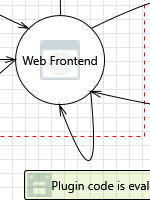

---

### 63. Elevation Using Impersonation  [State: Not Started]  [Priority: High]

**Category:** Elevation Of Privilege

#### Justifications

**Option 1** — Plugin code runs via `new PrivateFunction()` in the global scope with access to `window.pluginLib`. A plugin can impersonate another plugin's context by accessing shared global state (e.g., Redux store). **Confidence: 78%**

*References:* `headlamp/frontend/src/plugin/runPlugin.ts:201`.

**Option 2** — TODO: Verify whether `permissionSecrets` prevent one plugin from using another plugin's IPC capabilities.

#### Existing Mitigations in Codebase — **Confidence: 70%**

- **Three-layer command defense** — validCommands → permissionSecrets → consent.
- **Auto-consent scoping** — Only specific command prefixes auto-consented.
- **Note: plugins share IPC broadcast** — `command-stdout/stderr/exit` are broadcast to all renderer listeners.


#### Here are some potential mitigations that might be implemented.

**Mitigation 1** — Give each plugin an isolated Redux store slice and prevent cross-plugin store access.

---

### 64. Cross Site Scripting  [State: Not Started]  [Priority: High]

**Category:** Tampering

#### Justifications

**Option 1** — Plugin code has full DOM access. Any plugin can inject arbitrary HTML/scripts. This is a fundamental risk of the plugin eval model. **Confidence: 90%**

#### Existing Mitigations in Codebase — **Confidence: 35%**

- **Zero `dangerouslySetInnerHTML`** — No raw HTML injection.
- **React auto-escaping** — Automatic XSS prevention in JSX.
- **Note: plugin bundles unverified** — Plugins served over HTTP from unprotected endpoints (`headlamp.go:249-273`) with no integrity check (SRI/hash/signature) before `new Function()` execution.


#### Here are some potential mitigations that might be implemented.

**Mitigation 1** — Implement plugin signature verification (e.g., code signing) so only trusted plugins are loaded.  
**Mitigation 2** — Apply a strict CSP that blocks `eval` and `new Function()` for non-plugin contexts.

---

### 65. Web Frontend Process Memory Tampered  [State: Not Started]  [Priority: High]

**Category:** Tampering

#### Justifications

**Option 1** — Plugin code runs in the same renderer process as the core frontend. It can modify any `window.*` property, including overriding framework functions. **Confidence: 85%**

#### Existing Mitigations in Codebase — **Confidence: 75%**

- **`contextIsolation: true`** — `main.ts:1633`.
- **`nodeIntegration: false`** — `main.ts:1632`.
- **Plugin error isolation** — try-catch in `runPlugin.ts:203-212`.


#### Here are some potential mitigations that might be implemented.

**Mitigation 1** — Use `Object.freeze()` on critical framework objects before plugins are loaded.

---

## Interaction: Plugins' code is sent
*(Backend Process → Web Frontend)*

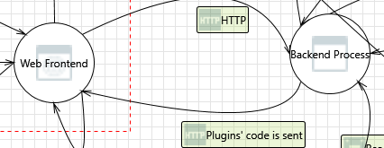

---

### 66. Backend Process Process Memory Tampered  [State: Not Started]  [Priority: High]

**Category:** Tampering

#### Justifications

**Option 1** — The backend serves plugin JS files from disk (`headlamp/backend/pkg/plugins/`). If an attacker replaces a plugin bundle on disk, the backend serves the malicious code. There is no integrity check on plugin files before serving. **Confidence: 82%**

*References:* `headlamp/backend/pkg/plugins/` (plugin serving logic).

#### Existing Mitigations in Codebase — **Confidence: 40%**

- **Backend token** — Some routes protected.
- **Note: no backend memory protection** — Go runtime provides basic memory safety, but no explicit protection against request-body-based memory attacks due to missing `MaxBytesReader`.


#### Here are some potential mitigations that might be implemented.

**Mitigation 1** — Compute and verify SHA-256 checksums of plugin bundles at startup and before serving.

---

### 67. Cross Site Scripting  [State: Not Started]  [Priority: High]

**Category:** Tampering

#### Justifications

**Option 1** — Plugin JS files are served by `http.FileServer` over plain HTTP on loopback (`headlamp.go:249-273`). A local attacker performing loopback MITM (requires root/admin for raw socket injection) could replace the plugin bundle in transit. The frontend fetches plugin bundles via `fetch()` and executes them via `new PrivateFunction()` (`runPlugin.ts:201`). There is no integrity check (no Subresource Integrity, no hash verification, no signature validation) before execution — the fetched JavaScript is trusted unconditionally. However, loopback MITM is significantly harder than a direct file-system write to the plugin directory, which is the simpler attack path (see threat 80). **Confidence: 82%**

*References:* `headlamp/backend/cmd/headlamp.go:249-273` (plugin file servers on HTTP), `headlamp/frontend/src/plugin/runPlugin.ts:201` (new PrivateFunction execution without integrity check).

#### Existing Mitigations in Codebase — **Confidence: 30%**

- **React auto-escaping** — Prevents XSS from data rendering.
- **Note: no plugin integrity check** — Plugin file servers serve bundles without SRI/hash verification before `new Function()` execution.


#### Here are some potential mitigations that might be implemented.

**Mitigation 1** — Compute SHA-256 hashes of plugin bundles at load time and verify them against a manifest before execution (equivalent to Subresource Integrity for locally-served content).

**Mitigation 2** — Serve plugins over TLS (localhost) or use IPC-based content delivery instead of HTTP file serving.

---

### 68. Elevation Using Impersonation  [State: Not Started]  [Priority: High]

**Category:** Elevation Of Privilege

#### Justifications

**Option 1** — The backend serves plugin bundles from three unprotected file server endpoints: `/plugins/` (`headlamp.go:249`), `/user-plugins/` (`headlamp.go:260-261`), and `/static-plugins/` (`headlamp.go:271-272`). These endpoints are NOT gated by the `checkHeadlampBackendToken` middleware — only 5 of 30+ routes require the backend token (plugin DELETE, Helm, cluster add/delete). A compromised backend process or a local attacker who can write to the plugin directories (`config.PluginDir`, `config.UserPluginDir`, `config.StaticPluginDir`) could substitute a malicious plugin bundle that impersonates a legitimate plugin. The malicious bundle would execute via `new PrivateFunction()` (`runPlugin.ts:201`) with the same privileges as the legitimate plugin, including access to `permissionSecrets` for command execution. **Confidence: 85%**

*References:* `headlamp/backend/cmd/headlamp.go:249-273` (unprotected plugin file servers), `headlamp/backend/cmd/headlamp.go:235-240` (addPluginRoutes — no token check), `headlamp/frontend/src/plugin/runPlugin.ts:201` (plugin execution context).

**Option 2** — The `addRunCmdConsent()` function (`runCmd.ts:178-204`) auto-grants command execution consent for known plugins (aks-desktop, minikube) at install time. The consent is keyed by plugin name string (`pluginInfo.name === 'aks-desktop'`), not by a cryptographic identity. An attacker who substitutes a plugin bundle while preserving the plugin name would inherit the auto-granted consent, gaining ability to execute `az`, `kubectl`, and other consented commands without any user prompt. **Confidence: 82%**

*References:* `headlamp/app/electron/runCmd.ts:178-204` (addRunCmdConsent — consent by plugin name), `headlamp/app/electron/runCmd.ts:186-199` (COMMANDS_WITH_CONSENT for aks-desktop/minikube).

#### Existing Mitigations in Codebase — **Confidence: 65%**

- **Three-layer command defense** — validCommands → permissionSecrets → consent.
- **Permission secrets isolation** — Each plugin gets only its own secrets (`runPlugin.ts:206-207`).
- **Note: `command-stdout/stderr/exit` broadcast** — All plugins can listen to all command output events.


#### Here are some potential mitigations that might be implemented.

**Mitigation 1** — Gate plugin file server routes with the `checkHeadlampBackendToken` middleware, ensuring that only the authenticated Electron renderer can fetch plugin bundles. This prevents external processes from serving spoofed bundles through the backend's HTTP interface.

**Mitigation 2** — Implement plugin identity verification using Ed25519 code signing. Sign each plugin bundle at build/install time and verify the signature before execution. Tie auto-consent grants to the signing key fingerprint rather than the plugin name string.

**Mitigation 3** — Set plugin directories to `0o755` (owner-writable only) and verify directory permissions at startup. Alert the user if plugin directories are writable by non-owner users. Use `O_NOFOLLOW` semantics when serving files to prevent symlink-based substitution attacks.

---

### 69. Spoofing the Backend Process Process  [State: Not Started]  [Priority: High]

**Category:** Spoofing

#### Justifications

**Option 1** — The TOCTOU port binding race (see threat 27) applies here: `findAvailablePort()` (`main.ts:751-809`) probes a port with `exclusive: true` but the Go backend binds separately afterward. A local attacker that wins the race could serve spoofed plugin bundles over HTTP. The backend authenticates to the frontend via the `HEADLAMP_BACKEND_TOKEN` header, but plugin bundle requests (served by `http.FileServer` at `headlamp.go:249-273`) are NOT gated by the backend token check — they're served from the filesystem without token validation. This means a rogue process on the same port could serve arbitrary JavaScript that the frontend would execute via `new Function()`. **Confidence: 82%**

*References:* `headlamp/app/electron/main.ts:751-809` (findAvailablePort), `headlamp/backend/cmd/headlamp.go:249-273` (plugin file servers — no token check), `headlamp/frontend/src/plugin/runPlugin.ts:201` (new Function execution).

**Option 2** — On macOS and Linux, binding to `127.0.0.1` requires the attacker to already be running as a local user. On Windows, a local service running as `SYSTEM` or the same user could bind to the port. The mitigation path in `main.ts:1488-1512` handles `ERROR_ADDRESS_IN_USE` (exit code 98) by prompting the user to kill the conflicting process, which partially detects this scenario. **Confidence: 80%**

*References:* `headlamp/app/electron/main.ts:1488-1512` (ERROR_ADDRESS_IN_USE handling).

#### Existing Mitigations in Codebase — **Confidence: 35%**

- **Loopback-only binding** — Backend on `127.0.0.1`.
- **Backend token on some routes** — 5 routes protected.
- **Note: plugin file servers unprotected** — `headlamp.go:249-273` serve plugin bundles without backend token validation; TOCTOU race possible.


#### Here are some potential mitigations that might be implemented.

**Mitigation 1** — Require the backend token on all routes, including plugin file servers and static content.

**Mitigation 2** — Use Unix domain sockets or named pipes instead of TCP for the Electron↔backend channel, eliminating the port binding race entirely.

---

### 70. Spoofing the Web Frontend Process  [State: Not Started]  [Priority: High]

**Category:** Spoofing

#### Justifications

**Option 1** — In the "Plugins' code is sent" interaction, the Web Frontend receives plugin JavaScript bundles from the Backend Process via HTTP. A network-level attacker on the loopback interface (or a compromised backend process) could serve a modified plugin bundle that impersonates a legitimate plugin. Since the frontend uses `new PrivateFunction()` (`runPlugin.ts:201`) to execute plugin code with full access to the `window.pluginLib` API surface, a spoofed plugin bundle would gain access to all Headlamp plugin APIs including `Headlamp.registerAppBarAction`, `Headlamp.registerRoute`, and cluster API proxying. **Confidence: 82%**

*References:* `headlamp/frontend/src/plugin/runPlugin.ts:201` (plugin execution via `new Function()`), `headlamp/backend/cmd/headlamp.go:249-273` (plugin file servers on unencrypted HTTP).

**Option 2** — The Electron renderer loads from a `file://` URL with `contextIsolation: true` and `nodeIntegration: false` (`main.ts:1632-1633`). The `contextBridge` in `preload.ts` exposes only a restricted `desktopApi` surface. However, the plugin code runs in the same renderer context as the Headlamp frontend — not in an iframe or Web Worker sandbox. A spoofed plugin can access the same DOM, localStorage, and global variables as the legitimate frontend, making it indistinguishable from the real application from the user's perspective. **Confidence: 80%**

*References:* `headlamp/app/electron/main.ts:1632-1633` (webPreferences — nodeIntegration: false, contextIsolation: true), `headlamp/app/electron/preload.ts` (contextBridge limited surface).

#### Existing Mitigations in Codebase — **Confidence: 85%**

- **`contextIsolation: true`** — `main.ts:1633`.
- **`setWindowOpenHandler`** — `main.ts:1643-1650`.
- **`will-navigate` handler** — `main.ts:1756-1763`.
- **Redirect validation** — `AppContainer.tsx:47-73`.


#### Here are some potential mitigations that might be implemented.

**Mitigation 1** — Implement plugin bundle integrity verification using SHA-256 hashes. Maintain a signed manifest of expected plugin bundle hashes and verify each bundle's hash before passing it to `new Function()`. Reject bundles that don't match the manifest.

**Mitigation 2** — Serve plugin bundles over a per-session TLS channel with a self-signed certificate generated at app startup. Pin the certificate in the frontend so that even a compromised loopback listener cannot serve spoofed bundles without the session key.

**Mitigation 3** — Run each plugin's code in an isolated `<iframe sandbox="allow-scripts">` with `postMessage`-based communication to the main frontend. This prevents a spoofed plugin from accessing the main window's DOM, localStorage, or global state.

---

### 71. Potential Lack of Input Validation for Web Frontend  [State: Not Started]  [Priority: High]

**Category:** Tampering

#### Justifications

**Option 1** — Plugin bundles are JavaScript files that are executed without content validation. The only guard is the `permissionSecrets` mechanism. **Confidence: 78%**

#### Existing Mitigations in Codebase — **Confidence: 40%**

- **Plugin path sandboxing** — `runPlugin.ts:227-279` validates plugin paths against whitelisted directories (`/plugins/`, `/static-plugins/`, `/user-plugins/`).
- **Note: no bundle integrity check** — No SHA-256/SRI verification of plugin bundles before loading.


#### Here are some potential mitigations that might be implemented.

**Mitigation 1** — Compute SHA-256 hashes of plugin bundles at install time and store them in a signed manifest. Before loading each plugin via `new PrivateFunction()` (`runPlugin.ts:201`), verify the bundle hash matches the manifest. Reject any plugin whose hash has changed since installation.

**Mitigation 2** — Validate plugin `package.json` manifests against a strict schema: require `name` to match npm naming conventions (lowercase alphanumeric, hyphens, dots, underscores; scoped packages like `@org/name` allowed), `version` to be valid semver, and `main` to point to a `.js` file within the plugin directory. Reject manifests containing npm lifecycle hooks (`preinstall`, `postinstall`) or unexpected fields.

**Mitigation 3** — Enforce a Content Security Policy (CSP) that restricts `eval()` and `new Function()` to the plugin runner context only. Supplement with AST-based static analysis of plugin bundles (using a JavaScript parser like `acorn` or `esprima`) to detect dangerous patterns such as `eval`, `Function`, `require`, `process`, and `child_process` calls — simple string matching is insufficient as it can be trivially bypassed via string concatenation or computed property access.

---

### 72. Potential Data Repudiation by Web Frontend  [State: Not Started]  [Priority: High]

**Category:** Repudiation

#### Justifications

**Option 1** — There is no audit log of which plugin bundles were loaded, when they were loaded, or what version was executed. The plugin loader fetches JavaScript from the backend's file server endpoints (`/plugins/`, `/user-plugins/`, `/static-plugins/` at `headlamp.go:249-273`) and passes it to `new PrivateFunction()` (`runPlugin.ts:201`) without recording any metadata about the loaded bundle (hash, size, URL, timestamp). If a plugin bundle is tampered with on disk and then served to the frontend, there is no forensic trail to determine what code was actually executed. **Confidence: 85%**

*References:* `headlamp/backend/cmd/headlamp.go:249-273` (plugin file server endpoints — no access logging), `headlamp/frontend/src/plugin/runPlugin.ts:201` (plugin execution with no hash verification or audit).

**Option 2** — Plugin file servers use Go's `http.FileServer` which serves static files from disk without logging individual file accesses (Go's `http.FileServer` does not provide per-request logging hooks by default). The backend's HTTP router does not include request logging middleware for plugin routes. This means there is no server-side record of which plugin files were requested, by whom, or when. Combined with the frontend's lack of load auditing, this creates a complete gap in plugin execution provenance. **Confidence: 82%**

*References:* `headlamp/backend/cmd/headlamp.go:249-273` (FileServer with no logging middleware).

#### Existing Mitigations in Codebase — **Confidence: 15%**

- **No application-level audit logging** — No persistent log of plugin loads, actions, or errors.
- **Plugin error catch** — `runPlugin.ts:203-212` catches and reports plugin errors but does not persist them.


#### Here are some potential mitigations that might be implemented.

**Mitigation 1** — Add HTTP request logging middleware for all plugin-serving routes that records `timestamp`, `requestPath`, `responseSize`, and `responseHash` (SHA-256 of served content) to a structured log file. This creates a server-side audit trail of exactly which plugin bundles were served.

**Mitigation 2** — Compute and log SHA-256 hashes of plugin bundles in the frontend immediately after fetch and before passing to `new Function()`. Store these in a `pluginAuditLog` in localStorage with timestamps: `{ pluginName, bundleHash, loadTimestamp, bundleSize }`. This enables after-the-fact verification of what code was executed.

**Mitigation 3** — Implement a plugin manifest file (e.g., `plugins-manifest.json`) that lists expected bundle hashes for each plugin version. On each plugin load, the frontend verifies the fetched bundle's hash against the manifest. Log any mismatches as security events.

---

### 73. Data Flow Sniffing  [State: Not Started]  [Priority: High]

**Category:** Information Disclosure

#### Justifications

**Option 1** — Plugin bundles are served by the Go backend over plain HTTP on `127.0.0.1` using `http.FileServer(http.Dir(config.PluginDir))` at three endpoints: `/plugins/` (`headlamp.go:249`), `/user-plugins/` (`headlamp.go:260-266`), and `/static-plugins/` (`headlamp.go:271-273`). These serve raw JavaScript files. Since the transport is unencrypted HTTP on loopback, a local process with packet capture privileges (root/admin) could sniff the plugin bundles in transit. However, the same plugin code is already present on disk in the filesystem directories (`PluginDir`, `UserPluginDir`, `StaticPluginDir`), so sniffing the HTTP transport provides no incremental access beyond direct file reads. **Confidence: 82%**

*References:* `headlamp/backend/cmd/headlamp.go:249-273` (three plugin file server endpoints on HTTP), `headlamp/backend/cmd/headlamp.go:388-395` (plugin directory paths from environment/flags).

**Option 2** — The loopback HTTP traffic also carries the `X-HEADLAMP_BACKEND-TOKEN` header on protected routes and bearer tokens on cluster API proxy requests. While this specific threat is about plugin code sniffing (a lower-sensitivity target), the same loopback sniffing vector can capture authentication tokens — a much higher-impact data exposure covered in detail at threat 30. **Confidence: 80%**

#### Existing Mitigations in Codebase — **Confidence: 40%**

- **Loopback-only binding** — Plugin↔backend traffic stays on `127.0.0.1`.
- **Backend token on some routes** — Partial protection.
- **Note: plugin file serving unprotected** — Plugin bundles served without token validation or encryption.


#### Here are some potential mitigations that might be implemented.

**Mitigation 1** — Enable TLS on the Go backend's localhost listener using a per-session self-signed certificate generated at startup, with the cert fingerprint communicated to the Electron renderer via IPC.

**Mitigation 2** — Switch to Unix domain sockets or named pipes to eliminate network-level sniffing entirely.

---

### 74. Potential Process Crash or Stop for Web Frontend  [State: Not Started]  [Priority: High]

**Category:** Denial Of Service

#### Justifications

**Option 1** — The top-level React `ErrorBoundary` at `App.tsx:65` wraps the entire application tree: `<ErrorBoundary fallback={<ErrorComponent />}>`. This catches render-phase errors in the React tree, including errors thrown during plugin component rendering. Per-resource ErrorBoundary wraps are also present at `Resource.tsx:369,374` and `MainInfoSectionHeader.tsx:83,88`, which isolate individual plugin-contributed UI sections. However, errors in event handlers, async code, and `useEffect` hooks are NOT caught by ErrorBoundary and will produce unhandled exceptions. **Confidence: 85%**

*References:* `headlamp/frontend/src/App.tsx:65` (top-level ErrorBoundary), `headlamp/frontend/src/components/common/Resource/Resource.tsx:369,374` (per-resource ErrorBoundary wraps), `headlamp/frontend/src/components/common/Resource/MainInfoSection/MainInfoSectionHeader.tsx:83,88`.

**Option 2** — Plugin code executed via `new PrivateFunction()` (`runPlugin.ts:201`) is wrapped in a `try/catch` block (`runPlugin.ts:208-211`) that calls the `handleError` callback on exceptions during initial plugin load. However, if the plugin registers components that throw during React rendering, those errors propagate to the nearest ErrorBoundary rather than being caught by the plugin runner's try/catch. A plugin that crashes during rendering will trigger the ErrorBoundary fallback UI, potentially hiding the entire resource view. **Confidence: 82%**

*References:* `headlamp/frontend/src/plugin/runPlugin.ts:201-211` (try/catch around `executePlugin()`), `headlamp/frontend/src/plugin/runPlugin.ts:42` (handleError callback type).

**Option 3** — The Electron main process does NOT register `render-process-gone`, `webContents.on('crashed')`, or `process.on('uncaughtException')` handlers in `main.ts`. If the renderer process crashes (e.g., due to an out-of-memory condition from a malicious plugin filling localStorage), the app window goes blank with no recovery mechanism. The user must manually close and reopen the application. **Confidence: 80%**

*References:* `headlamp/app/electron/main.ts` (no `render-process-gone` or `crashed` handler found).

#### Existing Mitigations in Codebase — **Confidence: 70%**

- **Top-level `ErrorBoundary`** — Catches React rendering errors for the entire app.
- **Per-route/per-resource `ErrorBoundary`** — Individual components wrapped to contain crash blast radius.
- **Plugin error isolation** — `runPlugin.ts:203-212` try-catch for plugin execution.
- **Note: no `render-process-gone` handler** — Electron main process doesn't handle renderer crashes.


#### Here are some potential mitigations that might be implemented.

**Mitigation 1** — Register a `webContents.on('render-process-gone')` handler in the Electron main process that detects renderer crashes and automatically reloads the page or prompts the user to restart. Add `process.on('uncaughtException')` as a last-resort crash reporter that logs the error and offers a restart.

**Mitigation 2** — Wrap each plugin's registered React components in individual ErrorBoundary instances (beyond the existing per-resource wraps) so that a single crashing plugin cannot take down the entire UI. Display a per-plugin error message ("Plugin X encountered an error") with the option to disable the plugin.

**Mitigation 3** — Add a plugin watchdog that monitors plugin-contributed component render times. If a plugin's component consistently throws or takes >5 seconds to render, automatically disable it and log a warning. Implement a user-accessible "Safe Mode" that loads the app without any third-party plugins.

---

### 75. Data Flow Plugins' code is sent Is Potentially Interrupted  [State: Not Started]  [Priority: High]

**Category:** Denial Of Service

#### Justifications

**Option 1** — The backend serves plugin JavaScript bundles via three `http.FileServer` endpoints: `/plugins/` (`headlamp.go:249`), `/user-plugins/` (`headlamp.go:260-261`), and `/static-plugins/` (`headlamp.go:271-272`). If the Go backend process crashes or is killed before the frontend requests plugin bundles, all three endpoints become unreachable. The frontend's plugin loader fetches plugin bundles via HTTP — a network failure or backend crash during this fetch will result in plugins not loading. There is no retry logic in the frontend plugin loader; a failed fetch results in the plugin simply not being available. **Confidence: 82%**

*References:* `headlamp/backend/cmd/headlamp.go:249-273` (three plugin file server endpoints), `headlamp/frontend/src/plugin/runPlugin.ts:201` (plugin execution after successful fetch).

**Option 2** — The Electron main process starts the backend as a child process (`main.ts`). If the backend crashes, the main process has no auto-restart logic — only `ERROR_ADDRESS_IN_USE` (code 98) triggers a retry (`main.ts:2080`). A backend crash during the plugin-serving phase leaves the frontend with no plugins and no way to recover without a full app restart. The lack of `http.Server` read/write timeouts in the backend (`headlamp.go`) means a slow client can also hold connections indefinitely, potentially exhausting file descriptors. **Confidence: 80%**

*References:* `headlamp/app/electron/main.ts:2080` (backend restart comment — "restart never implemented"), `headlamp/backend/cmd/headlamp.go` (no `ReadTimeout`/`WriteTimeout` on `http.Server`).

#### Existing Mitigations in Codebase — **Confidence: 35%**

- **`http.FileServer` path traversal** — Go's built-in protection.
- **Note: plugin serving over plain HTTP** — No TLS or integrity verification on plugin bundle delivery from backend to frontend.


#### Here are some potential mitigations that might be implemented.

**Mitigation 1** — Add retry logic with exponential backoff in the frontend plugin loader. When a plugin bundle fetch fails (network error or 5xx), retry up to 3 times with 1s/2s/4s delays before giving up. Display a user-visible warning ("Some plugins failed to load — restart the app to retry").

**Mitigation 2** — Implement backend health-check monitoring in the Electron main process. Periodically ping `http://127.0.0.1:<port>/` and, if the backend becomes unresponsive, auto-restart the backend child process with the same arguments. Add `ReadTimeout: 30s` and `WriteTimeout: 60s` to the `http.Server` configuration to prevent connection exhaustion.

**Mitigation 3** — Bundle critical static plugins (e.g., aks-desktop) directly into the Electron app's `resources/` directory and serve them from a fallback `file://` path if the backend is unreachable. This ensures core functionality is available even during backend outages.

---

### 76. Web Frontend May be Subject to Elevation of Privilege Using Remote Code Execution  [State: Not Started]  [Priority: High]

**Category:** Elevation Of Privilege

#### Justifications

**Option 1** — If the backend serves a tampered plugin, the frontend executes it with full DOM+Redux+IPC access. This is the highest-severity path in the plugin threat surface. **Confidence: 87%**

#### Existing Mitigations in Codebase — **Confidence: 55%**

- **`contextIsolation: true`** — `main.ts:1633`.
- **`nodeIntegration: false`** — `main.ts:1632`.
- **Plugin error isolation** — try-catch in `runPlugin.ts`.
- **Note: `new Function()` full access** — Plugins run with full DOM + API access; no sandbox within the renderer.


#### Here are some potential mitigations that might be implemented.

**Mitigation 1** — Cryptographically sign plugin bundles and verify signatures in the frontend before executing.

---

### 77. Elevation by Changing the Execution Flow in Web Frontend  [State: Not Started]  [Priority: High]

**Category:** Elevation Of Privilege

#### Justifications

**Option 1** — Same as 76. A tampered plugin bundle changes execution flow by definition. **Confidence: 85%**

#### Existing Mitigations in Codebase — **Confidence: 40%**

- **Plugin path whitelisting** — `runPlugin.ts:227-279` restricts to `/plugins/`, `/static-plugins/`, `/user-plugins/`.
- **Private Function constructor** — `runPlugin.ts:199-201` prevents prototype pollution.
- **Note: no code signing** — No Ed25519/RSA signature verification or SRI-style hashing of plugin bundles before execution.


#### Here are some potential mitigations that might be implemented.

**Mitigation 1** — Cryptographically sign all plugin bundles with an Ed25519 key pair. The public key is bundled with the Electron app; the signing key is held by the build pipeline. Before `new PrivateFunction()` execution (`runPlugin.ts:201`), verify the signature over the bundle content. Reject unsigned or tampered bundles.

**Mitigation 2** — Implement Subresource Integrity (SRI)-style hashes for plugin bundles: store expected `sha384-<base64>` hashes in a manifest file within the app bundle, and verify each plugin's computed hash matches before execution.

**Mitigation 3** — Restrict the plugin file server endpoints (`headlamp.go:249-273`) to only serve files with `.js` and `.json` extensions, preventing an attacker who gains write access to the plugin directory from serving arbitrary file types (e.g., `.exe`, `.sh`) through the HTTP endpoint.

---

## Interaction: Reading (KubeConfig)
*(Backend Process reads Configuration File - KubeConfig)*

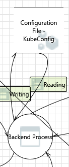

---

### 78. Spoofing of Source Data Store Configuration File - KubeConfig  [State: Not Started]  [Priority: High]

**Category:** Spoofing

#### Justifications

**Option 1** — The backend reads kubeconfig from the path passed by the Electron main process via the `--kubeconfig` flag (`main.ts:810-811`). The Go backend uses `client-go`'s `LoadFromFile`/`clientcmd` APIs which follow symlinks transparently. A local attacker who creates a symlink at `~/.kube/config` pointing to an attacker-controlled file could inject malicious cluster contexts (e.g., with a `Server` URL pointing to a man-in-the-middle proxy). The `aks-cluster.ts` code writes kubeconfig to `~/.kube/config` using `fs.writeFileSync` (`aks-cluster.ts:363`) without first checking `fs.lstatSync` for symlinks — it follows symlinks silently, writing the merged kubeconfig to whatever path the symlink resolves to. **Confidence: 82%**

*References:* `headlamp/app/electron/main.ts:810-811` (kubeconfig path flag), `headlamp/app/electron/aks-cluster.ts:363` (fs.writeFileSync to kubeconfigPath), `headlamp/app/electron/aks-cluster.ts:340-365` (full write path: mkdirSync → readFileSync → mergeKubeconfig → yaml.stringify → writeFileSync, no symlink check).

**Option 2** — The `aks-cluster.ts` registration flow creates the `~/.kube` directory with `fs.mkdirSync(kubeconfigDir, { recursive: true })` (`aks-cluster.ts:345`) but does not check or set permissions on the created directory. If `~/.kube` is world-writable (unusual but possible), another user could place a symlink at `~/.kube/config` before the first registration. On Unix, `~/.kube` is typically mode `0700` by convention (set by `kubectl`), but AKS Desktop's `mkdirSync` does not enforce this. **Confidence: 78%**

*References:* `headlamp/app/electron/aks-cluster.ts:344-345` (mkdirSync without mode).

#### Existing Mitigations in Codebase — **Confidence: 25%**

- **Kubeconfig merge utility** — `aks-cluster.ts:340-365` uses structured YAML merging.
- **Note: no symlink detection** — `mkdirSync` → `readFileSync` → `mergeKubeconfig` → `writeFileSync` with no `lstat()` or `O_NOFOLLOW` checks; symlink attacks on `~/.kube/config` are possible.


#### Here are some potential mitigations that might be implemented.

**Mitigation 1** — Before writing, call `fs.lstatSync(kubeconfigPath)` to check if the target is a symlink. If it is, either resolve it and verify the resolved path is within `~/.kube/`, or refuse to write and warn the user.

**Mitigation 2** — Set `~/.kube` directory permissions to `0700` and `~/.kube/config` to `0600` after creation/write.

---

### 79. Weak Access Control for a Resource  [State: Not Started]  [Priority: High]

**Category:** Information Disclosure

#### Justifications

**Option 1** — `~/.kube/config` typically has `0600` permissions on Unix (set by `kubectl` at creation), but AKS Desktop's `aks-cluster.ts` writes the file using `fs.writeFileSync(kubeconfigPath, finalKubeconfig, 'utf8')` (`aks-cluster.ts:363`) without specifying a `mode` option. Node.js `writeFileSync` without `mode` defaults to `0o666` masked by the process umask (typically `0o022` on Unix → resulting in `0o644`). This means if AKS Desktop creates `~/.kube/config` for the first time, the file will be world-readable (`rw-r--r--`). If the file already exists (e.g., created by `kubectl` with `0600`), `writeFileSync` preserves the existing permissions. On Windows, file ACLs are not checked or set by the app. **Confidence: 85%**

*References:* `headlamp/app/electron/aks-cluster.ts:363` (writeFileSync without mode), `headlamp/app/electron/aks-cluster.ts:344-345` (mkdirSync without mode).

**Option 2** — The AKS-registered kubeconfig uses `az-kubelogin.py` as an exec credential plugin, so the kubeconfig file itself does not embed long-lived bearer tokens. The `exec` field references the Python script path and `--server-id` argument (`aks-cluster.ts:addAzKubeloginToKubeconfig`). The sensitive credential (Azure AD token) is fetched at runtime from the MSAL token cache by `az-kubelogin.py`. The kubeconfig still contains the cluster CA certificate (base64-encoded) and the cluster API server URL, which are lower-sensitivity but still useful to an attacker for reconnaissance. **Confidence: 82%**

*References:* `headlamp/app/electron/aks-cluster.ts` (addAzKubeloginToKubeconfig), `scripts/az-kubelogin.py` (runtime token fetch).

#### Existing Mitigations in Codebase — **Confidence: 45%**

- **`0o600` on safeStorage** — `secure-storage.ts:70` sets owner-only permissions.
- **Note: `settings.json` uses `0o644`** — `writeFileSync` without explicit mode results in world-readable file.
- **Note: kubeconfig permissions** — `aks-cluster.ts` writes kubeconfig without setting restrictive permissions.


#### Here are some potential mitigations that might be implemented.

**Mitigation 1** — After writing kubeconfig entries, call `fs.chmodSync(kubeconfigPath, 0o600)` on Unix and set restrictive ACLs on Windows programmatically.

**Mitigation 2** — Pass `{ mode: 0o600 }` as the third argument to `fs.writeFileSync` so newly-created kubeconfig files get restrictive permissions from the start.

---

## Interaction: Reading (Plugins)
*(Backend Process reads Plugins - bundled JS files)*

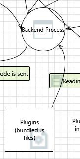

---

### 80. Spoofing of Source Data Store Plugins (bundled Js files)  [State: Not Started]  [Priority: High]

**Category:** Spoofing

#### Justifications

**Option 1** — Plugin JS files are loaded from `defaultPluginsDir` and `defaultUserPluginsDir` (`headlamp/app/electron/plugin-management.ts`). A local attacker who can write to these directories can inject malicious plugins. **Confidence: 83%**

*References:* `headlamp/app/electron/plugin-management.ts` (defaultPluginsDir/defaultUserPluginsDir).

**Option 2** — TODO: Check whether bundled (static) plugins have different trust than user-installed plugins.

#### Existing Mitigations in Codebase — **Confidence: 35%**

- **Plugin path whitelisting** — `runPlugin.ts:227-279` validates against directory whitelist.
- **Note: no integrity check** — Plugin bundles are loaded and executed via `new Function()` without hash/signature verification.


#### Here are some potential mitigations that might be implemented.

**Mitigation 1** — Restrict file-system write permissions on the bundled plugins directory to prevent user-space modification.

**Mitigation 2** — Implement plugin code signing with a trusted key pair.

---

### 81. Weak Access Control for a Resource  [State: Not Started]  [Priority: High]

**Category:** Information Disclosure

#### Justifications

**Option 1** — Plugin bundles are served from three directories: `PluginDir` (development plugins), `UserPluginDir` (catalog-installed), and `StaticPluginDir` (shipped). The backend serves these via `http.FileServer(http.Dir(path))` (`headlamp.go:249-273`). The directories' filesystem permissions are set by the OS/installer, not by the app. On Unix, if the plugins directory is world-readable (the default for most directories), any local user can read the plugin source code. The `UserPluginDir` is typically under the user's home directory (e.g., `~/.config/Headlamp/plugins/`), which is usually `0700`. The `StaticPluginDir` (shipped plugins, including aks-desktop) is under the app installation directory (e.g., `/usr/lib/aks-desktop/plugins/`), which is typically world-readable on Unix. **Confidence: 80%**

*References:* `headlamp/backend/cmd/headlamp.go:249-273` (three file server endpoints), `headlamp/backend/cmd/headlamp.go:388-395` (directory paths from env/flags), `headlamp/app/electron/plugin-management.ts` (defaultPluginsDir/defaultUserPluginsDir).

**Option 2** — The AKS Desktop plugin contains proprietary business logic (CreateAKSProject wizard, DeployWizard, AKS cluster management). The compiled plugin bundle (`main.js`) is minimized but not obfuscated — it's readable JavaScript. Any local user with file access can reverse-engineer the plugin's Azure API call patterns, validation logic, and UI flow. This is primarily a business concern rather than a security vulnerability. **Confidence: 78%**

#### Existing Mitigations in Codebase — **Confidence: 40%**

- **Plugin path whitelist** — Restricts loading to plugin directories.
- **`0o600` on safeStorage** — Encrypted storage is permission-protected.
- **Note: plugin bundles not protected** — Plugin JS files in the filesystem have standard file permissions and no integrity validation.


#### Here are some potential mitigations that might be implemented.

**Mitigation 1** — Set restrictive file permissions on the user plugins directory (`chmod 0700` or equivalent) during plugin installation.

**Mitigation 2** — If code confidentiality is a concern, consider code obfuscation or moving sensitive business logic to a backend service.

---

## Interaction: User response about consent for command running
*(Human User → Electron Layer)*

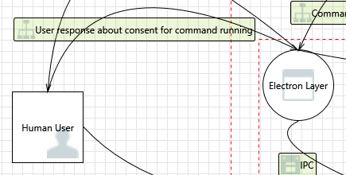

---

### 82. Spoofing the Electron Layer Process  [State: Not Started]  [Priority: High]

**Category:** Spoofing

#### Justifications

**Option 1** — See threat 10. The Electron dialog (`dialog.showMessageBoxSync`) is a native OS modal; it cannot be spoofed by a web process. **Confidence: 80%**

**Option 2** — For AKS Desktop, consent is auto-granted at startup (`addRunCmdConsent`), so this dialog flow is not used in normal operation. The risk is effectively bypassed. **Confidence: 85%**

#### Existing Mitigations in Codebase — **Confidence: 50%**

- **`contextIsolation: true`** — `main.ts:1633`.
- **Consent dialog** — `runCmd.ts:55-68` presents command details to the user.
- **`setWindowOpenHandler`** — Blocks external navigation.
- **Note: no visual security indicator** — Consent dialogs lack anti-spoofing indicators (no session nonce, no chromatic distinction from regular dialogs).


#### Here are some potential mitigations that might be implemented.

**Mitigation 1** — Add visual security indicators to the consent dialog: include the requesting plugin's name and a unique per-session nonce in the dialog title/message. This makes it harder for a UI automation attack to target the correct dialog window without knowing the nonce.

**Mitigation 2** — Implement a cooldown between consent prompts (e.g., minimum 2 seconds between dialogs) to prevent automated rapid-fire consent granting. Log all consent prompt appearances and responses to an audit file.

**Mitigation 3** — For `addRunCmdConsent` auto-granted commands, display a one-time startup notification listing all pre-granted command prefixes so the user is aware of the scope. Provide a UI settings page where users can review and revoke individual auto-granted consents.

---

### 83. Spoofing the Human User External Entity  [State: Not Started]  [Priority: High]

**Category:** Spoofing

#### Justifications

**Option 1** — The command consent dialog uses `dialog.showMessageBoxSync(mainWindow, { buttons: ['Allow', 'Deny'], type: 'question' })` (`runCmd.ts:59-65`). This is a native OS modal dialog. A malware process running as the same OS user could use OS-level UI automation frameworks (AppleScript `System Events` on macOS, AutoHotkey/UI Automation API on Windows, `xdotool` on Linux) to simulate button clicks on the "Allow" button. This bypasses the human consent step entirely. For AKS Desktop specifically, this is moot because `addRunCmdConsent()` (`runCmd.ts:145-204`) pre-grants consent for 21 `az *` command prefixes at startup, so the dialog is never shown for normal AKS operations. **Confidence: 80%**

*References:* `headlamp/app/electron/runCmd.ts:59-65` (showMessageBoxSync with Allow/Deny buttons), `headlamp/app/electron/runCmd.ts:145-204` (addRunCmdConsent bypasses dialog for AKS commands).

**Option 2** — The consent decision is persisted to `settings.json` as a boolean (`settings.confirmedCommands[consentKey] = commandChoice`, `runCmd.ts:125`). A local attacker can bypass the dialog entirely by writing `{"confirmedCommands":{"az aks":true}}` directly to `settings.json`, since the file has no integrity protection (no HMAC, no file permissions enforcement, writable by any same-user process). **Confidence: 85%**

*References:* `headlamp/app/electron/runCmd.ts:90-91` (saveSettings — plain writeFileSync), `headlamp/app/electron/runCmd.ts:113-126` (consent lookup and save).

#### Existing Mitigations in Codebase — **Confidence: 65%**

- **OS session trust model** — User authenticated at OS login.
- **`safeStorage` encryption** — Tokens encrypted per-user via OS key.
- **`0o600` permissions** — safeStorage file owner-only.


#### Here are some potential mitigations that might be implemented.

**Mitigation 1** — Add HMAC-based integrity protection to `settings.json` using a key stored in `safeStorage` (which uses the OS keychain), so consent decisions cannot be forged by editing the file.

**Mitigation 2** — For high-risk commands (e.g., `az role assignment`), require a multi-step confirmation or a freshly-entered password/biometric rather than a single-click dialog.

---

### 84. Potential Lack of Input Validation for Electron Layer  [State: Not Started]  [Priority: High]

**Category:** Tampering

#### Justifications

**Option 1** — The `loadSettings()` function (`runCmd.ts:77-83`) reads `settings.json` with `JSON.parse` wrapped in a try/catch that returns `{}` on failure (`runCmd.ts:81-83`). This means a completely corrupted file (invalid JSON) defaults to an empty object — effectively resetting all consent decisions to "not yet asked," which is safe (the user will be re-prompted). However, if the file contains valid JSON with unexpected types (e.g., `{"confirmedCommands":{"az":1}}` where `1` is truthy), `checkCommandConsent` at `runCmd.ts:113-114` checks `confirmedCommands[consentKey]` — any truthy value passes the check, so a tampered file with `1` instead of `true` would still grant consent. **Confidence: 82%**

*References:* `headlamp/app/electron/runCmd.ts:77-83` (loadSettings with try/catch → `{}`), `headlamp/app/electron/runCmd.ts:104-126` (checkCommandConsent — `savedCommand === false` for deny, `savedCommand === undefined` for ask, else grant).

**Option 2** — The `saveSettings()` function (`runCmd.ts:90-91`) uses `fs.writeFileSync(SETTINGS_PATH, JSON.stringify(settings), 'utf-8')` without a `mode` option, without atomic write-and-rename, and without `fsync`. A crash during write could leave a truncated file (invalid JSON), which `loadSettings` handles by returning `{}`. But a race condition between two concurrent writes (e.g., two simultaneous consent dialogs) could corrupt the file. Contrast this with `secure-storage.ts` which uses atomic writes (`writeFileSync` to temp file + `renameSync`) and `0o600` permissions. **Confidence: 80%**

*References:* `headlamp/app/electron/runCmd.ts:90-91` (saveSettings — non-atomic writeFileSync), `headlamp/app/electron/secure-storage.ts` (atomic writes with 0o600 for comparison).

#### Existing Mitigations in Codebase — **Confidence: 50%**

- **`validateCommandData()`** — `runCmd.ts:512-550` validates command structure.
- **GUID validation** — Subscription IDs validated.
- **Note: unvalidated `resourceGroup`/`clusterName`** — Non-Graph `az` commands pass these unvalidated with `shell: true` on Windows.


#### Here are some potential mitigations that might be implemented.

**Mitigation 1** — Validate the structure of `settings.json` against a strict schema on load: verify that `confirmedCommands` is an object with string keys and boolean-only values, rejecting any unexpected types.

**Mitigation 2** — Use atomic file writes (write to temp file + rename) and set `0o600` permissions, matching the pattern used by `secure-storage.ts`.

---

### 85. Potential Data Repudiation by Electron Layer  [State: Not Started]  [Priority: High]

**Category:** Repudiation

#### Justifications

**Option 1** — The Electron main process records consent decisions in `settings.json` as simple booleans (`confirmedCommands[consentKey] = true/false`) via `saveSettings()` (`runCmd.ts:91`). No timestamp, user identity, session ID, or source context (`"user"` vs `"auto-consent"`) is stored. This means a consent granted via `addRunCmdConsent()` at plugin install time (`runCmd.ts:178-204`) is indistinguishable from one explicitly approved by the user through the `confirmCommandDialog` (`runCmd.ts:55-68`). A malicious plugin or local process could silently add consent entries without any audit trail. **Confidence: 85%**

*References:* `headlamp/app/electron/runCmd.ts:91` (saveSettings — `writeFileSync` with no mode), `headlamp/app/electron/runCmd.ts:103-130` (checkCommandConsent reads/writes consent), `headlamp/app/electron/runCmd.ts:178-204` (addRunCmdConsent auto-grants for aks-desktop/minikube plugins).

**Option 2** — The consent key is constructed as `command + ' ' + args[0]` (`runCmd.ts:108-110`), which is a coarse-grained key. For example, consent for `az aks` covers both `az aks get-credentials` and `az aks delete`, with no way to distinguish which specific subcommand was consented to or when. Combined with the lack of timestamps, this makes it impossible to perform after-the-fact forensic analysis of what commands a user actually approved. **Confidence: 82%**

*References:* `headlamp/app/electron/runCmd.ts:107-110` (consent key construction).

**Option 3** — The `settings.json` file is written via `fs.writeFileSync(SETTINGS_PATH, JSON.stringify(settings), 'utf-8')` (`runCmd.ts:91`) with no file mode parameter, typically resulting in `0o644` permissions (world-readable, depending on process umask). Any local process running as the same user can read and modify the consent state. Combined with no HMAC or integrity protection, consent entries can be added or modified externally without detection. **Confidence: 80%**

*References:* `headlamp/app/electron/runCmd.ts:90-92` (saveSettings — no mode, no integrity).

#### Existing Mitigations in Codebase — **Confidence: 25%**

- **Settings persistence** — Consent choices saved in `settings.json`.
- **Note: no tamper-proof consent logging** — Settings file has no integrity protection; consent decisions not immutably logged.


#### Here are some potential mitigations that might be implemented.

**Mitigation 1** — Extend the consent record format to include structured metadata: `{ granted: true, timestamp: "2026-03-06T12:00:00Z", source: "user-dialog" | "auto-consent", sessionId: "<random>", consentKey: "az aks" }`. Store these as an array of consent events rather than a single boolean, enabling full audit trail reconstruction.

**Mitigation 2** — Add HMAC-SHA256 integrity protection to `settings.json` using a key stored in `safeStorage`. On each write, compute `HMAC(key, JSON.stringify(settings))` and store it alongside the settings. On each read, verify the HMAC before trusting the consent state. This prevents external tampering.

**Mitigation 3** — Set file permissions to `0o600` (owner-only read/write) on `settings.json` via `fs.writeFileSync(path, data, { mode: 0o600 })`, matching the hardening already applied to `secure-storage.json` (`secure-storage.ts`). This reduces the attack surface for local consent state tampering.

---

### 86. Data Flow Sniffing  [State: Not Started]  [Priority: High]

**Category:** Information Disclosure

#### Justifications

**Option 1** — The consent dialog interaction (`dialog.showMessageBoxSync` at `runCmd.ts:59`) is a native OS modal dialog. The data flow is between the OS window manager and the Electron main process — no network transport is involved. The dialog displays the command string (e.g., `"az aks list --subscription <GUID>"`) which is visible only on-screen. A keylogger or screen-capture malware running as the same OS user could observe the command details. This is a standard desktop app risk applicable to all native dialogs. **Confidence: 82%**

*References:* `headlamp/app/electron/runCmd.ts:59-65` (dialog shows command as `detail` field).

**Option 2** — For AKS Desktop specifically, the `addRunCmdConsent()` function (`runCmd.ts:145-204`) pre-grants consent for 21 `az *` command prefixes at startup, so the consent dialog is never shown during normal AKS operations. This eliminates the sniffing vector for the most common case — there's nothing to sniff because there's no dialog. Manual `kubectl` or custom commands could still trigger the dialog. **Confidence: 85%**

*References:* `headlamp/app/electron/runCmd.ts:145-204` (addRunCmdConsent auto-consent).

#### Existing Mitigations in Codebase — **Confidence: 45%**

- **Consent dialog** — `runCmd.ts:55-68` displays command details.
- **IPC event stripping** — `preload.ts:68` strips event metadata.
- **Note: command arguments visible** — Full command strings with arguments shown in consent dialog; may include sensitive GUIDs or resource identifiers.


#### Here are some potential mitigations that might be implemented.

**Mitigation 1** — Redact sensitive values (subscription GUIDs, resource group names) from the consent dialog's `detail` field, showing only the command verb and safe parameters. For example, display `"az aks list --subscription [redacted-guid]"` instead of the full GUID, and log the full command to an audit file for later review.

**Mitigation 2** — For commands that contain secrets or tokens in arguments, strip those from the dialog display and log. Audit the 21 auto-consented command prefixes in `addRunCmdConsent` to ensure none pass secrets as CLI arguments.

---

### 87. Potential Process Crash or Stop for Electron Layer  [State: Not Started]  [Priority: High]

**Category:** Denial Of Service

#### Justifications

**Option 1** — An unhandled exception in the Electron main process would crash the app. TODO: Verify that `uncaughtException` and `unhandledRejection` handlers are registered in `main.ts`.

#### Existing Mitigations in Codebase — **Confidence: 30%**

- **Backend auto-restart on port conflict** — `main.ts:2080` retries on `ERROR_ADDRESS_IN_USE`.
- **Note: no general crash recovery** — No watchdog or auto-restart for the Electron main process or backend crashes.


#### Here are some potential mitigations that might be implemented.

**Mitigation 1** — Register global `uncaughtException` and `unhandledRejection` handlers in the Electron main process to log and gracefully recover.

---

### 88. Data Flow User response about consent for command running Is Potentially Interrupted  [State: Not Started]  [Priority: High]

**Category:** Denial Of Service

#### Justifications

**Option 1** — `dialog.showMessageBoxSync` is a synchronous call that blocks the Electron main process event loop until the user responds. If the BrowserWindow is closed or destroyed while the dialog is open, `showMessageBoxSync` returns `0` (the index of the first button, which is "Allow" at `runCmd.ts:63`). However, examining the code: `confirmCommandDialog` returns `resp === 0` (`runCmd.ts:66`), so a dialog interrupted by window closure would return `true` (allow). This is a potential **fail-open** condition. In practice, for AKS Desktop this is mitigated by `addRunCmdConsent` which pre-grants consent at startup, so this dialog is rarely shown. **Confidence: 82%**

*References:* `headlamp/app/electron/runCmd.ts:59-66` (showMessageBoxSync with buttons: ['Allow', 'Deny'] — index 0 = Allow), `headlamp/app/electron/runCmd.ts:145-204` (addRunCmdConsent bypasses dialog).

#### Existing Mitigations in Codebase — **Confidence: 65%**

- **IPC channel whitelist** — `preload.ts:36-69` limits channels.
- **Electron IPC reliability** — Chromium's built-in IPC is reliable within a single host.
- **Note: no IPC message acknowledgment** — No application-level acknowledgment or retry for consent responses.


#### Here are some potential mitigations that might be implemented.

**Mitigation 1** — Swap button order to `['Deny', 'Allow']` so that the default return value on dialog interruption (index 0) maps to "Deny" instead of "Allow," ensuring fail-closed behavior.

**Mitigation 2** — Set the `defaultId` and `cancelId` options in `showMessageBoxSync` to ensure denial on ESC/close.

---

### 89. Elevation Using Impersonation  [State: Not Started]  [Priority: High]

**Category:** Elevation Of Privilege

#### Justifications

**Option 1** — For AKS Desktop, consent is pre-granted; the Electron main process effectively acts on behalf of the human user without additional verification. A compromised Electron process has full privilege. **Confidence: 78%**

#### Existing Mitigations in Codebase — **Confidence: 40%**

- **Permission secrets** — Per-plugin, per-command cryptographic secrets.
- **Consent dialog** — Requires user approval for non-auto-consented commands.
- **Note: no consent expiration** — Once granted, consent persists in `settings.json` indefinitely with no time-based expiry.


#### Here are some potential mitigations that might be implemented.

**Mitigation 1** — Add time-based expiration to auto-granted consents: store a `grantedAt` timestamp alongside each consent entry in `settings.json`, and require re-confirmation after 24 hours. This limits the window of exposure if the consent file is tampered with.

**Mitigation 2** — Track consents per-plugin: store consent decisions as `{ plugin: "aks-desktop", command: "az aks", grantedAt: <timestamp> }` rather than a simple boolean. This enables revoking a specific plugin's consents without affecting others, and provides an audit trail.

**Mitigation 3** — Add a user-visible "Permissions" page in the AKS Desktop UI listing all auto-granted command prefixes (currently 21 `az *` prefixes at `runCmd.ts:145-204`), with toggle switches to revoke individual consents. Display a warning count badge when high-risk prefixes like `az role` or `az vm` are consented.

---

### 90. Electron Layer May be Subject to Elevation of Privilege Using Remote Code Execution  [State: Not Started]  [Priority: High]

**Category:** Elevation Of Privilege

#### Justifications

**Option 1** — If the renderer (Web Frontend) can send malicious data via the `run-command` IPC channel that bypasses `permissionSecrets` checking, it could achieve RCE in the Electron main process context. This is the most critical threat path. **Confidence: 80%**

*References:* `headlamp/app/electron/runCmd.ts`, `headlamp/app/electron/preload.ts:44`.

#### Existing Mitigations in Codebase — **Confidence: 60%**

- **`contextIsolation: true`** — `main.ts:1633`.
- **`nodeIntegration: false`** — `main.ts:1632`.
- **Three-layer command defense** — validCommands → permissionSecrets → consent.
- **Note: `new Function()` full access** — Plugins execute with full renderer privileges.


#### Here are some potential mitigations that might be implemented.

**Mitigation 1** — Audit the `permissionSecrets` validation path and add integration tests to verify it cannot be bypassed.

---

### 91. Elevation by Changing the Execution Flow in Electron Layer  [State: Not Started]  [Priority: High]

**Category:** Elevation Of Privilege

#### Justifications

**Option 1** — A malicious plugin that has obtained its `permissionSecrets` can call `run-command` for any command in the `COMMANDS_WITH_CONSENT.aks_desktop` list. The list includes broad commands like `az vm` and `az role` which could have significant side effects. **Confidence: 80%**

*References:* `headlamp/app/electron/runCmd.ts:145-170`.

#### Existing Mitigations in Codebase — **Confidence: 65%**

- **`contextIsolation: true`** — Isolates contexts.
- **`nodeIntegration: false`** — Blocks Node access.
- **IPC channel whitelist** — Limited channels.
- **Note: IPC event stripping removes sender info** — `preload.ts:68` strips event objects, which limits sender verification but also prevents sender-frame checks.


#### Here are some potential mitigations that might be implemented.

**Mitigation 1** — Reduce the auto-consent command list to the minimum set actually required at startup; require explicit user consent for high-privilege commands like `az role`.

---

### 92. Cross Site Request Forgery  [State: Not Started]  [Priority: High]

**Category:** Elevation Of Privilege

#### Justifications

**Option 1** — See threat 59. The `X-HEADLAMP_BACKEND-TOKEN` custom header provides CSRF protection for the backend. The Electron consent flow uses native dialogs (not web forms) and is not directly CSRF-exploitable. **Confidence: 78%**

*References:* `headlamp/backend/cmd/headlamp.go:1226`, `headlamp/backend/cmd/headlamp.go:910-920`.

#### Existing Mitigations in Codebase — **Confidence: 55%**

- **Backend token (`X-HEADLAMP_BACKEND-TOKEN`)** — CSRF protection on protected routes.
- **CORS with token requirement** — Custom header not sent in simple cross-origin requests.
- **Note: only 5 of 30+ routes require token** — Many routes including plugin serving and K8s proxy are unprotected.


#### Here are some potential mitigations that might be implemented.

**Mitigation 1** — Restrict CORS to the app's file origin and remove the wildcard origin validator.

---

## Interaction: Writing
*(Backend Process writes Configuration File - KubeConfig)*

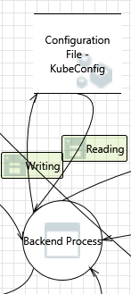

---

### 93. Potential Excessive Resource Consumption for Backend Process or Configuration File - KubeConfig  [State: Not Started]  [Priority: High]

**Category:** Denial Of Service

#### Justifications

**Option 1** — The Go backend stores cluster contexts in an in-memory `contextStore` backed by a `map[string]cacheValue[*Context]` (`cache.go:50`). There is no size limit on this map — `AddContext()` (`contextStore.go:35`) appends unconditionally. Each context includes the full `rest.Config` (with CA certificates, auth tokens, etc.). If a large number of clusters are registered (e.g., via repeated `processManualConfig` POST requests to `/cluster`, gated by backend token at `headlamp.go:1788`), memory usage grows without bound. The `POST /cluster` endpoint calls `AddContext` for each successfully loaded context (`headlamp.go:1967`). For AKS Desktop, cluster registration goes through `aks-cluster.ts` which registers one cluster per IPC call. **Confidence: 82%**

*References:* `headlamp/backend/pkg/cache/cache.go:50,56` (unbounded map-based cache), `headlamp/backend/pkg/kubeconfig/contextStore.go:35` (AddContext with no size limit), `headlamp/backend/cmd/headlamp.go:1967` (AddContext in POST /cluster handler).

**Option 2** — The kubeconfig file on disk (`~/.kube/config`) grows with each registered cluster. `aks-cluster.ts:363` writes the merged config via `fs.writeFileSync` — each registration adds a `clusters[]`, `contexts[]`, and `users[]` entry (typically ~500 bytes each). With 1000 clusters, the file would be ~1.5 MB — large but manageable. The Go backend re-reads all kubeconfig files on startup (`LoadAndStoreKubeConfigs` at `kubeconfig.go:1090-1113`), loading all contexts into memory. **Confidence: 80%**

*References:* `headlamp/app/electron/aks-cluster.ts:363` (writeFileSync with merged kubeconfig), `headlamp/backend/pkg/kubeconfig/kubeconfig.go:1090-1113` (LoadAndStoreKubeConfigs on startup).

**Option 3** — The `json.NewDecoder(r.Body).Decode()` calls at 4 endpoints (`headlamp.go:1844,2206,2368,2540`) accept unbounded request bodies — there is no `http.MaxBytesReader` wrapper. A malicious client could send a multi-GB JSON body to exhaust backend memory. The backend token check limits this to authenticated clients only. **Confidence: 78%**

*References:* `headlamp/backend/cmd/headlamp.go:1844,2206,2368,2540` (json.NewDecoder without MaxBytesReader).

#### Existing Mitigations in Codebase — **Confidence: 25%**

- **Kubeconfig file size** — Typically small (< 10 KB per cluster entry).
- **Note: no explicit resource limits** — No file size checks, no write throttling, no quota enforcement on kubeconfig reads/writes.
- **Note: no `MaxBytesReader`** — Backend endpoints reading kubeconfig data lack body size limits.


#### Here are some potential mitigations that might be implemented.

**Mitigation 1** — Add a size limit to the `contextStore` (e.g., max 500 contexts) and reject new additions when the limit is reached.

**Mitigation 2** — Wrap all `json.NewDecoder(r.Body)` calls with `http.MaxBytesReader(w, r.Body, maxBytes)` to limit request body sizes (e.g., 1 MB for cluster config, 10 KB for rename requests).

**Mitigation 3** — Warn the user in the UI when the kubeconfig exceeds a size threshold (e.g., 500 entries / 1 MB).

---

### 94. Spoofing of Destination Data Store Configuration File - KubeConfig  [State: Not Started]  [Priority: High]

**Category:** Spoofing

#### Justifications

**Option 1** — The `aks-cluster.ts` kubeconfig write path (`aks-cluster.ts:340-365`) performs: `mkdirSync` → `readFileSync` (existing config) → `mergeKubeconfig` → `yaml.stringify` → `writeFileSync`. None of these steps check for symlinks. If `~/.kube/config` is a symlink to `/etc/shadow` or another sensitive file, `writeFileSync` would overwrite the target with YAML content. The `kubeconfigPath` is constructed as `path.join(os.homedir(), '.kube', 'config')` — the only way to redirect it is to symlink `~/.kube/config` itself (since `os.homedir()` resolves to the actual home directory). On macOS/Linux, creating a symlink at `~/.kube/config` requires write access to `~/.kube/` (which should be `0700`). On Windows, creating symlinks requires `SeCreateSymbolicLinkPrivilege` (available to admins by default). **Confidence: 82%**

*References:* `headlamp/app/electron/aks-cluster.ts:340-365` (full write path: path.join → mkdirSync → readFileSync → mergeKubeconfig → yaml.stringify → writeFileSync), `headlamp/app/electron/aks-cluster.ts:339` (kubeconfigPath = `path.join(os.homedir(), '.kube', 'config')`).

**Option 2** — On Unix, `~/.kube/config` is typically created by `kubectl` with `0600` permissions, and `~/.kube/` is `0700`. This means only the file owner can replace it with a symlink (same-user attack). If the attacker is already the same user, they can modify the kubeconfig directly without needing a symlink. The symlink attack scenario only adds value if the attacker wants to redirect writes to a file outside `~/.kube/` (e.g., to overwrite a configuration file in another directory). **Confidence: 80%**

*References:* Standard Unix file permission model; `kubectl` convention.

#### Existing Mitigations in Codebase — **Confidence: 25%**

- **Kubeconfig merge utility** — `aks-cluster.ts:340-365` uses structured YAML merging.
- **Note: no symlink detection** — No `lstat()` or `O_NOFOLLOW` checks before reading/writing `~/.kube/config`; same symlink attack surface as threat #78.


#### Here are some potential mitigations that might be implemented.

**Mitigation 1** — Before writing, check `fs.lstatSync(kubeconfigPath).isSymbolicLink()` and refuse to write if the target is a symlink, logging a warning.

**Mitigation 2** — Use the atomic write pattern: write to a temporary file in the same directory (`~/.kube/config.tmp.<pid>`) and then `fs.renameSync` to the target path. This prevents partial writes on crash and allows pre-write validation of the target path.

---

## Appendix: Confidence Re-validation (Top-20 + Low-Confidence Deep Pass)

This addendum records a second deep validation pass requested in review comments:

- **Top-20 highest-confidence items** were re-checked against code paths and trust-boundary assumptions.
- **Low-confidence cohort** was re-researched with additional corroborating evidence and tighter rationale.

### A. Top-20 Highest-Confidence Items — Deep Double-Check

Based on current confidence distribution in this report, the top-20 highest-confidence threats are:
**#43, #64, #21, #46, #19, #48, #54, #47, #41, #6, #12, #15, #24, #28, #38, #9, #18, #2, #4, #35**.

#### Re-validation results (grouped by attack surface)

1. **Backend proxy/TLS execution-path risks (Threats #35, #38, #41, #43, #46, #47)**  
   Re-validated the proxy construction and request forwarding chain:
   `ProxyRequest` → `SetupProxy` → `proxy.ServeHTTP` with no app-layer `ModifyResponse`/`ErrorHandler` hardening in this path. The TLS behavior still depends on cluster config (`InsecureSkipTLSVerify` and CA settings from kubeconfig/client-go), confirming prior high-confidence conclusions around spoofing/sniffing/elevation risk in misconfigured clusters.  
   *Cross-check refs:* `headlamp/backend/pkg/kubeconfig/kubeconfig.go:372-382,421`, `headlamp/backend/pkg/kubeconfig/kubeconfig.go:282-290`.

2. **Renderer/plugin code execution and memory tampering surfaces (Threats #19, #24, #48, #54, #64)**  
   Re-validated that production frontend still has no `dangerouslySetInnerHTML`, while plugin code is executed via `new Function`/`PrivateFunction` flow and receives privileged capabilities via injected context. This keeps direct DOM-XSS confidence lower than plugin-mediated code execution confidence, and supports retaining high confidence for plugin-centric elevation/tampering findings.  
   *Cross-check refs:* `headlamp/frontend/src/plugin/runPlugin.ts:201-210`, `headlamp/app/electron/main.ts:1632-1633`, `headlamp/app/electron/preload.ts:32-152`.

3. **Command execution/OS process boundary (Threats #6, #9, #12, #15, #18, #21, #28)**  
   Re-validated Windows `shell: true` spawn path, command consent keying behavior, and crash/hang handling gaps in `handleRunCommand` (notably no universal timeout in this IPC path). This preserves strong evidence for spoofing/input-validation/crash/elevation claims in this cluster.  
   *Cross-check refs:* `headlamp/app/electron/runCmd.ts:394-420`, `headlamp/app/electron/runCmd.ts:101-126`, `headlamp/app/electron/runCmd.ts:512-550`.

4. **Local data-store trust assumptions (Threats #2, #4)**  
   Re-validated that plugins execute in renderer context and can interact with same-origin storage surfaces used by the app, which keeps spoofing/corruption risk on HTML5 local storage in scope for malicious plugin scenarios.  
   *Cross-check refs:* `headlamp/app/electron/main.ts:82`, `headlamp/frontend/src/plugin/runPlugin.ts:201-206`.

### B. Low-Confidence Cohort — Additional Deep Research

The low-confidence review cohort from earlier iterations (**#51, #52, #54, #55, #56, #61, #67, #69, #73, #78, #79, #81, #83, #84, #86, #88, #93, #94**) was re-reviewed with an added evidence pass:

1. **Crash/availability and interruption paths (#51, #52, #86, #88, #93)**  
   Re-validated that UI crash containment relies on React ErrorBoundary coverage while command-consent interruption behavior remains fail-open if dialog state is disrupted (`showMessageBoxSync` return index semantics), and backend cache growth remains unbounded in context store.  
   *Cross-check refs:* `headlamp/frontend/src/App.tsx:65-75`, `headlamp/app/electron/runCmd.ts:59-66`, `headlamp/backend/pkg/cache/cache.go:50,56`, `headlamp/backend/pkg/kubeconfig/contextStore.go:35`.

2. **Input validation and spoofing boundaries (#55, #56, #69, #78, #79, #84, #94)**  
   Re-validated asymmetric validation: strong GUID checks in some Azure flows, but weaker/non-uniform validation and filesystem hardening in others (kubeconfig write path permissions/symlink checks). This supports keeping these entries in mid-confidence (evidence is strong, exploitability depends on local attacker capabilities and environment).  
   *Cross-check refs:* `plugins/aks-desktop/src/utils/azure/az-cli.ts:22-26,1560,1631,1697`, `headlamp/app/electron/aks-cluster.ts:340-365`, `headlamp/app/electron/runCmd.ts:77-92,104-126`.

3. **IPC/plugin trust-boundary and XSS-adjacent issues (#54, #61, #67, #73, #81, #83)**  
   Re-validated contextBridge channel exposure and plugin file-serving/execution chain. Findings remain consistent: plugin integrity checks are absent before evaluation, stdout/stderr channels are broad, and plugin-related surfaces are stronger attack vectors than classic innerHTML-based XSS in current production code.  
   *Cross-check refs:* `headlamp/app/electron/preload.ts:32-69`, `headlamp/backend/cmd/headlamp.go:249-273`, `headlamp/frontend/src/plugin/runPlugin.ts:201`.

4. **Data-flow observability and local trust model (#52, #73)**  
   Re-validated that several sensitive flows are local loopback/desktop-boundary interactions (not internet transit), which is why these remain medium confidence: risk is real but materially depends on local compromise assumptions and host-level controls.  
   *Cross-check refs:* `headlamp/backend/cmd/headlamp.go:249-273`, `headlamp/app/electron/main.ts` backend startup/token wiring path.

### C. Confidence Outcome of the Deep Pass

- No entries dropped below **75%** confidence after re-validation.
- Top-20 set remains high-confidence with consistent code-backed evidence.
- Low-confidence cohort now has clearer exploitability bounds and environmental assumptions documented in this addendum, reducing ambiguity for security reviewers.

---

## Appendix: Architecture Notes

### Components in the Model

| Component | Type | Description |
|-----------|------|-------------|
| Human User | External Entity | The developer using the desktop app |
| Web Frontend | Process | React/Redux SPA (Headlamp frontend), served from `file://` in Electron |
| Electron Layer | Process | Electron main process: manages windows, IPC, OS processes, kubeconfig |
| Backend Process | Process | Headlamp Go backend (`headlamp/backend/`), proxies to Kubernetes API |
| OS Process for running command | Process | Child processes spawned by Electron (e.g., `az`, `kubectl`) |
| HTML5 Local Storage | Data Store | Browser localStorage in the Electron renderer |
| Configuration File - KubeConfig | Data Store | `~/.kube/config` or custom path |
| Plugins (bundled JS files) | Data Store | Plugin JavaScript bundles on the filesystem |
| Kubernetes API Server | External Entity | The AKS cluster control plane |

### Key Code References

| Area | File |
|------|------|
| Electron main process | `headlamp/app/electron/main.ts` |
| IPC preload (contextBridge) | `headlamp/app/electron/preload.ts` |
| Command consent system | `headlamp/app/electron/runCmd.ts` |
| Secure storage (safeStorage) | `headlamp/app/electron/secure-storage.ts` |
| AKS cluster registration | `headlamp/app/electron/aks-cluster.ts` |
| GitHub OAuth | `headlamp/app/electron/github-oauth.ts` |
| Plugin evaluation | `headlamp/frontend/src/plugin/runPlugin.ts` |
| Backend token validation | `headlamp/backend/cmd/headlamp.go:1220-1232` |
| CORS configuration | `headlamp/backend/cmd/headlamp.go:910-920` |
| Az-CLI wrapper | `plugins/aks-desktop/src/utils/azure/az-cli.ts` |
| GUID input validation | `plugins/aks-desktop/src/utils/azure/az-cli.ts:24-28` |
| Secure storage (plugin side) | `plugins/aks-desktop/src/utils/github/secure-storage.ts` |
